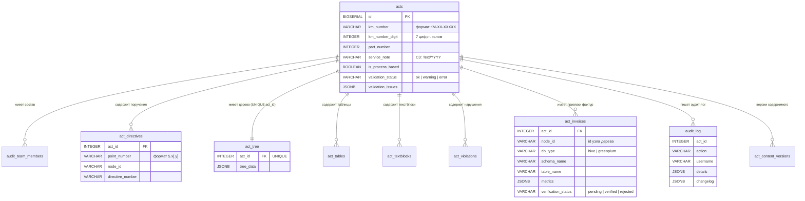

# Архитектура и backend

> Часть гайд-бука разработчика Audit Workstation. Точка входа и навигация по всем частям — [`developer-guide.md`](developer-guide.md).

Слои приложения, жизненный цикл, доменная плагин-система, структура backend-кода и REST-контракты.
Нумерация разделов (§2–§5, §14) сохранена от единого гайд-бука — ссылки вида «§3.7» остаются валидными.


## Оглавление

- [2. Архитектура и принципы](#2-архитектура-и-принципы)
  - [2.1 3-tier layered architecture](#21-3-tier-layered-architecture)
  - [2.2 Жизненный цикл приложения](#22-жизненный-цикл-приложения)
  - [2.3 Adapter pattern для мультиБД](#23-adapter-pattern-для-мультибд)
  - [2.4 Domain plugin system](#24-domain-plugin-system)
  - [2.5 Middleware stack](#25-middleware-stack)
- [3. Backend: структура и паттерны](#3-backend-структура-и-паттерны)
  - [3.1 Слои: API -> Services -> Repositories](#31-слои-api---services---repositories)
  - [3.2 FastAPI Depends (DI)](#32-fastapi-depends-di)
  - [3.3 Shared API — как добавить эндпоинт](#33-shared-api--как-добавить-эндпоинт)
  - [3.4 Domain API — как добавить эндпоинт в домен](#34-domain-api--как-добавить-эндпоинт-в-домен)
  - [3.5 Pydantic-схемы](#35-pydantic-схемы)
  - [3.6 Обработка ошибок](#36-обработка-ошибок)
  - [3.7 Полный путь запроса от HTTP до БД](#37-полный-путь-запроса-от-http-до-бд)
- [4. Frontend: 3-зонная архитектура](#4-frontend-3-зонная-архитектура)
  - [4.1 Зоны и страницы](#41-зоны-и-страницы)
  - [4.2 Как добавить новый JS-модуль или CSS-компонент](#42-как-добавить-новый-js-модуль-или-css-компонент)
- [5. Доменная система: создание нового домена](#5-доменная-система-создание-нового-домена)
  - [5.1 Минимальная структура домена](#51-минимальная-структура-домена)
  - [5.2 DomainDescriptor: поля и назначение](#52-domaindescriptor-поля-и-назначение)
  - [5.3 Пошаговый пример: создание домена с нуля](#53-пошаговый-пример-создание-домена-с-нуля)
  - [5.4 Настройки домена (settings_registry)](#54-настройки-домена-settings_registry)
  - [5.5 Навигация (NavItem)](#55-навигация-navitem)
  - [5.6 Knowledge bases и chat_system_prompt](#56-knowledge-bases-и-chat_system_prompt)
  - [5.7 Жизненный цикл домена](#57-жизненный-цикл-домена)
  - [5.8 Зависимости между доменами](#58-зависимости-между-доменами)
- [14. API contracts (list, limits, error envelope)](#14-api-contracts-list-limits-error-envelope)
  - [14.1 Paginated response](#141-paginated-response)
  - [14.2 Pagination limits и UI-паттерн Load More](#142-pagination-limits-и-ui-паттерн-load-more)
  - [14.3 Error envelope](#143-error-envelope)
  - [14.4 Kerberos handler — special-case](#144-kerberos-handler--special-case)
  - [14.5 Acts: `GET /limits` и `SaveContentResponse`](#145-acts-get-limits-и-savecontentresponse)

---

## 2. Архитектура и принципы

### 2.1 3-tier layered architecture

Приложение построено по трехслойной архитектуре с доменной plugin-системой:

```
Browser (vanilla JS)
    ↓ HTTP/JSON + HTML
FastAPI Application (app/main.py)
    ├── Middleware (HTTPSRedirect → RequestId → SecurityHeaders
    │               → RequestSizeLimit → RateLimit → HttpMetrics → Auth)
    ├── Shared HTML Routes (portal — landing page; app/auth — /auth/login, /profile)
    ├── Shared API Routes (auth, system, roles, admin/diagnostics)
    ├── Domain Plugin Registry (domain_registry.py)
    │   └── acts/          — API, routes, services, repositories
    │   └── admin/         — API, routes, services, repositories
    │   └── chat/          — AI-ассистент (поллинг сообщений, conversation persistence)
    │   └── ck_*/          — верификация метрик
    │   └── notifications/ — центр уведомлений (public_api)
    │   └── sqlagent/      — портал-страница со встроенным Text-to-SQL агентом
    │   └── ua_data/       — справочники UA (только фабрики + миграции)
    ├── Redis Layer (app/core/redis.py — кэши, сессии/ОТП, локи актов)
    └── Database Layer
        ├── Connection Pool (asyncpg)
        ├── DbExecutor (соединение на операцию, app/db/executor.py)
        ├── Adapters (PostgreSQL | Greenplum)
        └── Base Repository (conn + adapter)
```

**Принципы:**
- Каждый слой зависит только от нижележащего
- Бизнес-логика в сервисах, SQL-запросы в репозиториях
- API-эндпоинты тонкие — только вызов сервисов и возврат результата
- Домены изолированы друг от друга (кроме явных зависимостей)

**ER-диаграмма ключевых таблиц домена `acts`:**



> Уникальность акта обеспечивается парой `(km_number_digit, part_number)` **на уровне приложения** (`ActCrudService.create_act`), а не БД-констрейнтом: на Greenplum `DISTRIBUTED BY` должен быть подмножеством каждого `UNIQUE` (см. §6.5 в [`database.md`](database.md)), а DB-UNIQUE по этой паре потребовал бы либо `DISTRIBUTED REPLICATED` (копия на каждом сегменте), либо смены distribution с потерей co-location. Это сознательный компромисс, не баг.

### 2.2 Жизненный цикл приложения

Приложение управляется фабрикой `create_app()` в `app/main.py`.

**Порядок инициализации:**

```
1. Settings         — загрузка конфигурации из .env
2. Logging          — настройка уровня логирования
3. discover_domains() — сканирование app/domains/* с регистрацией Settings и chat_tools
4. auth.lifecycle.register_lifespan_hooks() — регистрация hook'а Redis (идемпотентна)
5. Middleware       — добавление в обратном порядке (см. раздел 2.5)
6. Static files     — монтирование /static, /favicon.ico, корневой /health
7. Exception handlers — регистрация обработчиков ошибок
8. Router registration:
   ├── Shared HTML routes (portal + app/auth: /auth/login, /auth/logout, /profile)
   ├── Shared API routes
   └── Domain API/HTML routes    — автоматически через domain_registry
9. Lifespan startup (при запуске ASGI-сервера):
   ├── ensure_directories()                — проверка templates/ и static/
   ├── discover_domains()                  — из кэша, нужен для lifecycle и БД
   ├── init_db(settings)                   — создание asyncpg пула
   ├── warmup_pool()                       — если DATABASE__POOL_WARMUP_ENABLED
   ├── create_tables_if_not_exist(domains) — автосоздание таблиц из schema.sql
   ├── singleton_lock.acquire()            — захват блокировки инстанса (в БД)
   ├── get_startup_hooks()                 — инфраструктурные hooks (см. §5.7)
   └── domain.on_startup()                 — per-domain, в порядке топосорта
```

**Финальный порядок инфраструктурных startup-hooks.** Порядок = порядок регистрации: домены обходятся по алфавиту имени каталога в `discover_domains()` (не по топосорту — топосорт применяется к списку доменов уже после того, как `_build_domain()` зарегистрировал hooks), а `auth.redis` регистрируется в `create_app()` **после** `discover_domains()`:

1. `acts.audit_log_batcher`
2. `admin.http_metrics_batcher`
3. `admin.access_denied_audit_batcher`
4. `admin.db_pool_monitor`
5. `chat.tool_metrics_batcher`
6. `chat.audit_log_batcher`
7. `chat.agent_channel_poller`
8. `chat.llm_health_probe`
9. `notifications.email_init`
10. `auth.redis` — подключение Redis, **fail-fast**: при недоступности приложение не стартует (Redis обязателен во всех окружениях)

Что делает каждый hook — в §9.5b в [`deploy-and-configuration.md`](deploy-and-configuration.md) (один раздел, без дублирования).

**Порядок остановки:**

```
1. domain.on_shutdown() — в обратном порядке (только стартовавшие домены)
2. get_shutdown_hooks() — в обратном порядке регистрации
3. release_singleton_lock() — best-effort, до закрытия пула
4. close_db()           — закрытие asyncpg пула
```

> **Важно:** startup-hooks вызываются **после** `discover_domains` / `settings_registry` / `init_db` / `create_tables_if_not_exist` **и после** захвата singleton-lock — чтобы инфраструктурные сервисы (батчеры, фоновые таски) видели готовый pool и зарегистрированные Settings и не поднимались в воркере, у которого lock уже занят другим процессом. При падении startup-hook'а откатываются парные по имени shutdown-hooks уже выполненных.
>
> Docstring `app/core/domain_registry.py` до сих пор утверждает «ДО захвата singleton-lock» — это устаревший текст в коде, источник истины — `app/main.py`.

**Защита от частичного старта:** если домен N падает при startup, вызываются `on_shutdown()` для доменов 1..N-1:

```python
started: list = []
for d in domains:
    if d.on_startup:
        await d.on_startup(app)
    started.append(d)
# При ошибке:
for d in reversed(started):
    if d.on_shutdown:
        await d.on_shutdown(app)
```

### 2.3 Adapter pattern для мультиБД

Приложение поддерживает две СУБД через паттерн Adapter. Подробнее см. [§6.2 в `database.md`](database.md#62-адаптеры-postgresql-vs-greenplum).

```
DatabaseAdapter (абстрактный)
    ├── PostgreSQLAdapter   — имена с префиксом, CASCADE, GIN-индексы
    └── GreenplumAdapter    — schema-квалифицированные имена с префиксом, BIGSERIAL, Kerberos
```

Адаптер выбирается при старте по значению `DATABASE__TYPE` и доступен глобально через `get_adapter()`.

### 2.4 Domain plugin system

Домены обнаруживаются автоматически сканированием директории `app/domains/`. Каждый домен — изолированный Python-пакет с `__init__.py`, экспортирующим `_build_domain() -> DomainDescriptor`.

Подробнее о создании доменов см. [раздел 5](#5-доменная-система-создание-нового-домена).

**Текущие домены:**

| Домен | Статус | Описание |
|-------|--------|----------|
| `acts` | Основной | Создание и управление актами |
| `admin` | Активный | Администрирование, управление ролями |
| `chat` | Активный | AI-ассистент (conversations, polling сообщений, function-calling, файлы, канал к внешнему агенту). Фронтенд: event-driven (13 модулей через ChatEventBus) |
| `ck_fin_res` | Активный | ЦК Финансовый результат — верификация метрик FR |
| `ck_client_exp` | Активный | ЦК Клиентский опыт — верификация метрик CS |
| `ua_data` | Активный | Справочные данные УА — словари процессов, ТБ, подразделений, метрик нарушений. Зависит от `admin`. Без своих API/HTML-роутеров: домен-библиотека (настройки, миграции и фабрики `ua_data.*` для `acts`/`ck_*`) |
| `sqlagent` | Активный | Портал-страница `/sqlagent` со встроенным через iframe родным UI Text-to-SQL агента (отдельный uvicorn-процесс). Без API-роутеров и БД: только HTML-роут, настройки и NavItem |
| `notifications` | Активный | Центр уведомлений: персистентные (адресные + broadcast) со статусами прочитано/непрочитано/скрыто + живые замечания. Действия над записью — через контекстное меню (`⋮`/правый клик): прочитать/вернуть в непрочитанное/удалить (крестик dismiss убран); endpoint `POST /{id}/unread` зеркалит `/read`. Единый светлый стиль колокольчика на портале и в конструкторе (шапка без декоративной иконки). Меню шире по умолчанию и свободно ресайзится угловой ручкой в левом-нижнем углу (меню прижато к правому краю → растёт влево и вниз; размер в localStorage `notif:menu:size`). Логика ресайза — общая утилита `static/js/shared/resizable-panel.js` (`makeResizablePanel`), та же, что у popup чата (`ChatPopupManager`): клампит к вьюпорту при restore/ресайзе окна, гасит «хвостовой» click после drag'а, авто-стоп при потерянном mouseup. Править ресайз любой панели — в утилите, не в копии. Клик по записи помечает её прочитанной (если поддерживает). API без доменного гейта (`public_api=True`); продьюсеры (acts, chat) пушат через фабрику `notifications.push`. См. отчёт `docs/reports/2026-06-07-notifications-center.md` |

> **`public_api`** — флаг `DomainDescriptor`. По умолчанию `register_domains()` вешает на роутеры домена `require_domain_access(<домен>)`. Для кросс-доменного «общего» API, доступного всем авторизованным ролям (центр уведомлений), выставь `public_api=True` — гейт не вешается, остаётся только `get_username`.

> **`POST /api/v1/notifications/internal`** — service-to-service эндпоинт для встроенных sidecar-агентов (например, SQLAgent) в том же per-user контейнере. В отличие от admin-only `POST ""`, доступен любому авторизованному пользователю, но **форсит** `source="sqlagent"` и адресата = текущий пользователь (`recipient_user_id`), `link` по умолчанию `/sqlagent`. Источник/адресата подделать нельзя; защищён изоляцией контейнера (как iframe-режим, см. [`agent-integration-iframe.md`](agent-integration-iframe.md)). Используется обратным каналом уведомлений о завершении/ошибке выгрузки SQLAgent.

### 2.5 Middleware stack

В `create_app()` подключаются семь middleware. В Starlette порядок выполнения обратный порядку регистрации: последний `add_middleware` обрабатывает запрос первым.

**Порядок выполнения при запросе (снаружи внутрь):**

```
Запрос → HTTPSRedirect → RequestId → SecurityHeaders → RequestSizeLimit → RateLimit → HttpMetrics → Auth → FastAPI → Ответ
```

| Middleware | Назначение |
|-----------|-----------|
| `HTTPSRedirectMiddleware` | Переписывает `scheme` на `https` по заголовкам `x-forwarded-proto` / `x-scheme`. Outermost — должен отработать до SecurityHeaders, который опирается на scheme. |
| `RequestIdMiddleware` | Берёт `X-Request-ID` из заголовка или генерирует свой. Кладёт в `ContextVar`, возвращает в заголовке ответа. |
| `SecurityHeadersMiddleware` | Ставит CSP / HSTS / X-Frame-Options. Стоит снаружи RateLimit/RequestSize/Auth, чтобы заголовки попадали и в их 413/429/401-ответы. |
| `RequestSizeLimitMiddleware` | Ограничивает размер тела запроса. Реализован как raw ASGI: `BaseHTTPMiddleware` буферизует тело до `dispatch()`, а здесь нужно резать по байтам в стриме. |
| `RateLimitMiddleware` | Per-IP лимит запросов через TTLCache. Дефолт — 1024 req/min. |
| `HttpMetricsMiddleware` | Меряет latency и пишет HTTP-метрики через batched `HttpMetricsService` (см. §9.5a в [`deploy-and-configuration.md`](deploy-and-configuration.md)). Сервис резолвится в `create_app()` через фабрику `admin.http_metrics_service`: если метрики выключены или админ-домена нет — `service=None`, middleware только меряет. Стоит снаружи Auth (видит 401 анонимов), но внутри лимитов — отбитые 429/413 в метрики не попадают, чтобы флуд не разгонял журнал. |
| `AuthMiddleware` | Проверка JWT-cookie на каждый запрос, тихий refresh истёкшего access. Самый внутренний слой — raw ASGI, как и остальные middleware проекта. Его 401 и редиректы поднимаются через весь стек: получают security-заголовки, request_id и попадают в метрики. |

Все классы — в `app/core/middleware.py`, кроме `HttpMetricsMiddleware` (`app/core/middlewares/http_metrics.py`) и `AuthMiddleware` (`app/auth/middleware.py`).

---

## 3. Backend: структура и паттерны

### 3.1 Слои: API -> Services -> Repositories

```
Эндпоинт (HTTP)
    ↓ FastAPI Depends()
Service (бизнес-логика)
    ├── AccessGuard — проверка доступа
    ├── Repository  — SQL-запросы
    ├── Валидация, трансформация
    └── Repository  — сохранение
    ↓
Ответ клиенту
```

**Shared API** (`app/api/v1/`):

```
app/api/v1/
├── routes.py              — главный роутер (агрегирует shared endpoints)
├── deps/
│   ├── auth_deps.py       — get_username() — username из JWT (или из env в тест-режиме)
│   └── role_deps.py       — get_user_roles(), require_admin(),
│                            require_domain_access(<домен>),
│                            invalidate_user_roles_cache()
└── endpoints/
    ├── system.py          — /health, /health/detailed[/full], /health/{domain},
    │                        /version, POST /client-error
    ├── roles.py           — GET /my-roles (интеграция с admin доменом)
    └── admin_diagnostics.py — GET /admin/diagnostics: снимок батчеров и
                               фоновых задач из observability_registry;
                               доступ через require_domain_access("admin")
```

> Роутер авторизации — **не** в `endpoints/`: он живёт в `app/auth/router.py`
> (`/auth/request-otp`, `/verify-otp`, `/refresh`, `/logout`, `/me`, `/avatar`)
> и подключается в `ROUTERS` импортом оттуда. HTML-страницы входа и профиля —
> `app/auth/portal_router.py`.

**Domain API** (`app/domains/acts/api/`):

```
app/domains/acts/api/
├── __init__.py            — get_api_routers() → [(router, prefix, tags)]
├── limits.py              — GET /limits (регистрируется ПЕРВЫМ, см. ниже)
├── editor_telemetry.py    — приём батчей телеметрии редактора
├── management.py          — CRUD + блокировка
├── content.py             — загрузка/сохранение содержимого
├── export.py              — экспорт в форматы
├── invoice.py             — работа с фактурами
├── audit_log.py           — история операций и версии содержимого
└── users.py               — поиск пользователей для autocomplete участников
```

> **Порядок регистрации значим.** `limits_router` и `editor_telemetry_router`
> подключаются **до** `management_router`: их пути литеральные, а в management
> есть `GET /{act_id}` с `act_id: int` — иначе `/acts/limits` упирался бы в
> 422 на int-конвертации сегмента без fallthrough к следующему маршруту.

**Сервисы домена актов:**

| Сервис | Файл | Назначение |
|--------|------|-----------|
| `ActCrudService` | `act_crud_service.py` | CRUD, управление метаданными |
| `ActLockService` | `act_lock_service.py` | Блокировка с инактивностью |
| `ActContentService` | `act_content_service.py` | Содержимое (дерево, таблицы, текст) |
| `ActInvoiceService` | `act_invoice_service.py` | CRUD фактур, валидация метрик |
| `ExportService` | `export_service.py` | Форматирование через ThreadPoolExecutor |
| `StorageService` | `storage_service.py` | Файловый I/O (`acts_storage/`) |
| `AuditLogService` | `audit_log_service.py` | История операций, восстановление версий |
| `AccessGuard` | `access_guard.py` | Проверка доступа и прав |
| `ActAuditLogBatcher` | `audit_log_batcher.py` | Батч-запись аудит-лога (наследник `MetricsBatcher`), поднимается hook'ом `acts.audit_log_batcher` |
| — (модуль функций) | `content_validation.py` | `collect_validation_issues` / `status_from_issues` — структурная валидация содержимого, не бросает |
| — (модуль функций) | `notifications_producer.py` | `emit_act_notification` — пуш уведомлений в центр уведомлений через фабрику `notifications.push` |

**Репозитории домена актов** (`app/domains/acts/repositories/`):

| Репозиторий | Файл | Назначение |
|-------------|------|-----------|
| `ActCrudRepository` | `act_crud.py` | CRUD-операции с метаданными актов |
| `ActContentRepository` | `act_content.py` | Чтение дерева, таблиц, текстблоков, нарушений |
| `ActContentVersionRepository` | `act_content_version.py` | Снимки содержимого для истории |
| `ActLockRepository` | `act_lock.py` | Блокировка актов (pessimistic locking); **не** `BaseRepository` — работает поверх Redis-бэкенда, без соединения с БД |
| `RedisLockBackend` | `act_lock_backends.py` | Единственный бэкенд локов актов: ключи `lock:act:{id}` на Redis-TTL, атомарность через Lua |
| `ActAccessRepository` | `act_access.py` | Управление доступом и правами |
| `ActInvoiceRepository` | `act_invoice.py` | CRUD фактур |
| `ActAuditLogRepository` | `act_audit_log.py` | Запись и чтение журнала операций (`ActAuditLogRecord` — DTO батчера) |
| `ActEditorTelemetryRepository` | `act_editor_telemetry.py` | Запись событий телеметрии редактора |

Отдельного `act_users.py` в домене нет: поиск пользователей для autocomplete участников идёт через
кросс-доменную фабрику `admin.user_directory` (см. §5.8), эндпоинт — `api/users.py`.

**Форматтеры экспорта** (`app/domains/acts/formatters/`):

| Форматтер | Файл | Назначение |
|-----------|------|-----------|
| `DocxFormatter` | `docx/formatter.py` | Экспорт акта в DOCX (python-docx) |
| `MarkdownFormatter` | `markdown_formatter.py` | Экспорт акта в Markdown |
| `TextFormatter` | `text_formatter.py` | Экспорт акта в plain text |

Базовый класс `BaseFormatter` (`formatters/base_formatter.py`) наследуют `MarkdownFormatter` и
`TextFormatter`; `DocxFormatter` от него **не** наследуется — у DOCX своя сборка документа.
Обход дерева вынесен в `tree_walker.py`, общий рендер нарушений — в `violation_render.py`.

DOCX разросся до подпакета `formatters/docx/`: `formatter.py` (`DocxFormatter` + `_DocxTreeVisitor`),
`context.py`, `styles.py`, `numbering.py`, `footnotes.py` и `builders/`
(`cover`, `header_footer`, `inline`, `rubricator`, `signature`, `tables`, `violation`).

Общие утилиты в `app/domains/acts/formatters/utils/`:

| Файл | Назначение |
|------|-----------|
| `html_utils.py` | Парсинг и очистка HTML-контента |
| `json_utils.py` | Трансформация JSON-структур |
| `markdown_utils.py` | Экранирование и сборка Markdown |
| `table_utils.py` | Форматирование табличных данных |

### 3.2 FastAPI Depends (DI)

Все сервисы получают БД через исполнитель `get_executor()` — DI-фабрики,
вызываемые через `Depends`, оформлены корутинами (`async def`, чтобы FastAPI
исполнял их в event loop, а не гонял через пул потоков `run_in_threadpool`);
соединение из пула они всё равно не удерживают (детали — [§6.3a в `database.md`](database.md#63a-исполнитель-бд-connection-per-operation)):

```python
# app/domains/acts/deps.py
async def get_crud_service(settings: Settings = Depends(get_settings)) -> ActCrudService:
    return ActCrudService(conn=get_executor(), settings=settings)
```

**Цепочка зависимостей:**

```
Эндпоинт
    ↓ Depends()
    ├── get_username() → str (или HTTPException 401)
    └── get_crud_service() → ActCrudService (async def, без yield — соединение не держит)
        └── get_executor() → DbExecutor (процесс-синглтон, соединения не держит)
            └── Service.__init__(conn=executor, settings)
                └── Repository(conn=executor)
                    └── self.adapter = get_adapter()
```

Соединение из пула исполнитель берёт только на время конкретного SQL-вызова
(`fetch`/`execute`/…) или явной транзакции — не на время жизни запроса.

**Auth dependency** (`app/api/v1/deps/auth_deps.py`, упрощённо — оба режима `AUTH__ENABLED`, детали — §9.3a в [`deploy-and-configuration.md`](deploy-and-configuration.md)):

```python
async def get_username(request: Request) -> str:
    if not get_settings().auth.enabled:
        # Тест-режим (pytest/Playwright, локальная отладка): username из env.
        # Имя переменной JUPYTERHUB_USER — историческое, к деплою отношения не имеет.
        username = resolve_env_username()
    else:
        # ОТП-режим: sub из JWT, который AuthMiddleware кладёт в scope["state"]["user"].
        username = (request.scope.get("state", {}).get("user") or {}).get("sub")
    if not username:
        raise HTTPException(status_code=401, detail="Не авторизован")
    return username
```

Похода в БД тут нет: `sub` и есть username справочника пользователей. Роли и профиль
подтягиваются отдельно — `get_user_roles()` / `require_domain_access()` в `role_deps.py`
(кэш ролей на Redis, инвалидация — `await invalidate_user_roles_cache(username)`).

### 3.3 Shared API — как добавить эндпоинт

**Шаг 1.** Добавить функцию в существующий файл `app/api/v1/endpoints/*.py` или создать новый:

```python
# app/api/v1/endpoints/system.py
@router.get("/ping", status_code=200)
async def ping(username: str = Depends(get_username)):
    logger.info(f"Пинг от пользователя {username}")
    return {"message": "pong"}
```

**Шаг 2.** Если создан новый файл — зарегистрировать в `app/api/v1/routes.py`:

```python
from app.api.v1.endpoints import admin_diagnostics, roles, system, new_module
from app.auth.router import router as auth_router   # особый случай: живёт в app/auth/, не в endpoints/

ROUTERS = [
    (auth_router, "/auth", ["Авторизация"]),
    (system, "/system", ["Системные операции"]),
    (roles, "/roles", ["Роли пользователей"]),
    (admin_diagnostics, "/admin/diagnostics", ["Администрирование"]),
    (new_module, "/new", ["Новый модуль"]),  # добавить
]
```

Результат: эндпоинт доступен по `GET /api/v1/system/ping`.

### 3.4 Domain API — как добавить эндпоинт в домен

**Шаг 1.** Создать файл `app/domains/acts/api/status.py`:

```python
from fastapi import APIRouter, Depends
from app.api.v1.deps.auth_deps import get_username
from app.domains.acts.deps import get_crud_service

router = APIRouter()

@router.get("/{act_id}/status")
async def get_act_status(
    act_id: int,
    username: str = Depends(get_username),
    service: ActCrudService = Depends(get_crud_service),
):
    act = await service.get_act(act_id, username)   # -> ActResponse
    return {"act_id": act.id, "validation_status": act.validation_status}
```

**Шаг 2.** Зарегистрировать в `app/domains/acts/api/__init__.py`:

```python
from app.domains.acts.api.status import router as status_router

def get_api_routers():
    return [
        # ... существующие
        (status_router, "/acts", ["Статус актов"]),
    ]
```

Результат: `GET /api/v1/acts/{act_id}/status`.

### 3.5 Pydantic-схемы

Схемы запросов и ответов определяются в `app/domains/acts/schemas/`:

| Файл | Модели |
|------|--------|
| `act_metadata.py` | `ActCreate`, `ActUpdate`, `ActResponse`, `ActListItem`, `ActAttentionItem`, `AuditTeamMember`, `ActDirective`, `UserSearchResult`, `AuditPointIdsRequest` |
| `act_content.py` | `ActItemSchema`, `TableSchema`/`TableCellSchema`, `TextBlockSchema`, `ViolationSchema` (+ подсхемы `ViolationContentItemSchema`, `ViolationAdditionalContentSchema`, …), `ActDataSchema`, `ActSaveResponse` |
| `act_invoice.py` | `InvoiceSave`, `MetricItem`, `InvoiceResponse`, `InvoiceVerifyRequest` |
| `act_audit_log.py` | `AuditLogEntry`, `ContentVersionEntry`, `ContentVersionDetail` |
| `act_responses.py` | `OperationResult`, `LockResponse`, `LockConfigResponse`, `InvoiceConfigResponse`, `RestoreVersionResponse`, `SaveContentResponse` |
| `editor_telemetry.py` | `EditorTelemetryEvent`, `EditorTelemetryBatch` |

Схемы чата определены в домене `app/domains/chat/schemas/`:

```python
# app/domains/chat/schemas/requests.py
class CreateConversationRequest(BaseModel):
    title: str | None = Field(None, max_length=500)
    domain_name: str | None = Field(None, max_length=100)
    context: dict[str, Any] | None = None

class UpdateConversationRequest(BaseModel):
    title: str = Field(min_length=1, max_length=500)

class MessageFeedbackRequest(BaseModel):
    rating: Literal["up", "down"]
    reasons: list[str] | None = None
    comment: str | None = None
    agent_mode: str | None = Field(None, max_length=16)

# app/domains/chat/schemas/responses.py
class ConversationResponse(BaseModel):
    id: str            # UUID-строка, не int
    user_id: str
    title: str | None
    domain_name: str | None
    context: Any
    created_at: datetime
    updated_at: datetime

class MessageResponse(BaseModel):
    id: str
    conversation_id: str
    role: str
    content: list[dict[str, Any]]
    model: str | None
    token_usage: dict[str, Any] | None
    status: str | None = None       # streaming → complete | failed
    created_at: datetime
    feedback: dict[str, Any] | None = None   # оценка ТЕКУЩЕГО пользователя
```

Рядом: `ConversationListItem` (усечённая карточка для списка бесед),
`MessageFeedbackResponse`, `FileUploadResponse`, а также `schemas/text_actions.py`.

**Все идентификаторы чата — строковые UUID (`VARCHAR(36)`), не автоинкремент.**

Сообщения отправляются через `FormData` (`message` + `files` + `domains` + `agent_mode`),
не через JSON body.

### 3.6 Обработка ошибок

**Базовый класс** (`app/core/exceptions.py`):

```python
class AppError(Exception):
    status_code: int = 500
    code: ClassVar[str] = "app-error"  # kebab-case, уникальный на подкласс

    def __init__(self, message: str) -> None:
        self.message = message
        self.extra: dict[str, Any] = {}  # доп. поля envelope-а
        super().__init__(message)

    def to_envelope(self) -> dict[str, Any]:
        envelope = {"detail": self.message, "code": self.code}
        if self.extra:
            envelope["extra"] = self.extra
        return envelope
```

**Унифицированный error envelope** для всех HTTP-ответов:

```json
{"detail": "Человекочитаемое сообщение", "code": "kebab-case-machine-code", "extra": {...}}
```

`extra` — опциональный объект с типизированными доп. полями (например `{"locked_by": "11111111", "locked_until": "..."}` для `ActLockError`). Если у исключения нет доп. полей, `extra` в envelope **отсутствует**, не `null`.

**Доменные исключения**:

| Исключение | HTTP-код | `code` | Назначение |
|-----------|----------|--------|-----------|
| `ServiceUnavailableError` | 503 | `service-unavailable` | Сервис временно недоступен (таймаут ожидания соединения из пула) |
| `ActNotFoundError` | 404 | `act-not-found` | Акт не найден |
| `AccessDeniedError` | 403 | `access-denied` | Нет доступа |
| `InsufficientRightsError` | 403 | `insufficient-rights` | Роль не позволяет |
| `ActLockError` | 409 | `act-locked` | Конфликт блокировки (extra: locked_by, locked_until) |
| `KmConflictError` | 409 | `km-number-exists` | КМ уже существует (extra: km_number, current_parts, next_part) |
| `ActValidationError` | 400 | `act-validation` | Бизнес-валидация |
| `UnsupportedFormatError` | 400 | `act-unsupported-format` | Неподдерживаемый формат экспорта |
| `ActExportValidationError` | 400 | `act-export-validation` | Бизнес-валидация при экспорте |
| `ActExportTimeoutError` | 408 | `act-export-timeout` | Таймаут экспорта |
| `ManagementRoleRequiredError` | 403 | `act-management-role-required` | Требуется Куратор/Руководитель |
| `InvoiceError` | 400 | `act-invoice-error` | Ошибка фактуры |
| `ChatLimitError` | 422 | `chat-limit-exceeded` | Превышен лимит чата |
| `ChatFileValidationError` | 422 | `chat-file-validation` | Файл не прошёл валидацию |
| `ChatFeedbackValidationError` | 422 | `chat-feedback-validation` | Невалидная оценка сообщения (коды причин / длина комментария) |
| `TextActionValidationError` | 422 | `text-action-validation` | Невалидное текстовое действие |
| `ChatFileNotFoundError` | 404 | `chat-file-not-found` | Файл чата не найден |
| `ChatMessageNotFoundError` | 404 | `chat-message-not-found` | Сообщение чата не найдено |
| `ChatToolValidationError` | 400 | `chat-tool-validation` | ChatTool: невалидный вызов |
| `ChatRateLimitError` | 429 | `chat-rate-limit` | Per-user rate-limit (extra: retry_after_sec) |
| `AgentChannelUnavailableError` | 502 | `chat-agent-channel-unavailable` | Канал к внешнему ИИ-агенту недоступен |
| `ConversationNotFoundError` | 404 | `conversation-not-found` | Беседа не найдена |
| `ConversationLockedError` | 409 | `conversation-locked` | Беседа занята активной генерацией ответа |
| `OptimisticLockFailed` | 409 | `chat-optimistic-lock-failed` | Optimistic lock при финализации записи |
| `NotificationNotFoundError` | 404 | `notification-not-found` | Уведомление не найдено |
| `UserNotFoundError` | 404 | `admin-user-not-found` | Пользователь не найден |
| `RoleNotFoundError` | 404 | `admin-role-not-found` | Роль не найдена |
| `AdminAccessDeniedError` | 403 | `admin-access-denied` | Не админ |
| `LastAdminError` | 409 | `admin-last-admin` | Последний админ |
| `FRRecordNotFoundError` | 404 | `ck-fin-res-record-not-found` | FR-запись не найдена |
| `FRValidationError` | 400 | `ck-fin-res-validation` | FR-валидация |
| `FRGroupConflictError` | 409 | `ck-fin-res-group-conflict` | FR-группа: параллельное изменение или дубль при создании |
| `CSRecordNotFoundError` | 404 | `ck-client-exp-record-not-found` | CS-запись не найдена |
| `CSValidationError` | 400 | `ck-client-exp-validation` | CS-валидация |

`AppError` напрямую (без подкласса) → `code = "app-error"` (fallback, используется в обёртках OSError/MemoryError в `ExportService`).

**Не-AppError-обработчики** в `main.py` тоже добавляют `code`:
- `UniqueViolationError` → 409 + `code: db-unique-violation`
- `CheckViolationError` → 422 + `code: db-check-violation`
- `HTTPException` (FastAPI) → status + `code: http-error`
- любой `Exception` → 500 + `code: internal-server-error`

**Special-case** — Kerberos handler не меняет формат: на API-путях возвращает 401 с `{"error": "kerberos_token_expired", "detail": ..., "message": ..., "instructions": [...], "action_required": "kinit"}`, на HTML-путях — страницу `shared/errors/401.html` с `reason="kerberos"`. Это сознательное исключение — фронт показывает развёрнутую инструкцию, формат завязан на UI.

**Exception handlers** регистрируются в `main.py` и работают автоматически:

```python
@app.exception_handler(AppError)
async def app_error_handler(request, exc):
    if _is_html_request(request):
        return _render_error_page(request, exc.status_code)
    return JSONResponse(status_code=exc.status_code, content=exc.to_envelope())
```

Нет необходимости в try-except в эндпоинтах — достаточно бросить исключение из сервиса.

### 3.7 Полный путь запроса от HTTP до БД

Пример: `GET /api/v1/acts/list` — получение списка актов.

```
1. HTTP запрос → Middleware chain (см. §2.5): … → Auth кладёт user в scope
2. FastAPI routing → acts/api/management.py:list_user_acts()
   (роутер домена уже под Depends(require_domain_access("acts")))
3. Depends(get_username) → sub из JWT в scope["state"]["user"]
4. Depends(get_crud_service):
   a. get_executor() → DbExecutor (синглтон, соединения не держит)
   b. ActCrudService(conn=executor, settings)
5. service.list_acts(username, limit, offset):
   a. self._crud.count_user_acts / get_user_acts → executor.fetch(...):
      взял соединение из пула → SQL SELECT → сразу вернул в пул
   b. Возврат (items, total)
6. FastAPI → PaginatedResponse[ActListItem] → JSON response → клиент
```

Соединение живёт только шаг 5a, а не всё время запроса — детали [§6.3a в `database.md`](database.md#63a-исполнитель-бд-connection-per-operation).

---

## 4. Frontend: 3-зонная архитектура

> **Deep-dive по фронту — в [`frontend-architecture.md`](../architecture/frontend-architecture.md)**: ES-модули и entry-файлы, `AppConfig`, AppState (Proxy deep-tracking), StorageManager (state machine + persistence), LockManager и inactivity, Tree/items/per-node render API, PreviewManager, диалоги, Acts manager, безопасность, accessibility, CSS-каскад. Этот §4 — короткое содержание для тех, кто пришёл за обзором.
>
> **Чат-фронт — отдельно**: [`chat-frontend-architecture.md`](../architecture/chat-frontend-architecture.md), плюс event-driven раздел §7.7 в [`ai-assistant.md`](ai-assistant.md).
>
> **Движок rich-редактора — отдельно**: [`textblock-editor-architecture.md`](../architecture/textblock-editor-architecture.md) — капсулы ссылок/сносок, caret-guard (`U+FEFF`), 3-слойная целостность капсул, DOCX-экспорт; с PR #37 движок обобщён до поверхностей (EditableSurface) и обслуживает и rich-поля нарушений (§15 там же).

### 4.1 Зоны и страницы

Vanilla JS (ES6+), **Native ES Modules без bundler'а**. Браузер сам резолвит `import`-граф через `<script type="module">`. Node на проде не нужен — отдаём статику как есть, новые файлы создаются на месте без сборки. Entry-модули: `static/js/entries/portal-common.js` (для портала) и `static/js/entries/constructor.js`. Шаблоны page-уровня (landing, acts-manager, admin, ck) подключают свой inline `<script type="module">` с импортом нужного page-класса.

| Зона | `static/js/` | Назначение |
|------|--------------|------------|
| `shared/` | актуальные цифры — `frontend-architecture.md` §1.1 | Кросс-зональный код: `AppConfig` (`app-config.js`), `APIClient` (`api.js`), `AuthManager` (`auth.js`), `Notifications` (`notifications.js`) + `notifications-center/`, `SafeHTML` (`sanitize.js`), `ErrorBoundary`, `FilterEngine`, `DialogBase`/`DialogManager` (`dialog/`), `chat/` (13 модулей), `datatable/`, `ck/` |
| `portal/` | актуальные цифры — `frontend-architecture.md` §1.1 | Sidebar-страницы: landing, acts-manager, admin, ck-fin-res, ck-client-exp |
| `constructor/` | актуальные цифры — `frontend-architecture.md` §1.1 | Редактор актов (`/constructor?act_id=N`): state/, tree/, items/, table/, textblock/, violation/, preview/, dialog/, context-menu/, header/, validation/, services/, clipboard/, search/, text-actions/ |

Всего ~183 JS-файла и ~97 CSS-файлов (свежие цифры — `frontend-architecture.md` §1.1).

**Страницы приложения:**

| Страница | URL | Базовый шаблон | JS точка входа |
|----------|-----|---------------|----------------|
| Landing | `GET /` | `base_portal.html` | `landing-page.js` |
| Acts Manager | `GET /acts` | `base_portal.html` | `acts-manager-page.js` |
| Constructor | `GET /constructor?act_id=X` | `base_constructor.html` | `app.js` |
| Admin | `GET /admin` | `base_portal.html` | `admin-page.js` |
| ЦК Фин.Рез. | `GET /ck-fin-res` | `base_portal.html` (extends `_ck_layout.html`) | `ck-fin-res-page.js` |
| ЦК Клиентский опыт | `GET /ck-client-experience` | `base_portal.html` (extends `_ck_layout.html`) | `ck-client-exp-page.js` |
| SQL-агент | `GET /sqlagent` | `base_portal.html` | iframe с внешним UI |
| Профиль | `GET /profile` | `base_portal.html` | `profile-page.js` |
| Вход | `GET /auth/login` | `auth/login.html` (собственная база) | страница ОТП-входа (`app/auth/portal_router.py`) |

> URL страницы ЦК Клиентского опыта — `/ck-client-experience` (полное слово),
> хотя домен, API-префикс и каталог JS называются `ck-client-exp`.

**CSS — 3 entry-point файла**, каждый для своей зоны:

```
static/css/entry/{shared,portal,constructor}.css
portal.css     → @import './shared.css' → base/ + shared/
constructor.css → @import './shared.css' + constructor-specific (~50 файлов в каскаде)
```

Каждая зона задаёт свой корневой `font-size` (конструктор 12px, портал 13px) — плотность интерфейса управляется им, а печатно-точные зоны от него защищены явными px. Деталь — `frontend-architecture.md` §13.5.

CSS-переменные (581 шт.) — `static/css/base/variables.css` (агрегатор `@import`; сами переменные разложены по темам в `static/css/base/variables/{colors,typography,spacing,shadows,z-index,motion,components}.css`).

Cache-busting — Jinja-фильтр `versioned` (`{{ '...' | versioned }}`): дописывает `?v=<app_version>` к URL статики. Регистрируется вместе с глобалами `app_version` и `auth_enabled` в `app/core/templating.py::get_templates()`.

**Jinja2** — две независимые базы наследования: `templates/portal/base_portal.html` и `templates/constructor/base_constructor.html`. Каждая загружает свой ESM-entry (`portal-common.js` / `constructor.js`). Деталь — `frontend-architecture.md` §2.

<!-- 4.2-4.6 поглощены в frontend-architecture.md (§2, §3, §4, §5, §13). Эта секция оставлена тонкой как навигационная. -->

### 4.2 Как добавить новый JS-модуль или CSS-компонент

**Добавление JS-модуля:**

1. Создать файл в соответствующей зоне: `static/js/<zone>/<module>.js`. Top-level декларации помечать `export class X` / `export const X = ...`. Импорты зависимостей — относительными путями с `.js` в конце: `import { AppConfig } from '../shared/app-config.js';`.
2. Опубликовать singleton дополнительно как `window.X = X` в конце файла — для совместимости с inline-скриптами в шаблонах. Деталь — `frontend-architecture.md` §2.3.
3. Добавить `import './path/to/module.js';` в соответствующий entry-файл (`static/js/entries/portal-common.js` или `static/js/entries/constructor.js`). Если модуль side-effect-only (мутирует чужой state) — этого достаточно. Если экспортит что-то нужное конкретной странице — добавь именованный `import` в inline `<script type="module">` шаблона страницы.
4. Все `fetch` и навигации — через `AppConfig.api.getUrl()`: единая точка сборки абсолютного URL от базового адреса приложения (кешируется, покрыт тестами), а не россыпь относительных путей по модулям. Регрессионный поиск прямых обращений: `grep -rn "fetch(\s*['\"\`]/api" static/js/`. См. `frontend-architecture.md` §3.

**Добавление CSS-компонента:**

1. Создать файл: `static/css/<zone>/<category>/<component>.css`.
2. Добавить `@import` в entry point зоны:
   - `static/css/entry/shared.css` — автоматически доступен везде.
   - `static/css/entry/portal.css` — только portal-страницы.
   - `static/css/entry/constructor.css` — только редактор.


---

## 5. Доменная система: создание нового домена

### 5.1 Минимальная структура домена

```
app/domains/<name>/
├── __init__.py          — обязательно: _build_domain() → DomainDescriptor
├── settings.py          — опционально: BaseModel с настройками
├── deps.py              — опционально: FastAPI Depends
├── exceptions.py        — опционально: наследники AppError
├── _lifecycle.py        — опционально: on_startup / on_shutdown,
│                          register_lifespan_hooks(), register_factories()
├── api/
│   ├── __init__.py      — get_api_routers() → [(router, prefix, tags)]
│   └── <endpoints>.py   — APIRouter
├── routes/
│   ├── __init__.py      — get_html_routers() → [router]
│   └── <pages>.py       — HTML-роуты (Jinja2)
├── services/            — бизнес-логика
├── repositories/        — доступ к БД (наследуют BaseRepository)
├── schemas/             — Pydantic-модели
├── integrations/
│   ├── chat_tools.py    — определения ChatTool для AI
│   └── action_handlers.py — обработчики client-action'ов (если нужны)
└── migrations/
    ├── postgresql/schema.sql
    └── greenplum/schema.sql
```

### 5.2 DomainDescriptor: поля и назначение

```python
@dataclass
class DomainDescriptor:
    name: str                          # уникальное имя домена
    api_routers: list[tuple]           # [(router, prefix, tags), ...]
    html_routers: list                 # [router, ...]
    settings_class: type[BaseModel] | None  # модель настроек для загрузки из .env
    exception_handlers: dict | None    # {ExcClass: handler_fn}
    dependencies: dict[str, str]       # {"<домен>": "<зачем>"} — порядок топосорта
    on_startup: Callable | None        # async def on_startup(app)
    on_shutdown: Callable | None       # async def on_shutdown(app)
    package_path: Path | None          # заполняется автоматически
    chat_tools: list[ChatTool]         # инструменты для AI
    nav_items: list[NavItem]           # элементы sidebar
    knowledge_bases: list[KnowledgeBase]  # базы знаний для AI
    chat_system_prompt: str            # промпт для AI-ассистента
    migration_substitutions: dict      # плейсхолдеры для schema.sql
    health_check: Callable | None      # async def () -> dict, для /system/health/{domain}
    public_api: bool = False           # True → без гейта require_domain_access
```

`health_check` подключает домен к `GET /api/v1/system/health/{domain_name}`: возвращает словарь
вида `{"status": "ok"|"error", ...}`, эндпоинт достаёт домен через `get_domain(...)` и отдаёт 404,
если health-check не зарегистрирован. Упавшая проверка — это HTTP 200 со `status: "error"`
(решение принимает мониторинг). Реализован в `acts` и `admin` (пинг БД + наличие ключевой таблицы);
`/health/detailed` доменные проверки **не** агрегирует.

### 5.3 Пошаговый пример: создание домена с нуля

Создадим домен `reports` для генерации отчетов.

**Шаг 1: `__init__.py`**

```python
"""Домен отчетов."""

def _build_domain():
    from app.core.domain import DomainDescriptor, NavItem
    from app.domains.reports.api import get_api_routers
    from app.domains.reports.routes import get_html_routers
    from app.domains.reports.settings import ReportsSettings

    return DomainDescriptor(
        name="reports",
        api_routers=get_api_routers(),
        html_routers=get_html_routers(),
        settings_class=ReportsSettings,
        # dependencies — СЛОВАРЬ {домен: зачем}, не список
        dependencies={"acts": "чтение содержимого актов для отчётов"},
        nav_items=[
            NavItem(
                label="Отчеты",
                url="/reports",
                icon_svg='<path d="..." stroke="currentColor"/>',
                order=15,
                active_page="reports",
                chat_domains=["reports", "acts"],
                group="Аудит",
            ),
        ],
    )
```

**Шаг 2: `settings.py`**

```python
from pydantic import BaseModel

class ReportsSettings(BaseModel):
    max_report_size_mb: float = 50.0
    default_format: str = "docx"
```

**Шаг 3: `api/__init__.py`**

```python
from app.domains.reports.api.endpoints import router

def get_api_routers():
    return [(router, "/reports", ["Отчеты"])]
```

**Шаг 4: `api/endpoints.py`**

```python
from fastapi import APIRouter, Depends
from app.api.v1.deps.auth_deps import get_username

router = APIRouter()

@router.get("/list")
async def list_reports(username: str = Depends(get_username)):
    return {"reports": []}
```

**Шаг 5: `migrations/postgresql/schema.sql`**

```sql
CREATE TABLE IF NOT EXISTS reports (
    id BIGSERIAL PRIMARY KEY,
    title TEXT NOT NULL,
    created_by VARCHAR(50) NOT NULL,
    created_at TIMESTAMP DEFAULT CURRENT_TIMESTAMP
);
```

После создания файлов домен обнаружится автоматически при запуске приложения.

### 5.4 Настройки домена (settings_registry)

Доменные настройки загружаются из `.env` с префиксом `NAME__`. Механизм работы:

1. `discover_domains()` находит `settings_class` в `DomainDescriptor`
2. `settings_registry.register(name, cls)` динамически создает `BaseSettings`-класс с префиксом
3. Pydantic загружает значения из `.env` и валидирует

```python
# app/core/settings_registry.py
def _load_from_env(name: str, cls: type[BaseModel]) -> BaseModel:
    # Для домена "reports" с ReportsSettings:
    # создаёт временный BaseSettings с env_prefix="REPORTS__" и
    # загружает REPORTS__MAX_REPORT_SIZE_MB, REPORTS__DEFAULT_FORMAT
    loader_cls = type(
        f"_{name}_Loader",
        (BaseSettings,),
        {
            # cls.model_fields, а НЕ cls.__annotations__: последний видит только
            # поля, объявленные прямо на классе, и при наследовании Settings
            # унаследованные поля потерялись бы.
            "__annotations__": {
                fname: finfo.annotation for fname, finfo in cls.model_fields.items()
            },
            "model_config": SettingsConfigDict(
                env_prefix=f"{name.upper()}__",
                env_nested_delimiter="__",
                env_file=str(env_file),
                case_sensitive=False,
                extra="ignore",
            ),
            # + копия default'ов из cls (включая default_factory)
        },
    )
    return cls.model_validate(loader_cls().model_dump(by_alias=True))
```

Обе стадии обёрнуты в try/except с `RuntimeError`: ошибка чтения `.env` и ошибка валидации
дают разные сообщения с именем домена — падение на старте, а не при первом запросе.
`model_dump(by_alias=True)` важен для полей с `alias` (например `database.gp.schema_name`
с `alias="schema"`).

**Использование в коде:**

```python
from app.core.settings_registry import get as get_domain_settings
settings = get_domain_settings("reports")
print(settings.max_report_size_mb)  # 50.0
```

### 5.5 Навигация (NavItem)

`NavItem` определяет элемент в боковой навигации (sidebar):

```python
@dataclass(frozen=True)
class NavItem:
    label: str              # "Управление актами"
    url: str                # "/acts"
    icon_svg: str           # SVG-содержимое иконки
    order: int = 100        # сортировка (меньше = выше)
    active_page: str = ""   # для маркирования активной страницы
    chat_domains: list[str] = field(default_factory=list)  # фильтр chat tools на странице
    group: str = ""         # группировка в sidebar (пустая строка = без группы)
    description: str = ""   # короткое описание страницы для AI-ассистента и подсказок
```

Все `nav_items` из всех доменов собираются и отображаются в sidebar через `get_nav_items_grouped()` (`app/core/navigation.py`, кеш с TTL 60 сек + инвалидация через `add_domain_change_listener`).

Свои `NavItem` объявляют `acts` («Управление актами», группа «Аудит»), `ck_fin_res`, `ck_client_exp` и `sqlagent` («SQL-агент», группа «Аналитика»). У `admin` — `nav_items=[]` (страница есть, пункта в общем sidebar нет), у `notifications` и `ua_data` навигации нет по существу.

### 5.6 Knowledge bases и chat_system_prompt

**Knowledge bases** — декларация баз знаний для AI-ассистента:

```python
@dataclass(frozen=True)
class KnowledgeBase:
    key: str          # "knowledge_base_oarb" — ключ для localStorage
    label: str        # "База Знаний ОАРБ" — отображаемое имя
    description: str  # описание для toggle в UI
```

Три базы знаний объявлены доменом `acts`: `knowledge_base_oarb`, `knowledge_base_sources`, `knowledge_base_tools`.

База знаний ОАРБ управляется тумблером из 3 позиций (Выключен / Адаптивный / Всегда), сохранённым в `localStorage['assistant_oarb_mode']` и проброшенным в POST `/messages` как form-параметр `agent_mode` (`off`/`adaptive`/`always`, см. §7.8 в [`ai-assistant.md`](ai-assistant.md)). Две другие базы знаний («источников», «инструментов») в UI выключены. `ChatContext.getEnabledKnowledgeBases()` остаётся для будущей RAG-интеграции с фильтром по БЗ.

**`chat_system_prompt`** добавляется к базовому системному промпту при вызовах чата, если домен указан в фильтре `request.domains`.

### 5.7 Жизненный цикл домена

Есть два механизма управления lifespan-логикой домена:

**1. Per-domain hooks (`DomainDescriptor.on_startup` / `on_shutdown`)** — высокоуровневые. Вызываются с откатом: если N-й домен упал — для доменов 1..N-1 отрабатывают `on_shutdown`.

```python
# _lifecycle.py
async def on_startup(app: FastAPI) -> None:
    """Вызывается при старте приложения."""
    # Инициализация ресурсов, ThreadPoolExecutor, начальные данные.

async def on_shutdown(app: FastAPI) -> None:
    """Вызывается при остановке."""
    # Очистка ресурсов.
```

Домен `acts` использует `on_startup` для создания ThreadPoolExecutor (экспорт) и `on_shutdown` для его остановки. Домен `admin` — для seed'а ролей из справочника пользователей.

**2. Инфраструктурные hooks (`register_startup_hook` / `register_shutdown_hook`)** — для фоновых задач, батчеров, координаторов. Регистрируются доменом в момент `_build_domain()` (через локальную функцию `register_lifespan_hooks`); `app/main.py` итерирует их в общем lifespan-цикле через `get_startup_hooks()` / `get_shutdown_hooks()`. Контракт:

- Startup-hooks выполняются **после** `discover_domains` / `settings_registry` / `init_db`, но **до** singleton-lock.
- Shutdown-hooks — в **обратном порядке регистрации**.
- При падении startup-hook'а — частичный откат через уже выполненные shutdown-hooks.

Образец — `app/domains/admin/_lifecycle.py::register_lifespan_hooks` (HTTP-метрик батчер):

```python
def register_lifespan_hooks() -> None:
    from app.core.domain_registry import register_shutdown_hook, register_startup_hook

    async def _start_http_metrics_batcher(app: FastAPI) -> None:
        batcher = MetricsBatcher(
            flush_callback=_flush, max_batch_size=..., flush_interval_sec=...,
            max_buffer_size=..., name="admin_http_metrics",
        )
        await batcher.start()
        set_http_metrics_batcher(batcher)          # ссылка для deps домена
        app.state.http_metrics_batcher = batcher   # ссылка для парного shutdown
        register_batcher("admin.http_metrics_batcher", batcher)  # observability_registry

    async def _stop_http_metrics_batcher(app: FastAPI) -> None:
        batcher = getattr(app.state, "http_metrics_batcher", None)
        unregister_batcher("admin.http_metrics_batcher")
        set_http_metrics_batcher(None)
        if batcher is not None:
            await batcher.stop()

    register_startup_hook("admin.http_metrics_batcher", _start_http_metrics_batcher)
    register_shutdown_hook("admin.http_metrics_batcher", _stop_http_metrics_batcher)
```

Текущие зарегистрированные hooks (порядок startup) — см. §2.2.

**3. Cross-domain factory-registry (`register_factory` / `get_factory` / `has_factory`)** — реестр фабрик доменных компонентов под строковым ключом (конвенция: `"<домен>.<компонент>"`). Используется для cross-domain DI без прямого импорта классов.

```python
# admin регистрирует фабрику справочника пользователей
register_factory("admin.user_directory", _user_directory_factory)

# acts использует её через get_factory без import UserDirectoryRepository
from app.core.domain_registry import get_factory
factory = get_factory("admin.user_directory")
repo = factory()
users = await repo.search(query)
```

Это позволяет домену `acts` зависеть от `admin` через **интерфейс** (контракт фабрики), а не через прямой импорт реализации. Регистрация — на этапе `_build_domain()` (через `register_factories()`), до того как любой потребитель запросит фабрику в Depends.

**4. `add_domain_change_listener(listener)`** — callback-инвалидаторы для кешей, зависящих от состава доменов. Вызываются при `register_domains` / `reset_registry`. Используется навигационным кешем (`app/core/navigation.py`, TTL 60 сек) — при изменении состава доменов nav-кеш сбрасывается немедленно.

### 5.8 Зависимости между доменами

Поле `dependencies: dict[str, str]` в `DomainDescriptor` определяет порядок инициализации. Ключ — имя домена-зависимости; значение — короткое описание причины зависимости (логируется, помогает понять «зачем это здесь» через год). `discover_domains()` в `app/core/domain_registry.py` строит граф зависимостей и выполняет топологическую сортировку (алгоритм Кана) — домены инициализируются в порядке, при котором каждая зависимость уже зарегистрирована.

```python
# Реальный дескриптор acts (app/domains/acts/__init__.py)
DomainDescriptor(
    name="acts",
    dependencies={
        "admin": "роли/доступ к домену, справочник пользователей (IUserDirectory) "
                 "для атрибуции авторов актов",
        "ua_data": "имена таблиц фактур (UaInvoiceTableNames) и справочники "
                   "подразделений/контрагентов",
    },
)
```

Циклические зависимости и ссылки на незарегистрированные домены вызывают `RuntimeError` при старте. Порядок регистрации виден в логах `lifespan` — полезно для отладки «почему мой домен инициализируется до своей зависимости».

**DI между доменами — через factory-registry, не через прямые импорты.** Раньше `acts/deps.py` напрямую импортировал `UserDirectoryRepository` из `admin.services`; теперь `get_users_repository()` идёт через `domain_registry.get_factory("admin.user_directory")`. Контракт фабрики — обычный callable без аргументов, возвращающий готовый репозиторий на исполнителе БД (`get_executor()`, §6.3a в [`database.md`](database.md)): вызывающая сторона зовёт фабрику напрямую, без `async for`/`aclosing`. Преимущества:

- `acts` зависит от **интерфейса** (фабрика возвращает что-то, что умеет `search()`), а не от конкретного класса `UserDirectoryRepository`.
- Тесты `acts` могут зарегистрировать стаб через `register_factory("admin.user_directory", fake_factory)` без monkey-patch'а импортов.
- Перестановка реализации в admin не ломает acts, пока контракт фабрики стабилен.

См. §5.7 пункт 3 для деталей API.

---

## 14. API contracts (list, limits, error envelope)

Глава фиксирует единые контракты HTTP-API: shape пагинированных ответов, диапазоны пагинации и envelope ошибок. До Wave 4 контракт-унификации эти зоны были разнородны; сейчас — единое правило для всех новых эндпоинтов и фронт-консьюмеров.

### 14.1 Paginated response

**Все list-эндпоинты возвращают `PaginatedResponse[T]`** — generic-обёртку из `app/core/responses.py`:

```python
class PaginatedResponse(BaseModel, Generic[T]):
    items: list[T]
    total: int
    limit: int
    offset: int
```

Поля:
- `items` — страница результатов (≤ `limit` штук, начиная с `offset`).
- `total` — общее количество записей под текущим фильтром (для пагинатора/Load More).
- `limit` — размер запрошенной страницы (эхо для удобства клиента, фронту не нужно держать своё состояние).
- `offset` — смещение запрошенной страницы (эхо).

**Эндпоинты, отдающие `PaginatedResponse[T]`:**

| Endpoint | T |
|---|---|
| `GET /api/v1/acts/list` | `ActListItem` |
| `GET /api/v1/acts/users/search` | `UserSearchResult` |
| `GET /api/v1/acts/{id}/audit-log` | `AuditLogEntry` |
| `GET /api/v1/acts/{id}/versions` | `ContentVersionEntry` |
| `GET /api/v1/admin/roles` | `RoleSchema` |
| `GET /api/v1/admin/users/directory` | `UserDirectoryItem` |
| `GET /api/v1/admin/users/search` | `UserSearchResult` |
| `GET /api/v1/admin/audit-log` | `AuditLogEntry` |
| `GET /api/v1/chat/conversations` | `ConversationListItem` |
| `GET /api/v1/chat/conversations/{id}/messages` | `MessageResponse` |
| `POST /api/v1/ck-fin-res/records/search` | `dict` (группа ЦКФР: одна логическая строка на (суб-акт, КМ, пункт, метрика) с разверткой `tb_breakdown`) |
| `POST /api/v1/ck-client-exp/records/search` | `dict` (CS-запись) |

> У ЦК-эндпоинтов поиск — `POST` с телом (`ValidationSearchRequest`: `filters`/`sort`/`limit`/`offset`), поэтому `limit`/`offset` приходят в body, а не в query: `limit: int = Field(default=50, ge=1)` **без** жёсткого потолка в схеме — верхнюю границу страницы клампит сервис по `working_set_cap` домена. Shape ответа тот же `PaginatedResponse`.

До Wave 4 часть эндпоинтов возвращала «голый список» (`list[...]`), CK — `{data: [...]}`, что приводило к зоопарку парсеров на фронте. После унификации **фронт-консьюмеры всегда читают `.items`** (см. `static/js/shared/api.js` и доменные модули).

**Правило для новых list-эндпоинтов:** возвращай `PaginatedResponse[YourSchema]`, не пиши свою обёртку. Bulk-операции (`batch-update` — только ЦК Клиентский опыт; ЦКФР — `group-save`/`group-delete`) — отдельный контракт, они **не** под `PaginatedResponse`.

### 14.2 Pagination limits и UI-паттерн Load More

**Единый диапазон лимита для list-эндпоинтов:** `limit: int = Query(50, ge=1, le=200)`, `offset: int = Query(0, ge=0)`. До Wave 4 разброс был от 200 до 2000 без видимой системы (acts audit-log/versions держали `le=2000`, chat/messages — `le=500`, admin/audit-log — `le=200`); это позволяло фронту грузить «всё сразу» вместо честной пагинации. Теперь — верхний предел 200, дефолт 50.

**Осознанные исключения** (проверять по коду, не по памяти):

| Endpoint | Лимит | Почему |
|---|---|---|
| `GET /api/v1/chat/conversations/{id}/messages` | `Query(10000, ge=1, le=10000)` | История беседы отдаётся целиком в порядке ASC; `chat-context.js` её не пагинирует, а усечение до 50 скрывало бы свежие сообщения активных бесед |
| `GET /api/v1/chat/admin/feedback` | `Query(50, ge=1, le=500)` | Админская аналитика оценок, не под `PaginatedResponse` |
| `GET /api/v1/notifications` | `Query(None, ge=1, le=200)` | Лимит опционален (`None` = все), ответ — голый `list[NotificationOut]`, не `PaginatedResponse` |
| `POST /api/v1/ck-{fin-res,client-exp}/records/search` | `Field(default=50, ge=1)` в body | Потолок задан не схемой, а `working_set_cap` домена — сервис клампит `limit` сам |

**Pagination UI: Load More паттерн** применён в диалогах, которые раньше делали `limit=2000`:
- `static/js/portal/acts-manager/dialog-audit-log.js` — обе вкладки диалога (журнал операций и версии содержимого; отдельного `dialog-versions.js` нет, всё в одном модуле).

Поведение: начальная загрузка `limit=50`, при достижении конца списка кнопка «Загрузить ещё» дотягивает следующие 50 (`offset += limit`). `total` из ответа используется для счётчика «Показано N из total» и скрытия кнопки на последней странице. Состояние сбрасывается при закрытии диалога — повторное открытие снова идёт с `offset=0`.

**Контракт-тесты:** `tests/test_paginated_response.py` (unit на сам shape) + `tests/domains/acts/test_acts_api_e2e.py::TestListActs::test_list_limit_over_200_returns_422` (boundary 200/300 → 422 на уровне Query-валидации).

**Регрессионный поиск** «грузим всё одной страницей»: `grep -rn "limit=2000\|limit=1000\|limit=500" static/js/`. Должно быть 0 — иначе вернулся старый паттерн.

### 14.3 Error envelope

Унифицированный envelope ошибок — см. §3.6 «Обработка ошибок». Кратко: все 4xx/5xx (включая `AppError`-подклассы и не-AppError-обработчики в `main.py`) возвращают `{detail: string, code: string, extra?: object}`; `code` — kebab-case машинный идентификатор, уникальный на подкласс; `extra` — опциональный объект с типизированными доп. полями (`locked_by`/`retry_after_sec`/…).

**Фронт-парсер** (`static/js/shared/api.js::_throwApiError`) читает `code` и `extra` из ответа и кладёт их в throw'нутый `Error` (`err.code`, `err.extra`); заодно сворачивает массив `detail` из FastAPI-422 в человекочитаемую строку (`formatValidationDetail`). Консьюмеры переключают ветки по `code` вместо хрупких regex-проверок по `detail`: `constructor/lock-manager.js` (`error.code === 'act-locked'` → `error.extra.locked_by`), `portal/acts-manager/dialog-create-act.js` (`err.errData.code === 'km-number-exists'`). Старые ветки парсинга `errData.type === 'km_exists'` / regex по тексту удалены.

### 14.4 Kerberos handler — special-case

Единственное сознательное исключение из унифицированного envelope — Kerberos handler в `main.py`. При `kerberos_token_expired` он возвращает развёрнутую структуру:

```json
{
  "error": "kerberos_token_expired",
  "detail": "Токен авторизации Kerberos истек",
  "message": "... развёрнутое объяснение для пользователя ...",
  "instructions": ["Откройте терминал", "Выполните команду: kinit", "..."],
  "action_required": "kinit"
}
```

Причина: UI показывает пользователю пошаговую инструкцию по `kinit` (массив `instructions`), формат жёстко завязан на этот UX и шире, чем `{detail, code, extra}`. Менять Kerberos-формат «ради консистентности» нельзя — сломается шаблон ошибки. Если добавляешь новый infra-handler с похожей UX-нагрузкой (инструкции для админа) — рассмотри тот же приём, но **не** распространяй его на доменные ошибки: для них envelope `{detail, code, extra}` обязателен.

### 14.5 Acts: `GET /limits` и `SaveContentResponse`

**`GET /api/v1/acts/limits`** (`app/domains/acts/api/limits.py`) — единый источник лимитов конструктора для фронта. Отдаёт пять секций плюс скаляр, читаемые из настроек (`ACTS__IMAGES__*`/`ACTS__TABLES__*`/`ACTS__TEXTBLOCKS__*`/`ACTS__VIOLATIONS__*`/`ACTS__SANITIZER__*`):

```json
{
  "images":     { "max_file_size", "max_total_size_per_act", "allowed_mime_types",
                  "max_items_per_violation", "image_max_height_percent" },
  "tables":     { "max_rows", "max_cols", "min_col_width_px", "per_node" },
  "textblocks": { "font_size_min", "font_size_max", "font_size_default", "per_node" },
  "violations": { "per_node" },
  "sanitizer":  { "allowed_tags", "allowed_css_properties", "allowed_data_attrs" },
  "editor_telemetry_enabled": true
}
```

Секции **реально читаются** фронтом: картинки — в `violation-image-validator.js`, лимиты `per_node` таблиц/текстблоков/нарушений — рантайм-перекрытие фронт-гейтов дерева, санитайзер — `applyActsAllowlist` в `shared/sanitize.js` (синхронизация DOMPurify с бэком), `editor_telemetry_enabled` — kill-switch телеметрии редактора. Те же настройки питают Pydantic-валидаторы схемы, так что env-лимит меняется по всей цепочке (полная таблица переменных — §9.5 в [`deploy-and-configuration.md`](deploy-and-configuration.md)).

**`SaveContentResponse`** (`PUT /api/v1/acts/{id}/content`) несёт, помимо `status`/`message`/`updated_at`/`warning`, **статус валидации содержимого**: `validation_status` (`"ok"`/`"warning"`/`"error"`) и `validation_issues` (список замечаний). Те же поля выставлены в `ActListItem` (для карточек списка) и `ActResponse`. Семантика и поверхности — §12 в [`data-model-acts.md`](../architecture/data-model-acts.md).
