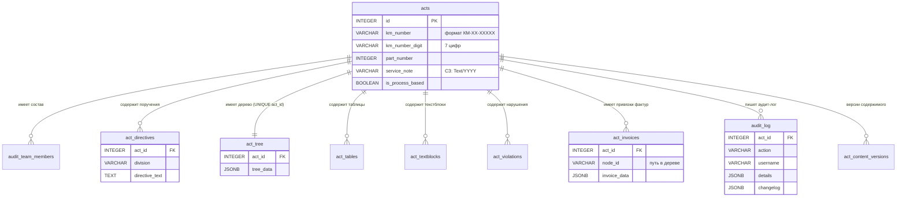

# Гайд-бук разработчика — Audit Workstation

## Связанные документы

- [`docs/operations/troubleshooting.md`](../operations/troubleshooting.md) — типовые проблемы (запуск, БД, чат, JupyterHub proxy) и решения.
- [`docs/operations/deployment-runbook.md`](../operations/deployment-runbook.md) — пошаговый чек-лист deploy / старт-проверка / rollback.
- [`docs/operations/operations-recovery.md`](../operations/operations-recovery.md) — operator playbook: что делать при инцидентах в проде (завис forward-запрос к агенту, singleton-lock, batcher overflow, denied access).
- [`docs/architecture/frontend-architecture.md`](../architecture/frontend-architecture.md) — **единый deep-dive по фронту** (constructor + portal + shared): ES-модули и entry-файлы, AppState/StorageManager/LockManager, per-node render API, диалоги, безопасность, a11y, CSS. Чат — отдельным документом ниже.
- [`docs/architecture/chat-frontend-architecture.md`](../architecture/chat-frontend-architecture.md) — deep-dive по фронт-архитектуре чата: 13 ядерных модулей, polling сообщений, режимы inline/modal/popup.
- [`docs/architecture/textblock-editor-architecture.md`](../architecture/textblock-editor-architecture.md) — deep-dive по движку rich-редактора (текстблоки + rich-поля нарушений через поверхности EditableSurface): капсулы ссылок/сносок, caret-guard, целостность капсул (prevent-then-heal), DOCX-экспорт (`inline.py`), поверхности и SURFACE_POLICY (§15).
- [`docs/integrations/external-agent-imitation.sql`](../integrations/external-agent-imitation.sql) — SQL-сниппеты для имитации внешнего ИИ-агента (см. §7.8).
- Retention bus-таблицы `chat_agent_messages_bus` — см. §9.6 (кода ретеншена в приложении нет, очистка — задача DBA).
- [`docs/testing/manual-qa-agent-channel.md`](../testing/manual-qa-agent-channel.md) — чек-лист ручного QA моста к внешнему агенту.
- [`docs/architecture/data-model-acts.md`](../architecture/data-model-acts.md) — модель данных дерева актов.
- [`docs/operations/logging.md`](../operations/logging.md) — формат логов и `request_id`-трассировка.
- [`docs/operations/agent-channel-production-checklist.md`](../operations/agent-channel-production-checklist.md) — операторский чек-лист для forward-моста.
- [`docs/guides/adding-chat-tool.md`](adding-chat-tool.md) — краткий чек-лист добавления нового chat-tool.
- [`docs/architecture/agent-channel-sequence.md`](../architecture/agent-channel-sequence.md) — sequence-диаграммы forward'а (live / reload+switch / refresh, краевые случаи).

## Оглавление

- [1. Обзор проекта и быстрый старт](#1-обзор-проекта-и-быстрый-старт)
  - [1.1 Назначение и основные возможности](#11-назначение-и-основные-возможности)
  - [1.2 Требования](#12-требования)
  - [1.3 Установка и первый запуск](#13-установка-и-первый-запуск)
  - [1.4 Структура репозитория](#14-структура-репозитория)
- [2. Архитектура и принципы](#2-архитектура-и-принципы)
  - [2.1 3-tier layered architecture](#21-3-tier-layered-architecture)
  - [2.2 Жизненный цикл приложения](#22-жизненный-цикл-приложения)
  - [2.3 Adapter pattern для мультиБД](#23-adapter-pattern-для-мультибд)
  - [2.4 Domain plugin system](#24-domain-plugin-system)
  - [2.5 Middleware stack](#25-middleware-stack)
- [3. Backend: структура и паттерны](#3-backend-структура-и-паттерны)
  - [3.1 Слои: API -> Services -> Repositories](#31-слои-api---services---repositories)
  - [3.2 FastAPI Depends (DI)](#32-fastapi-depends-di)
  - [3.3 Shared API — как добавить эндпоинт](#33-shared-api--как-добавить-эндпоинт)
  - [3.4 Domain API — как добавить эндпоинт в домен](#34-domain-api--как-добавить-эндпоинт-в-домен)
  - [3.5 Pydantic-схемы](#35-pydantic-схемы)
  - [3.6 Обработка ошибок](#36-обработка-ошибок)
  - [3.7 Полный путь запроса от HTTP до БД](#37-полный-путь-запроса-от-http-до-бд)
- [4. Frontend: 3-зонная архитектура](#4-frontend-3-зонная-архитектура)
  - [4.1 Зоны и страницы](#41-зоны-и-страницы)
  - [4.2 Как добавить новый JS-модуль или CSS-компонент](#42-как-добавить-новый-js-модуль-или-css-компонент)
- [5. Доменная система: создание нового домена](#5-доменная-система-создание-нового-домена)
  - [5.1 Минимальная структура домена](#51-минимальная-структура-домена)
  - [5.2 DomainDescriptor: поля и назначение](#52-domaindescriptor-поля-и-назначение)
  - [5.3 Пошаговый пример: создание домена с нуля](#53-пошаговый-пример-создание-домена-с-нуля)
  - [5.4 Настройки домена (settings_registry)](#54-настройки-домена-settings_registry)
  - [5.5 Навигация (NavItem)](#55-навигация-navitem)
  - [5.6 Knowledge bases и chat_system_prompt](#56-knowledge-bases-и-chat_system_prompt)
  - [5.7 Жизненный цикл домена](#57-жизненный-цикл-домена)
  - [5.8 Зависимости между доменами](#58-зависимости-между-доменами)
- [6. База данных](#6-база-данных)
  - [6.1 Схема: основные и справочные таблицы](#61-схема-основные-и-справочные-таблицы)
  - [6.2 Адаптеры (PostgreSQL vs Greenplum)](#62-адаптеры-postgresql-vs-greenplum)
  - [6.3 Пул подключений (asyncpg)](#63-пул-подключений-asyncpg)
  - [6.3a Исполнитель БД (connection-per-operation)](#63a-исполнитель-бд-connection-per-operation)
  - [6.4 BaseRepository: паттерн работы с БД](#64-baserepository-паттерн-работы-с-бд)
  - [6.5 Миграции](#65-миграции)
  - [6.5a Как добавить CHECK constraint](#65a-как-добавить-check-constraint)
  - [6.6 JSON/JSONB утилиты](#66-jsonjsonb-утилиты)
  - [6.7 Как добавить новое поле в таблицу](#67-как-добавить-новое-поле-в-таблицу)
  - [6.8 Пример: добавление новой таблицы](#68-пример-добавление-новой-таблицы)
  - [6.9 Добавление UA-справочника](#69-добавление-ua-справочника)
- [7. AI-ассистент](#7-ai-ассистент)
  - [7.1 Архитектура: chat domain](#71-архитектура-chat-domain)
  - [7.1a Маршруты LLM-провайдера (gigachat/openai/redis-bridge)](#71a-маршруты-llm-провайдера)
  - [7.2 ChatTool и ChatToolParam](#72-chattool-и-chattoolparam)
  - [7.3 Реестр chat tools](#73-реестр-chat-tools)
  - [7.4 Agent loop](#74-agent-loop)
  - [7.4a Resilience: retry + circuit breaker + fallback](#74a-resilience-retry--circuit-breaker--fallback)
  - [7.4b Resilience доменных батчеров и фоновых задач](#74b-resilience-доменных-батчеров-и-фоновых-задач)
  - [7.5 Knowledge bases](#75-knowledge-bases)
  - [7.6 Пример: добавление нового chat tool](#76-пример-добавление-нового-chat-tool)
  - [7.7 Фронтенд: event-driven архитектура чата](#77-фронтенд-event-driven-архитектура-чата)
  - [7.8 Внешний ИИ-агент через таблицы БД](#78-внешний-ии-агент-через-таблицы-бд)
  - [7.9 Action-handlers и ClientActionBlock](#79-action-handlers-и-clientactionblock)
- [8. Тестирование](#8-тестирование)
  - [8.1 Стек и структура](#81-стек-и-структура)
  - [8.2 Фикстуры: сброс реестров](#82-фикстуры-сброс-реестров)
  - [8.4 Тестирование сервисов и репозиториев](#84-тестирование-сервисов-и-репозиториев)
  - [8.5 Пример: тест для нового эндпоинта](#85-пример-тест-для-нового-эндпоинта)
- [9. Деплой и инфраструктура](#9-деплой-и-инфраструктура)
  - [9.1 Standalone (uvicorn)](#91-standalone-uvicorn)
  - [9.2 За JupyterHub proxy](#92-за-jupyterhub-proxy)
  - [9.3 За reverse proxy (HTTPS)](#93-за-reverse-proxy-https)
  - [9.3a Авторизация (ОТП/JWT)](#93a-авторизация-отпjwt)
  - [9.4 Конфигурация: .env и Pydantic Settings](#94-конфигурация-env-и-pydantic-settings)
    - [9.4.1 Примеры .env для LLM-маршрутов](#941-примеры-env-для-llm-маршрутов)
    - [9.4.2 MIME-типы файлов чата (дефолт)](#942-mime-типы-файлов-чата-дефолт)
    - [9.4.3 Settings-архитектура по доменам](#943-settings-архитектура-по-доменам)
  - [9.5 Полная таблица переменных окружения](#95-полная-таблица-переменных-окружения)
  - [9.5a Observability: HTTP metrics и MetricsBatcher](#95a-observability-http-metrics-и-metricsbatcher)
  - [9.5b Diagnostics endpoint и observability_registry](#95b-diagnostics-endpoint-и-observability_registry)
  - [9.5c Audit-лог отказов доступа (access_denied_audit)](#95c-audit-лог-отказов-доступа-access_denied_audit)
  - [9.6 Retention agent-bridge таблиц](#96-retention-agent-bridge-таблиц)
- [10. Acts domain deep-dive](#10-acts-domain-deep-dive)
  - [10.1 Доменная терминология](#101-доменная-терминология)
  - [10.2 Структура дерева акта](#102-структура-дерева-акта)
  - [10.3 Жизненный цикл акта](#103-жизненный-цикл-акта)
  - [10.4 Lock-механизм и inactivity dialog](#104-lock-механизм-и-inactivity-dialog)
  - [10.5 Версионирование и аудит-лог](#105-версионирование-и-аудит-лог)
  - [10.5a Статус валидации содержимого акта](#105a-статус-валидации-содержимого-акта)
  - [10.6 Экспорт](#106-экспорт)
  - [10.6a Карточка нарушения: контракт полей и рендер](#106a-карточка-нарушения-контракт-полей-и-рендер)
  - [10.7 Фактуры (invoice attachment)](#107-фактуры-invoice-attachment)
  - [10.8 URL страницы акта](#108-url-страницы-акта)
  - [10.9 Фронтенд: AppState и StorageManager](#109-фронтенд-appstate-и-storagemanager)
  - [10.10 Как добавить новый тип блока конструктора](#1010-как-добавить-новый-тип-блока-конструктора)
  - [10.11 Сознательные ограничения конструктора](#1011-сознательные-ограничения-конструктора)
- [11. Chat domain deep-dive](#11-chat-domain-deep-dive)
  - [11.1 Слои сервисов и их роли](#111-слои-сервисов-и-их-роли)
  - [11.2 Orchestrator: итерации agent loop](#112-orchestrator-итерации-agent-loop)
  - [11.3 ToolCallAccumulator: сборка стрим-fragments](#113-toolcallaccumulator-сборка-стрим-fragments)
  - [11.4 GigaChat-адаптер: native functions[] под капотом](#114-gigachat-адаптер-native-functions-под-капотом)
  - [11.5 Канал к внешнему ИИ-агенту: bus-таблица chat_agent_messages_bus](#115-канал-к-внешнему-ии-агенту-bus-таблица-chat_agent_messages_bus)
  - [11.6 AgentChannelPoller и AgentChannelService: фоновое сохранение ассистент-сообщений](#116-agentchannelpoller-и-agentchannelservice-фоновое-сохранение-ассистент-сообщений)
  - [11.7 Форвард и статусы chat_messages](#117-форвард-и-статусы-chat_messages)
- (§12 и §13 — зарезервированы)
- [14. API contracts (list, limits, error envelope)](#14-api-contracts-list-limits-error-envelope)
  - [14.1 Paginated response](#141-paginated-response)
  - [14.2 Pagination limits и UI-паттерн Load More](#142-pagination-limits-и-ui-паттерн-load-more)
  - [14.3 Error envelope](#143-error-envelope)
  - [14.4 Kerberos handler — special-case](#144-kerberos-handler--special-case)
  - [14.5 Acts: GET /limits и SaveContentResponse](#145-acts-get-limits-и-savecontentresponse)

---

## 1. Обзор проекта и быстрый старт

### 1.1 Назначение и основные возможности

Audit Workstation — веб-приложение для создания и управления актами аудиторских проверок. Все пользовательские интерфейсы и доменная терминология на русском языке.

**Основные возможности:**

- Создание и редактирование актов проверок с иерархической структурой (дерево разделов)
- Работа с таблицами, текстовыми блоками и карточками нарушений
- Экспорт актов в DOCX, Markdown и текстовый формат
- Система блокировок для совместной работы (exclusive editing)
- AI-ассистент с function-calling для извлечения и анализа данных актов
- Аудит-лог изменений и версионирование содержимого
- Прикрепление фактур к пунктам акта (Hive/Greenplum)
- Ролевая модель доступа (Куратор, Руководитель, Редактор, Участник)

**Доменная терминология:**

| Термин | Описание |
|--------|----------|
| КМ-номер | Номер контрольного мероприятия (формат `КМ-XX-XXXXX`) |
| Служебная записка | Номер документа при отправке руководству (формат `Текст/ГГГГ`) |
| Поручение (directive) | Задача структурному подразделению на исправление/улучшение |
| Фактура (invoice) | Привязка к таблице данных в Hive/Greenplum |

Полная доменная терминология актов (форматы, валидация, роли, протекшен) — в §10.1.

### 1.2 Требования

| Компонент | Минимум | Назначение |
|-----------|---------|-----------|
| Python | 3.11 | Runtime |
| PostgreSQL | 14 | БД для локальной разработки (dev) |
| Greenplum | 6.x | Прод-БД и единственный мост между сервисами (DataLab, закрытая сеть) |
| Kerberos `kinit` | — | Только для Greenplum (auth) |

Точные версии Python-пакетов — в `requirements.txt`.

### 1.3 Установка и первый запуск

**Локальная разработка (PostgreSQL):**

```bash
# 1. Клонировать репозиторий
git clone <repo-url>
cd "Audit Workstation"

# 2. Создать виртуальное окружение
python -m venv venv
source venv/bin/activate  # Linux/Mac
venv\Scripts\activate     # Windows

# 3. Установить зависимости
pip install -r requirements.txt

# 4. Создать .env (скопировать из шаблона)
cp .env.dev .env
# Отредактировать .env — указать параметры БД

# 5. Запустить
python -m app.main
```

Приложение будет доступно по адресу `http://localhost:8005` (порт берётся из `SERVER__PORT`; в `.env.prod` задан `8005`).

**DataLab / JupyterHub (Greenplum):**

```bash
# 1. Авторизоваться через Kerberos
kinit

# 2. Настроить .env
DATABASE__TYPE=greenplum
DATABASE__GP__HOST=gp_dns_pkap1123_audit.gp.df.sbrf.ru
DATABASE__GP__SCHEMA=s_grnplm_ld_audit_da_project_4

# 3. Запустить
python -m app.main
```

Таблицы создаются автоматически при первом запуске.

### 1.4 Структура репозитория

```
Audit Workstation/
├── app/                          — основной пакет приложения
│   ├── main.py                   — точка входа FastAPI (app factory, lifespan)
│   ├── core/                     — ядро (config, middleware, domain registry)
│   ├── db/                       — БД (adapters, connection pool, base repository)
│   ├── domains/                  — доменные плагины (acts, admin, ck_*)
│   ├── api/v1/                   — shared API (auth, system, roles)
│   ├── routes/                   — shared HTML routes
│   ├── schemas/                  — shared Pydantic-модели
│   ├── services/                 — shared сервисы
│   ├── formatters/               — shared утилиты форматирования
│   └── integrations/             — shared интеграции
├── static/                       — CSS, JS, изображения
│   ├── css/                      — 3-зонная CSS архитектура
│   └── js/                       — 3-зонная JS архитектура
├── templates/                    — Jinja2 шаблоны
├── tests/                        — pytest тесты
├── docs/                         — документация
├── scripts/                      — вспомогательные скрипты
├── acts_storage/                 — файловое хранилище актов (StorageService)
├── .env.dev                       — шаблон конфигурации (DEV)
├── .env.prod                      — шаблон конфигурации (ПРОМ)
├── requirements.txt              — зависимости
├── requirements-dev.txt          — dev-зависимости (pytest и т.д.)
└── pytest.ini                    — конфигурация pytest
```

---

## 2. Архитектура и принципы

### 2.1 3-tier layered architecture

Приложение построено по трехслойной архитектуре с доменной plugin-системой:

```
Browser (vanilla JS)
    ↓ HTTP/JSON + HTML
FastAPI Application (app/main.py)
    ├── Middleware (HTTPS → RequestSize → RateLimit)
    ├── Shared HTML Routes (portal — landing page)
    ├── Shared API Routes (auth, system, roles)
    ├── Domain Plugin Registry (domain_registry.py)
    │   └── acts/     — API, routes, services, repositories
    │   └── admin/    — API, routes, services, repositories
    │   └── chat/     — AI-ассистент (polling сообщений, conversation persistence)
    │   └── ck_*/     — верификация метрик
    └── Database Layer
        ├── Connection Pool (asyncpg)
        ├── Adapters (PostgreSQL | Greenplum)
        └── Base Repository (conn + adapter)
```

**Принципы:**
- Каждый слой зависит только от нижележащего
- Бизнес-логика в сервисах, SQL-запросы в репозиториях
- API-эндпоинты тонкие — только вызов сервисов и возврат результата
- Домены изолированы друг от друга (кроме явных зависимостей)

**ER-диаграмма ключевых таблиц домена `acts`:**



> Уникальность акта обеспечивается парой `(km_number_digit, part_number)` **на уровне приложения** (`ActCrudService.create_act`), а не БД-констрейнтом: на Greenplum `DISTRIBUTED BY` должен быть подмножеством каждого `UNIQUE` (см. §6.5), а DB-UNIQUE по этой паре потребовал бы либо `DISTRIBUTED REPLICATED` (копия на каждом сегменте), либо смены distribution с потерей co-location. Это сознательный компромисс, не баг.

### 2.2 Жизненный цикл приложения

Приложение управляется фабрикой `create_app()` в `app/main.py`.

**Порядок инициализации:**

```
1. Settings         — загрузка конфигурации из .env
2. Logging          — настройка уровня логирования
3. discover_domains() — сканирование app/domains/* с регистрацией Settings и chat_tools
4. Middleware       — добавление в обратном порядке (см. раздел 2.5)
5. Static files     — монтирование /static и /favicon.ico
6. Exception handlers — регистрация обработчиков ошибок
7. Router registration:
   ├── Shared HTML routes
   ├── Shared API routes
   └── Domain API/HTML routes    — автоматически через domain_registry
8. Lifespan startup (при запуске ASGI-сервера):
   ├── ensure_directories()                — проверка templates/ и static/
   ├── init_db(settings)                   — создание asyncpg пула
   ├── create_tables_if_not_exist(domains) — автосоздание таблиц из schema.sql
   ├── domain.on_startup()                 — per-domain, в порядке топосорта
   ├── get_startup_hooks()                 — инфраструктурные hooks (см. §5.7)
   └── singleton_lock.acquire()            — захват per-process блокировки
```

**Финальный порядок инфраструктурных startup-hooks** (регистрируются в `_build_domain`, выполняются в порядке регистрации):

1. `acts.audit_log_batcher`
2. `admin.http_metrics_batcher`
3. `admin.access_denied_audit_batcher`
4. `admin.db_pool_monitor`
5. `chat.tool_metrics_batcher`
6. `chat.audit_log_batcher`
7. `chat.agent_channel_poller`

Что делает каждый hook — в §9.5b (один раздел, без дублирования).

**Порядок остановки:**

```
1. get_shutdown_hooks() — в обратном порядке регистрации
2. domain.on_shutdown() — в обратном порядке (только стартовавшие домены)
3. close_db()           — закрытие asyncpg пула
```

> **Важно:** startup-hooks вызываются **после** `discover_domains` / `settings_registry` / `init_db`, но **до** singleton-lock. Это нужно, чтобы инфраструктурные сервисы (батчеры, фоновые таски) видели готовый pool и зарегистрированные Settings, но не работали в воркере, у которого singleton-lock уже занят другим процессом.

**Защита от частичного старта:** если домен N падает при startup, вызываются `on_shutdown()` для доменов 1..N-1:

```python
started: list = []
for d in domains:
    if d.on_startup:
        await d.on_startup(app)
    started.append(d)
# При ошибке:
for d in reversed(started):
    if d.on_shutdown:
        await d.on_shutdown(app)
```

### 2.3 Adapter pattern для мультиБД

Приложение поддерживает две СУБД через паттерн Adapter. Подробнее см. [раздел 6.2](#62-адаптеры-postgresql-vs-greenplum).

```
DatabaseAdapter (абстрактный)
    ├── PostgreSQLAdapter   — имена с префиксом, CASCADE, GIN-индексы
    └── GreenplumAdapter    — schema-квалифицированные имена с префиксом, BIGSERIAL, Kerberos
```

Адаптер выбирается при старте по значению `DATABASE__TYPE` и доступен глобально через `get_adapter()`.

### 2.4 Domain plugin system

Домены обнаруживаются автоматически сканированием директории `app/domains/`. Каждый домен — изолированный Python-пакет с `__init__.py`, экспортирующим `_build_domain() -> DomainDescriptor`.

Подробнее о создании доменов см. [раздел 5](#5-доменная-система-создание-нового-домена).

**Текущие домены:**

| Домен | Статус | Описание |
|-------|--------|----------|
| `acts` | Основной | Создание и управление актами |
| `admin` | Активный | Администрирование, управление ролями |
| `chat` | Активный | AI-ассистент (conversations, polling сообщений, function-calling, файлы, канал к внешнему агенту). Фронтенд: event-driven (13 модулей через ChatEventBus) |
| `ck_fin_res` | Активный | ЦК Финансовый результат — верификация метрик FR |
| `ck_client_exp` | Активный | ЦК Клиентский опыт — верификация метрик CS |
| `ua_data` | Активный | Справочные данные УА — словари процессов, ТБ, подразделений, метрик нарушений. Зависит от `admin` |
| `notifications` | Активный | Центр уведомлений: персистентные (адресные + broadcast) со статусами прочитано/непрочитано/скрыто + живые замечания. Действия над записью — через контекстное меню (`⋮`/правый клик): прочитать/вернуть в непрочитанное/удалить (крестик dismiss убран); endpoint `POST /{id}/unread` зеркалит `/read`. Единый светлый стиль колокольчика на портале и в конструкторе (шапка без декоративной иконки). Меню шире по умолчанию и свободно ресайзится угловой ручкой в левом-нижнем углу (меню прижато к правому краю → растёт влево и вниз; размер в localStorage `notif:menu:size`). Логика ресайза — общая утилита `static/js/shared/resizable-panel.js` (`makeResizablePanel`), та же, что у popup чата (`ChatPopupManager`): клампит к вьюпорту при restore/ресайзе окна, гасит «хвостовой» click после drag'а, авто-стоп при потерянном mouseup. Править ресайз любой панели — в утилите, не в копии. Клик по записи помечает её прочитанной (если поддерживает). API без доменного гейта (`public_api=True`); продьюсеры (acts, chat) пушат через фабрику `notifications.push`. См. отчёт `docs/reports/2026-06-07-notifications-center.md` |

> **`public_api`** — флаг `DomainDescriptor`. По умолчанию `register_domains()` вешает на роутеры домена `require_domain_access(<домен>)`. Для кросс-доменного «общего» API, доступного всем авторизованным ролям (центр уведомлений), выставь `public_api=True` — гейт не вешается, остаётся только `get_username`.

> **`POST /api/v1/notifications/internal`** — service-to-service эндпоинт для встроенных sidecar-агентов (например, SQLAgent) в том же per-user контейнере. В отличие от admin-only `POST ""`, доступен любому авторизованному пользователю, но **форсит** `source="sqlagent"` и адресата = текущий пользователь (`recipient_user_id`), `link` по умолчанию `/sqlagent`. Источник/адресата подделать нельзя; защищён изоляцией контейнера (как iframe-режим, см. `docs/guides/agent-integration-iframe.md`). Используется обратным каналом уведомлений о завершении/ошибке выгрузки SQLAgent.

### 2.5 Middleware stack

В `create_app()` подключаются семь middleware. В Starlette порядок выполнения обратный порядку регистрации: последний `add_middleware` обрабатывает запрос первым.

**Порядок выполнения при запросе (снаружи внутрь):**

```
Запрос → HTTPSRedirect → RequestId → SecurityHeaders → RequestSizeLimit → RateLimit → HttpMetrics → Auth → FastAPI → Ответ
```

| Middleware | Назначение |
|-----------|-----------|
| `HTTPSRedirectMiddleware` | Переписывает `scheme` на `https` по заголовкам `x-forwarded-proto` / `x-scheme`. Outermost — должен отработать до SecurityHeaders, который опирается на scheme. |
| `RequestIdMiddleware` | Берёт `X-Request-ID` из заголовка или генерирует свой. Кладёт в `ContextVar`, возвращает в заголовке ответа. |
| `SecurityHeadersMiddleware` | Ставит CSP / HSTS / X-Frame-Options. Стоит снаружи RateLimit/RequestSize/Auth, чтобы заголовки попадали и в их 413/429/401-ответы. |
| `RequestSizeLimitMiddleware` | Ограничивает размер тела запроса. Реализован как raw ASGI: `BaseHTTPMiddleware` буферизует тело до `dispatch()`, а здесь нужно резать по байтам в стриме. |
| `RateLimitMiddleware` | Per-IP лимит запросов через TTLCache. Дефолт — 1024 req/min. |
| `HttpMetricsMiddleware` | Меряет latency и пишет HTTP-метрики через batched `HttpMetricsService` (см. §9.5a). При выключенном admin.http_metrics_enabled только меряет, в БД не пишет. Стоит снаружи Auth (видит 401 анонимов), но внутри лимитов — отбитые 429/413 в метрики не попадают, чтобы флуд не разгонял журнал. |
| `AuthMiddleware` | Проверка JWT-cookie на каждый запрос, тихий refresh истёкшего access. Самый внутренний слой — raw ASGI, как и остальные middleware проекта. Его 401 и редиректы поднимаются через весь стек: получают security-заголовки, request_id и попадают в метрики. |

Все классы — в `app/core/middleware.py`, кроме `HttpMetricsMiddleware` (`app/core/middlewares/http_metrics.py`) и `AuthMiddleware` (`app/auth/middleware.py`).

---

## 3. Backend: структура и паттерны

### 3.1 Слои: API -> Services -> Repositories

```
Эндпоинт (HTTP)
    ↓ FastAPI Depends()
Service (бизнес-логика)
    ├── AccessGuard — проверка доступа
    ├── Repository  — SQL-запросы
    ├── Валидация, трансформация
    └── Repository  — сохранение
    ↓
Ответ клиенту
```

**Shared API** (`app/api/v1/`):

```
app/api/v1/
├── routes.py              — главный роутер (агрегирует shared endpoints)
├── deps/
│   ├── auth_deps.py       — get_username() — проверка авторизации
│   └── role_deps.py       — require_admin() — проверка роли Админ
└── endpoints/
    ├── auth.py            — GET /me, /validate
    ├── roles.py           — /roles/ (интеграция с admin доменом)
    └── system.py          — health, version
```

**Domain API** (`app/domains/acts/api/`):

```
app/domains/acts/api/
├── __init__.py            — get_api_routers() → [(router, prefix, tags)]
├── management.py          — CRUD + блокировка
├── content.py             — загрузка/сохранение содержимого
├── export.py              — экспорт в форматы
├── invoice.py             — работа с фактурами
├── audit_log.py           — история операций
└── users.py               — поиск пользователей для autocomplete участников
```

**Сервисы домена актов:**

| Сервис | Файл | Назначение |
|--------|------|-----------|
| `ActCrudService` | `act_crud_service.py` | CRUD, управление метаданными |
| `ActLockService` | `act_lock_service.py` | Блокировка с инактивностью |
| `ActContentService` | `act_content_service.py` | Содержимое (дерево, таблицы, текст) |
| `ActInvoiceService` | `act_invoice_service.py` | CRUD фактур, валидация метрик |
| `ExportService` | `export_service.py` | Форматирование через ThreadPoolExecutor |
| `StorageService` | `storage_service.py` | Файловый I/O (`acts_storage/`) |
| `AuditLogService` | `audit_log_service.py` | История операций, восстановление версий |
| `AccessGuard` | `access_guard.py` | Проверка доступа и прав |

**Репозитории домена актов** (`app/domains/acts/repositories/`):

| Репозиторий | Файл | Назначение |
|-------------|------|-----------|
| `ActCrudRepository` | `act_crud.py` | CRUD-операции с метаданными актов |
| `ActContentRepository` | `act_content.py` | Чтение дерева, таблиц, текстблоков, нарушений |
| `ActContentVersionRepository` | `act_content_version.py` | Снимки содержимого для истории |
| `ActLockRepository` | `act_lock.py` | Блокировка актов (pessimistic locking) |
| `ActAccessRepository` | `act_access.py` | Управление доступом и правами |
| `ActInvoiceRepository` | `act_invoice.py` | CRUD фактур |
| `ActAuditLogRepository` | `act_audit_log.py` | Запись и чтение журнала операций |
| `ActUsersRepository` | `act_users.py` | Поиск пользователей в справочнике (autocomplete) |

**Форматтеры экспорта** (`app/domains/acts/formatters/`):

| Форматтер | Файл | Назначение |
|-----------|------|-----------|
| `DocxFormatter` | `docx_formatter.py` | Экспорт акта в DOCX (python-docx) |
| `MarkdownFormatter` | `markdown_formatter.py` | Экспорт акта в Markdown |
| `TextFormatter` | `text_formatter.py` | Экспорт акта в plain text |

Базовый класс форматтеров — `app/domains/acts/formatters/base_formatter.py` (общий интерфейс и обход дерева).

Общие утилиты в `app/domains/acts/formatters/utils/`:

| Утилита | Файл | Назначение |
|---------|------|-----------|
| `formatting_utils.py` | Текстовые утилиты | Форматирование строк, отступов |
| `html_utils.py` | HTML-утилиты | Парсинг и очистка HTML-контента |
| `json_utils.py` | JSON-утилиты | Трансформация JSON-структур |
| `table_utils.py` | Табличные утилиты | Форматирование табличных данных |

### 3.2 FastAPI Depends (DI)

Все сервисы получают БД через исполнитель `get_executor()` — DI-фабрики,
вызываемые через `Depends`, оформлены корутинами (`async def`, чтобы FastAPI
исполнял их в event loop, а не гонял через пул потоков `run_in_threadpool`);
соединение из пула они всё равно не удерживают (детали — §6.3a):

```python
# app/domains/acts/deps.py
async def get_crud_service(settings: Settings = Depends(get_settings)) -> ActCrudService:
    return ActCrudService(conn=get_executor(), settings=settings)
```

**Цепочка зависимостей:**

```
Эндпоинт
    ↓ Depends()
    ├── get_username() → str (или HTTPException 401)
    └── get_crud_service() → ActCrudService (async def, без yield — соединение не держит)
        └── get_executor() → DbExecutor (процесс-синглтон, соединения не держит)
            └── Service.__init__(conn=executor, settings)
                └── Repository(conn=executor)
                    └── self.adapter = get_adapter()
```

Соединение из пула исполнитель берёт только на время конкретного SQL-вызова
(`fetch`/`execute`/…) или явной транзакции — не на время жизни запроса.

**Auth dependency** (`app/api/v1/deps/auth_deps.py`, упрощённо — оба режима `AUTH__ENABLED`, детали §9.3a):

```python
async def get_username(request: Request) -> str:
    if not get_settings().auth.enabled:
        username = resolve_env_username()   # тест-режим: JUPYTERHUB_USER
    else:
        username = request.scope.get("state", {}).get("user", {}).get("sub")  # ОТП: sub из JWT
    if not username:
        raise HTTPException(status_code=401, detail="Не авторизован")
    return username
```

### 3.3 Shared API — как добавить эндпоинт

**Шаг 1.** Добавить функцию в существующий файл `app/api/v1/endpoints/*.py` или создать новый:

```python
# app/api/v1/endpoints/system.py
@router.get("/ping", status_code=200)
async def ping(username: str = Depends(get_username)):
    logger.info(f"Пинг от пользователя {username}")
    return {"message": "pong"}
```

**Шаг 2.** Если создан новый файл — зарегистрировать в `app/api/v1/routes.py`:

```python
from app.api.v1.endpoints import admin_diagnostics, roles, system, new_module
from app.auth.router import router as auth_router   # особый случай: живёт в app/auth/, не в endpoints/

ROUTERS = [
    (auth_router, "/auth", ["Авторизация"]),
    (system, "/system", ["Системные операции"]),
    (roles, "/roles", ["Роли пользователей"]),
    (admin_diagnostics, "/admin/diagnostics", ["Администрирование"]),
    (new_module, "/new", ["Новый модуль"]),  # добавить
]
```

Результат: эндпоинт доступен по `GET /api/v1/system/ping`.

### 3.4 Domain API — как добавить эндпоинт в домен

**Шаг 1.** Создать файл `app/domains/acts/api/status.py`:

```python
from fastapi import APIRouter, Depends
from app.api.v1.deps.auth_deps import get_username
from app.domains.acts.deps import get_crud_service

router = APIRouter()

@router.get("/{act_id}/status")
async def get_act_status(
    act_id: int,
    username: str = Depends(get_username),
    service: ActCrudService = Depends(get_crud_service),
):
    act = await service.get_act(act_id, username)
    return {"act_id": act.id, "locked": act.locked_by is not None}
```

**Шаг 2.** Зарегистрировать в `app/domains/acts/api/__init__.py`:

```python
from app.domains.acts.api.status import router as status_router

def get_api_routers():
    return [
        # ... существующие
        (status_router, "/acts", ["Статус актов"]),
    ]
```

Результат: `GET /api/v1/acts/{act_id}/status`.

### 3.5 Pydantic-схемы

Схемы запросов и ответов определяются в `app/domains/acts/schemas/`:

| Файл | Модели |
|------|--------|
| `act_metadata.py` | `ActCreate`, `ActUpdate`, `AuditTeamMember`, `ActDirective`, `UserSearchResult` |
| `act_content.py` | `ActItemSchema`, `TableSchema`, `TextBlockSchema`, `ViolationSchema`, `ActDataSchema`, `ActSaveResponse` |
| `act_invoice.py` | `InvoiceSave`, `MetricItem` |
| `act_audit_log.py` | Модели для аудит-лога |
| `act_responses.py` | Модели ответов API (списки актов, метаданные, статусы) |

Схемы чата определены в домене `app/domains/chat/schemas/`:

```python
# app/domains/chat/schemas/requests.py
class CreateConversationRequest(BaseModel):
    domain_name: str | None = None
    context: dict | None = None

class UpdateConversationRequest(BaseModel):
    title: str

# app/domains/chat/schemas/responses.py
class ConversationResponse(BaseModel):
    id: int
    title: str
    domain_name: str | None
    created_at: datetime
    updated_at: datetime

class MessageResponse(BaseModel):
    id: int
    role: str
    content: list[dict]
    created_at: datetime
```

Сообщения отправляются через `FormData` (message + files + domains), не через JSON body.

### 3.6 Обработка ошибок

**Базовый класс** (`app/core/exceptions.py`):

```python
class AppError(Exception):
    status_code: int = 500
    code: ClassVar[str] = "app-error"  # kebab-case, уникальный на подкласс

    def __init__(self, message: str) -> None:
        self.message = message
        self.extra: dict[str, Any] = {}  # доп. поля envelope-а
        super().__init__(message)

    def to_envelope(self) -> dict[str, Any]:
        envelope = {"detail": self.message, "code": self.code}
        if self.extra:
            envelope["extra"] = self.extra
        return envelope
```

**Унифицированный error envelope** для всех HTTP-ответов:

```json
{"detail": "Человекочитаемое сообщение", "code": "kebab-case-machine-code", "extra": {...}}
```

`extra` — опциональный объект с типизированными доп. полями (например `{"locked_by": "11111111", "locked_until": "..."}` для `ActLockError`). Если у исключения нет доп. полей, `extra` в envelope **отсутствует**, не `null`.

**Доменные исключения**:

| Исключение | HTTP-код | `code` | Назначение |
|-----------|----------|--------|-----------|
| `ActNotFoundError` | 404 | `act-not-found` | Акт не найден |
| `AccessDeniedError` | 403 | `access-denied` | Нет доступа |
| `InsufficientRightsError` | 403 | `insufficient-rights` | Роль не позволяет |
| `ActLockError` | 409 | `act-locked` | Конфликт блокировки (extra: locked_by, locked_until) |
| `KmConflictError` | 409 | `km-number-exists` | КМ уже существует (extra: km_number, current_parts, next_part) |
| `ActValidationError` | 400 | `act-validation` | Бизнес-валидация |
| `UnsupportedFormatError` | 400 | `act-unsupported-format` | Неподдерживаемый формат экспорта |
| `ActExportValidationError` | 400 | `act-export-validation` | Бизнес-валидация при экспорте |
| `ActExportTimeoutError` | 408 | `act-export-timeout` | Таймаут экспорта |
| `ManagementRoleRequiredError` | 403 | `act-management-role-required` | Требуется Куратор/Руководитель |
| `InvoiceError` | 400 | `act-invoice-error` | Ошибка фактуры |
| `ChatLimitError` | 422 | `chat-limit-exceeded` | Превышен лимит чата |
| `ChatFileValidationError` | 422 | `chat-file-validation` | Файл не прошёл валидацию |
| `ChatFileNotFoundError` | 404 | `chat-file-not-found` | Файл чата не найден |
| `ChatToolValidationError` | 400 | `chat-tool-validation` | ChatTool: невалидный вызов |
| `ChatRateLimitError` | 429 | `chat-rate-limit` | Per-user rate-limit (extra: retry_after_sec) |
| `ConversationNotFoundError` | 404 | `conversation-not-found` | Беседа не найдена |
| `ConversationLockedError` | 409 | `conversation-locked` | Беседа занята активной генерацией ответа |
| `OptimisticLockFailed` | 409 | `chat-optimistic-lock-failed` | Optimistic lock при финализации записи |
| `UserNotFoundError` | 404 | `admin-user-not-found` | Пользователь не найден |
| `RoleNotFoundError` | 404 | `admin-role-not-found` | Роль не найдена |
| `AdminAccessDeniedError` | 403 | `admin-access-denied` | Не админ |
| `LastAdminError` | 409 | `admin-last-admin` | Последний админ |
| `FRRecordNotFoundError` | 404 | `ck-fin-res-record-not-found` | FR-запись не найдена |
| `FRValidationError` | 400 | `ck-fin-res-validation` | FR-валидация |
| `FRGroupConflictError` | 409 | `ck-fin-res-group-conflict` | FR-группа: параллельное изменение или дубль при создании |
| `CSRecordNotFoundError` | 404 | `ck-client-exp-record-not-found` | CS-запись не найдена |
| `CSValidationError` | 400 | `ck-client-exp-validation` | CS-валидация |

`AppError` напрямую (без подкласса) → `code = "app-error"` (fallback, используется в обёртках OSError/MemoryError в `ExportService`).

**Не-AppError-обработчики** в `main.py` тоже добавляют `code`:
- `UniqueViolationError` → 409 + `code: db-unique-violation`
- `CheckViolationError` → 422 + `code: db-check-violation`
- `HTTPException` (FastAPI) → status + `code: http-error`
- любой `Exception` → 500 + `code: internal-server-error`

**Special-case** — Kerberos handler не меняет формат: возвращает `{"error": "kerberos_token_expired", "detail": ..., "instructions": [...], "action_required": "kinit"}`. Это сознательное исключение — фронт показывает развёрнутую инструкцию, формат завязан на UI.

**Exception handlers** регистрируются в `main.py` и работают автоматически:

```python
@app.exception_handler(AppError)
async def app_error_handler(request, exc):
    if _is_html_request(request):
        return _render_error_page(request, exc.status_code)
    return JSONResponse(status_code=exc.status_code, content=exc.to_envelope())
```

Нет необходимости в try-except в эндпоинтах — достаточно бросить исключение из сервиса.

### 3.7 Полный путь запроса от HTTP до БД

Пример: `GET /api/v1/acts/list` — получение списка актов.

```
1. HTTP запрос → Middleware chain (HTTPS → Size → RateLimit)
2. FastAPI routing → acts/api/management.py:get_acts_list()
3. Depends(get_username) → извлечение username из окружения
4. Depends(get_crud_service):
   a. get_executor() → DbExecutor (синглтон, соединения не держит)
   b. ActCrudService(conn=executor, settings)
5. service.list_acts(username):
   a. self._crud.get_user_acts(username) → executor.fetch(...): взял
      соединение из пула → SQL SELECT → сразу вернул в пул
   b. Возврат [ActListItem, ...]
6. FastAPI → JSON response → клиент
```

Соединение живёт только шаг 5a, а не всё время запроса — детали §6.3a.

---

## 4. Frontend: 3-зонная архитектура

> **Deep-dive по фронту — в [`docs/architecture/frontend-architecture.md`](../architecture/frontend-architecture.md)**: ES-модули и entry-файлы, AppConfig и JupyterHub-proxy, AppState (Proxy deep-tracking), StorageManager (state machine + persistence), LockManager и inactivity, Tree/items/per-node render API, PreviewManager, диалоги, Acts manager, безопасность, accessibility, CSS-каскад. Этот §4 — короткое содержание для тех, кто пришёл за обзором.
>
> **Чат-фронт — отдельно**: [`docs/architecture/chat-frontend-architecture.md`](../architecture/chat-frontend-architecture.md), плюс event-driven раздел §7.7 ниже.
>
> **Движок rich-редактора — отдельно**: [`docs/architecture/textblock-editor-architecture.md`](../architecture/textblock-editor-architecture.md) — капсулы ссылок/сносок, caret-guard (`U+FEFF`), 3-слойная целостность капсул, DOCX-экспорт; с PR #37 движок обобщён до поверхностей (EditableSurface) и обслуживает и rich-поля нарушений (§15 там же).

### 4.1 Зоны и страницы

Vanilla JS (ES6+), **Native ES Modules без bundler'а**. Браузер сам резолвит `import`-граф через `<script type="module">`. Node на проде не нужен — отдаём статику как есть, новые файлы создаются на месте без сборки. Entry-модули: `static/js/entries/portal-common.js` (для портала) и `static/js/entries/constructor.js`. Шаблоны page-уровня (landing, acts-manager, admin, ck) подключают свой inline `<script type="module">` с импортом нужного page-класса.

| Зона | `static/js/` | Назначение |
|------|--------------|------------|
| `shared/` | актуальные цифры — `frontend-architecture.md` §1.1 | Кросс-зональный код: `AppConfig`, `APIClient`, `AuthManager`, `Notifications`, `SafeHTML`, `ErrorBoundary`, `DialogBase`/`DialogManager`, `FilterEngine` |
| `portal/` | актуальные цифры — `frontend-architecture.md` §1.1 | Sidebar-страницы: landing, acts-manager, admin, ck-fin-res, ck-client-exp |
| `constructor/` | актуальные цифры — `frontend-architecture.md` §1.1 | Редактор актов (`/constructor?act_id=N`): state/, tree/, items/, table/, textblock/, violation/, preview/, dialog/, context-menu/, header/, validation/, services/ |

Всего ~183 JS-файла и ~97 CSS-файлов (свежие цифры — `frontend-architecture.md` §1.1).

**Страницы приложения:**

| Страница | URL | Базовый шаблон | JS точка входа |
|----------|-----|---------------|----------------|
| Landing | `GET /` | `base_portal.html` | `landing-page.js` |
| Acts Manager | `GET /acts` | `base_portal.html` | `acts-manager-page.js` |
| Constructor | `GET /constructor?act_id=X` | `base_constructor.html` | `app.js` |
| Admin | `GET /admin` | `base_portal.html` | `admin-page.js` |
| ЦК (`/ck-fin-res`, `/ck-client-exp`) | `base_portal.html` (extends `_ck_layout.html`) | `ck-*-page.js` |

**CSS — 3 entry-point файла**, каждый для своей зоны:

```
static/css/entry/{shared,portal,constructor}.css
portal.css     → @import './shared.css' → base/ + shared/
constructor.css → @import './shared.css' + constructor-specific (~50 файлов в каскаде)
```

Каждая зона задаёт свой корневой `font-size` (конструктор 12px, портал 13px) — плотность интерфейса управляется им, а печатно-точные зоны от него защищены явными px. Деталь — `frontend-architecture.md` §13.5.

CSS-переменные (576 шт.) — `static/css/base/variables.css`. Cache-busting через Jinja-фильтр `versioned` (`{{ 'css/entry/...' | versioned }}`).

**Jinja2** — две независимые базы наследования: `templates/portal/base_portal.html` и `templates/constructor/base_constructor.html`. Каждая загружает свой ESM-entry (`portal-common.js` / `constructor.js`). Деталь — `frontend-architecture.md` §2.

<!-- 4.2-4.6 поглощены в frontend-architecture.md (§2, §3, §4, §5, §13). Эта секция оставлена тонкой как навигационная. -->

### 4.2 Как добавить новый JS-модуль или CSS-компонент

**Добавление JS-модуля:**

1. Создать файл в соответствующей зоне: `static/js/<zone>/<module>.js`. Top-level декларации помечать `export class X` / `export const X = ...`. Импорты зависимостей — относительными путями с `.js` в конце: `import { AppConfig } from '../shared/app-config.js';`.
2. Опубликовать singleton дополнительно как `window.X = X` в конце файла — для совместимости с inline-скриптами в шаблонах. Деталь — `frontend-architecture.md` §2.3.
3. Добавить `import './path/to/module.js';` в соответствующий entry-файл (`static/js/entries/portal-common.js` или `static/js/entries/constructor.js`). Если модуль side-effect-only (мутирует чужой state) — этого достаточно. Если экспортит что-то нужное конкретной странице — добавь именованный `import` в inline `<script type="module">` шаблона страницы.
4. Все `fetch` и навигации — через `AppConfig.api.getUrl()` (иначе 404 под JupyterHub-proxy). См. `frontend-architecture.md` §3.

**Добавление CSS-компонента:**

1. Создать файл: `static/css/<zone>/<category>/<component>.css`.
2. Добавить `@import` в entry point зоны:
   - `static/css/entry/shared.css` — автоматически доступен везде.
   - `static/css/entry/portal.css` — только portal-страницы.
   - `static/css/entry/constructor.css` — только редактор.


---

## 5. Доменная система: создание нового домена

### 5.1 Минимальная структура домена

```
app/domains/<name>/
├── __init__.py          — обязательно: _build_domain() → DomainDescriptor
├── settings.py          — опционально: BaseModel с настройками
├── deps.py              — опционально: FastAPI Depends
├── exceptions.py        — опционально: наследники AppError
├── _lifecycle.py        — опционально: on_startup / on_shutdown
├── api/
│   ├── __init__.py      — get_api_routers() → [(router, prefix, tags)]
│   └── <endpoints>.py   — APIRouter
├── routes/
│   ├── __init__.py      — get_html_routers() → [router]
│   └── <pages>.py       — HTML-роуты (Jinja2)
├── services/            — бизнес-логика
├── repositories/        — доступ к БД (наследуют BaseRepository)
├── schemas/             — Pydantic-модели
├── integrations/
│   └── chat_tools.py    — определения ChatTool для AI
└── migrations/
    ├── postgresql/schema.sql
    └── greenplum/schema.sql
```

### 5.2 DomainDescriptor: поля и назначение

```python
@dataclass
class DomainDescriptor:
    name: str                    # уникальное имя домена
    api_routers: list[tuple]     # [(router, prefix, tags), ...]
    html_routers: list           # [router, ...]
    settings_class: type | None  # BaseModel для загрузки из .env
    exception_handlers: dict     # {ExcClass: handler_fn}
    dependencies: dict[str, str]  # имена доменов-зависимостей: {"<домен>": "<зачем>"}
    on_startup: Callable | None  # async def on_startup(app)
    on_shutdown: Callable | None # async def on_shutdown(app)
    package_path: Path | None    # заполняется автоматически
    chat_tools: list[ChatTool]   # инструменты для AI
    nav_items: list[NavItem]     # элементы sidebar
    knowledge_bases: list        # базы знаний для AI
    chat_system_prompt: str      # промпт для AI-ассистента
    migration_substitutions: dict # плейсхолдеры для schema.sql
```

### 5.3 Пошаговый пример: создание домена с нуля

Создадим домен `reports` для генерации отчетов.

**Шаг 1: `__init__.py`**

```python
"""Домен отчетов."""

def _build_domain():
    from app.core.domain import DomainDescriptor, NavItem
    from app.domains.reports.api import get_api_routers
    from app.domains.reports.routes import get_html_routers
    from app.domains.reports.settings import ReportsSettings

    return DomainDescriptor(
        name="reports",
        api_routers=get_api_routers(),
        html_routers=get_html_routers(),
        settings_class=ReportsSettings,
        dependencies=["acts"],  # зависит от домена актов
        nav_items=[
            NavItem(
                label="Отчеты",
                url="/reports",
                icon_svg='<path d="..." stroke="currentColor"/>',
                order=15,
                active_page="reports",
                chat_domains=["reports", "acts"],
                group="Аудит",
            ),
        ],
    )
```

**Шаг 2: `settings.py`**

```python
from pydantic import BaseModel

class ReportsSettings(BaseModel):
    max_report_size_mb: float = 50.0
    default_format: str = "docx"
```

**Шаг 3: `api/__init__.py`**

```python
from app.domains.reports.api.endpoints import router

def get_api_routers():
    return [(router, "/reports", ["Отчеты"])]
```

**Шаг 4: `api/endpoints.py`**

```python
from fastapi import APIRouter, Depends
from app.api.v1.deps.auth_deps import get_username

router = APIRouter()

@router.get("/list")
async def list_reports(username: str = Depends(get_username)):
    return {"reports": []}
```

**Шаг 5: `migrations/postgresql/schema.sql`**

```sql
CREATE TABLE IF NOT EXISTS reports (
    id BIGSERIAL PRIMARY KEY,
    title TEXT NOT NULL,
    created_by VARCHAR(50) NOT NULL,
    created_at TIMESTAMP DEFAULT CURRENT_TIMESTAMP
);
```

После создания файлов домен обнаружится автоматически при запуске приложения.

### 5.4 Настройки домена (settings_registry)

Доменные настройки загружаются из `.env` с префиксом `NAME__`. Механизм работы:

1. `discover_domains()` находит `settings_class` в `DomainDescriptor`
2. `settings_registry.register(name, cls)` динамически создает `BaseSettings`-класс с префиксом
3. Pydantic загружает значения из `.env` и валидирует

```python
# app/core/settings_registry.py
def _load_from_env(name: str, cls: type[BaseModel]) -> BaseModel:
    # Для домена "reports" с ReportsSettings:
    # Создаёт временный BaseSettings с env_prefix="REPORTS__"
    # Загружает REPORTS__MAX_REPORT_SIZE_MB, REPORTS__DEFAULT_FORMAT
    loader_cls = type(
        f"_{name}_Loader",
        (BaseSettings,),
        {
            "__annotations__": cls.__annotations__.copy(),
            "model_config": SettingsConfigDict(
                env_prefix=f"{name.upper()}__",
                env_nested_delimiter="__",
                env_file=str(env_file),
            ),
        },
    )
    return cls.model_validate(loader_cls().model_dump())
```

**Использование в коде:**

```python
from app.core.settings_registry import get as get_domain_settings
settings = get_domain_settings("reports")
print(settings.max_report_size_mb)  # 50.0
```

### 5.5 Навигация (NavItem)

`NavItem` определяет элемент в боковой навигации (sidebar):

```python
@dataclass
class NavItem:
    label: str              # "Управление актами"
    url: str                # "/acts"
    icon_svg: str           # SVG-содержимое иконки
    order: int = 100        # сортировка (меньше = выше)
    active_page: str = ""   # для маркирования активной страницы
    chat_domains: list[str] # домены для фильтрации chat tools на странице
    group: str = ""         # группировка в sidebar
```

Все `nav_items` из всех доменов собираются и отображаются в sidebar через `get_nav_items_grouped()`.

### 5.6 Knowledge bases и chat_system_prompt

**Knowledge bases** — декларация баз знаний для AI-ассистента:

```python
KnowledgeBase(
    key="knowledge_base_oarb",      # ключ базы знаний
    label="База Знаний ОАРБ",       # отображаемое имя
    description="Поиск по базе...", # для toggle в UI
)
```

База знаний ОАРБ управляется тумблером из 3 позиций (Выключен / Адаптивный / Всегда), сохранённым в `localStorage['assistant_oarb_mode']` и проброшенным в POST `/messages` как form-параметр `agent_mode` (`off`/`adaptive`/`always`, см. §7.8). Две другие базы знаний («источников», «инструментов») в UI выключены. `ChatContext.getEnabledKnowledgeBases()` остаётся для будущей RAG-интеграции с фильтром по БЗ.

**`chat_system_prompt`** добавляется к базовому системному промпту при вызовах чата, если домен указан в фильтре `request.domains`.

### 5.7 Жизненный цикл домена

Есть два механизма управления lifespan-логикой домена:

**1. Per-domain hooks (`DomainDescriptor.on_startup` / `on_shutdown`)** — высокоуровневые. Вызываются с откатом: если N-й домен упал — для доменов 1..N-1 отрабатывают `on_shutdown`.

```python
# _lifecycle.py
async def on_startup(app: FastAPI) -> None:
    """Вызывается при старте приложения."""
    # Инициализация ресурсов, ThreadPoolExecutor, начальные данные.

async def on_shutdown(app: FastAPI) -> None:
    """Вызывается при остановке."""
    # Очистка ресурсов.
```

Домен `acts` использует `on_startup` для создания ThreadPoolExecutor (экспорт) и `on_shutdown` для его остановки. Домен `admin` — для seed'а ролей из справочника пользователей.

**2. Инфраструктурные hooks (`register_startup_hook` / `register_shutdown_hook`)** — для фоновых задач, батчеров, координаторов. Регистрируются доменом в момент `_build_domain()` (через локальную функцию `register_lifespan_hooks`); `app/main.py` итерирует их в общем lifespan-цикле через `get_startup_hooks()` / `get_shutdown_hooks()`. Контракт:

- Startup-hooks выполняются **после** `discover_domains` / `settings_registry` / `init_db`, но **до** singleton-lock.
- Shutdown-hooks — в **обратном порядке регистрации**.
- При падении startup-hook'а — частичный откат через уже выполненные shutdown-hooks.

Образец — `app/domains/admin/_lifecycle.py::register_lifespan_hooks` (HTTP-метрик батчер):

```python
def register_lifespan_hooks() -> None:
    from app.core.domain_registry import register_shutdown_hook, register_startup_hook

    async def _start_http_metrics_batcher(app: FastAPI) -> None:
        batcher = MetricsBatcher(flush_callback=..., max_batch_size=..., ...)
        await batcher.start()
        set_http_metrics_batcher(batcher)
        app.state.http_metrics_batcher = batcher

    async def _stop_http_metrics_batcher(app: FastAPI) -> None:
        batcher = getattr(app.state, "http_metrics_batcher", None)
        set_http_metrics_batcher(None)
        if batcher is not None:
            await batcher.stop()

    register_startup_hook("admin.http_metrics_batcher", _start_http_metrics_batcher)
    register_shutdown_hook("admin.http_metrics_batcher", _stop_http_metrics_batcher)
```

Текущие зарегистрированные hooks (порядок startup) — см. §2.2.

**3. Cross-domain factory-registry (`register_factory` / `get_factory` / `has_factory`)** — реестр фабрик доменных компонентов под строковым ключом (конвенция: `"<домен>.<компонент>"`). Используется для cross-domain DI без прямого импорта классов.

```python
# admin регистрирует фабрику справочника пользователей
register_factory("admin.user_directory", _user_directory_factory)

# acts использует её через get_factory без import UserDirectoryRepository
from app.core.domain_registry import get_factory
factory = get_factory("admin.user_directory")
repo = factory()
users = await repo.search(query)
```

Это позволяет домену `acts` зависеть от `admin` через **интерфейс** (контракт фабрики), а не через прямой импорт реализации. Регистрация — на этапе `_build_domain()` (через `register_factories()`), до того как любой потребитель запросит фабрику в Depends.

**4. `add_domain_change_listener(listener)`** — callback-инвалидаторы для кешей, зависящих от состава доменов. Вызываются при `register_domains` / `reset_registry`. Используется навигационным кешем (`app/core/navigation.py`, TTL 60 сек) — при изменении состава доменов nav-кеш сбрасывается немедленно.

### 5.8 Зависимости между доменами

Поле `dependencies: dict[str, str]` в `DomainDescriptor` определяет порядок инициализации. Ключ — имя домена-зависимости; значение — короткое описание причины зависимости (логируется, помогает понять «зачем это здесь» через год). `discover_domains()` в `app/core/domain_registry.py` строит граф зависимостей и выполняет топологическую сортировку (алгоритм Кана) — домены инициализируются в порядке, при котором каждая зависимость уже зарегистрирована.

```python
# Пример: acts зависит от admin (для справочника пользователей)
DomainDescriptor(
    name="acts",
    dependencies={"admin": "справочник пользователей IUserDirectory"},
)
```

Циклические зависимости и ссылки на незарегистрированные домены вызывают `RuntimeError` при старте. Порядок регистрации виден в логах `lifespan` — полезно для отладки «почему мой домен инициализируется до своей зависимости».

**DI между доменами — через factory-registry, не через прямые импорты.** Раньше `acts/deps.py` напрямую импортировал `UserDirectoryRepository` из `admin.services`; теперь `get_users_repository()` идёт через `domain_registry.get_factory("admin.user_directory")`. Контракт фабрики — обычный callable без аргументов, возвращающий готовый репозиторий на исполнителе БД (`get_executor()`, §6.3a): вызывающая сторона зовёт фабрику напрямую, без `async for`/`aclosing`. Преимущества:

- `acts` зависит от **интерфейса** (фабрика возвращает что-то, что умеет `search()`), а не от конкретного класса `UserDirectoryRepository`.
- Тесты `acts` могут зарегистрировать стаб через `register_factory("admin.user_directory", fake_factory)` без monkey-patch'а импортов.
- Перестановка реализации в admin не ломает acts, пока контракт фабрики стабилен.

См. §5.7 пункт 3 для деталей API.

---

## 6. База данных

### 6.1 Схема: основные и справочные таблицы

> **Префикс таблиц.** Все таблицы доменов `acts`, `chat` и `admin` имеют общий префикс из `DATABASE__TABLE_PREFIX` (по умолчанию `t_db_oarb_audit_act_`). В таблицах и в коде ниже имена приведены без префикса для краткости — реальное имя в БД: `t_db_oarb_audit_act_<имя>` (на GP дополнительно квалифицируется схемой `{SCHEMA}.`). Подстановкой занимаются адаптеры (`PostgreSQLAdapter.get_table_name`, `GreenplumAdapter.get_table_name`).

**Домен актов — 11 таблиц:**

| Таблица | Назначение | Связь |
|---------|-----------|-------|
| `acts` | Метаданные акта, блокировка | Главная |
| `audit_team_members` | Состав аудиторской группы | FK → acts, CASCADE |
| `act_directives` | Поручения (привязка к п.5) | FK → acts, CASCADE |
| `act_tree` | Иерархическая структура (JSONB) | FK → acts, CASCADE, UNIQUE |
| `act_tables` | Табличные данные (grid JSONB) | FK → acts, CASCADE |
| `act_textblocks` | Текстовые блоки с форматированием | FK → acts, CASCADE |
| `act_violations` | Карточки нарушений | FK → acts, CASCADE |
| `act_invoices` | Прикрепленные фактуры | FK → acts, CASCADE |
| `{REF_HADOOP_TABLES}` | Реестр таблиц Hadoop для поиска фактур | Справочная |
| `audit_log` | Журнал операций (JSONB details) | FK → acts, CASCADE |
| `act_content_versions` | Снимки содержимого для истории; дедуп по `content_hash` | FK → acts, CASCADE |

**Домен администрирования — 4 таблицы:**

| Таблица | Назначение |
|---------|-----------|
| `{REF_USER_TABLE}` | Справочник пользователей (ФИО, должность, подразделение) |
| `roles` | Справочник ролей (Админ, Цифровой акт, ЦК...) |
| `user_roles` | Связь пользователь → роль |
| `admin_audit_log` | Журнал действий администраторов (назначение/снятие ролей) |

**Домен ЦК Фин.Рез. (`ck_fin_res`) — 1 таблица:**

| Таблица | Назначение |
|---------|-----------|
| `t_db_oarb_ck_fr_validation` | Результаты верификации метрик FR (факты риска) |

Связанная таблица `t_db_oarb_ck_validation_reestr_metric` (реестр метрик, формат ФР00001) управляется ETL и в приложении не создаётся. VIEW `v_db_oarb_ck_fr_validation` (JOIN на `t_db_oarb_ua_sub_number` по `act_sub_number_id`) создаётся вне приложения средствами ETL/DBA.

Колонка `tb_leader` (ТБ-руководитель проверки, `tb_id` справочника терр. банков строкой) добавлена в `schema.sql` после первых развёртываний, а `create_tables_if_not_exist` не добавляет колонки в существующие таблицы (см. §6.5.4). Для уже развёрнутых PG-инсталляций нужны ДВА шага, не один: ручной `ALTER TABLE t_db_oarb_ck_fr_validation ADD COLUMN tb_leader TEXT NOT NULL DEFAULT ''`, а следом обязательно `CREATE OR REPLACE VIEW v_db_oarb_ck_fr_validation ...` тем же DDL, что в `schema.sql` — сама `schema.sql` для уже существующей таблицы не переисполняется (§6.5.4), поэтому без ручного пересоздания VIEW `tb_leader` останется невидимым для всех чтений через `self.view` (репозиторий читает только VIEW), и стартовая диагностика дрейфа это не поймает — она проверяет колонки таблицы, не выходной список VIEW. На GP колонку добавляет ETL-команда до деплоя.

Показатель «NPL 90+» (`npl_amount_rubles NUMERIC(38, 2) DEFAULT 0` — заполняется только для метрик с флагом `has_npl` в словаре `t_db_oarb_ua_violation_metric_dict`, сегодня это `602`; бэкенд (`_npl_metric_codes` в `fr_validation_service.py`) и фронт (`nplCodesFromMetrics` в `ck-fin-res-config.js`) читают один и тот же флаг из словаря, а статические наборы `NPL_METRIC_CODES_FALLBACK`/`CkFinResConfig.NPL_METRIC_CODES` — фолбэк для БД, где колонка `has_npl` ещё не добавлена: на уже развёрнутых PG нужен ручной `ALTER TABLE t_db_oarb_ua_violation_metric_dict ADD COLUMN has_npl BOOLEAN NOT NULL DEFAULT false` + `UPDATE ... SET has_npl = true WHERE code = '602'`, на GP колонку добавляет ETL-команда) изначально назывался «MPL 90+» и был полностью переименован, включая колонку БД (`mpl_amount_rubles` → `npl_amount_rubles`). Деплой-сценарий здесь другой, чем у `tb_leader` выше: не добавление колонки, а переименование существующей, и `CREATE OR REPLACE VIEW` для этого не подходит. На уже развёрнутых PG нужны два отдельных шага: `ALTER TABLE t_db_oarb_ck_fr_validation RENAME COLUMN mpl_amount_rubles TO npl_amount_rubles`, а следом — `ALTER VIEW v_db_oarb_ck_fr_validation RENAME COLUMN mpl_amount_rubles TO npl_amount_rubles`. Одного `ALTER TABLE` мало: RENAME COLUMN на таблице не переименовывает выходную колонку зависимого VIEW (имя зафиксировано star-expansion'ом на момент создания VIEW), а `CREATE OR REPLACE VIEW` в сценарии переименования существующей колонки падает `InvalidTableDefinitionError` — PostgreSQL требует именно `ALTER VIEW ... RENAME COLUMN`. Для сценария ADD COLUMN (как у `tb_leader`) `CREATE OR REPLACE VIEW` по-прежнему рабочий путь — разница именно в добавлении новой колонки против переименования существующей. На GP таблица `t_db_oarb_ck_fr_validation` целиком создаётся и наполняется ETL вне приложения (`app/domains/ck_fin_res/migrations/greenplum/schema.sql` содержит только комментарий, `CREATE TABLE` там нет); колонку там сразу заводят под именем `npl_amount_rubles`, переименование не требуется. `FRValidationService.group_save` проверяет обе стороны правила метрики 602 (NPL заполнен ⇒ метрика 602, метрика 602 ⇒ NPL заполнен), а строка развёртки по ТБ существует, если сумма ИЛИ NPL больше нуля (`TBBreakdownItem._at_least_one_amount` в `schemas/group.py`). Групповой агрегат `total_npl_amount` (`SUM(npl_amount_rubles)`) сортируется и фильтруется HAVING-диапазоном наравне с `total_amount` (`AGG_SORT_EXPR`/`AGG_FILTER_EXPR` в `fr_validation_repository.py`).

Membership-фильтр (строка попадает в выдачу, если условию удовлетворяет хотя бы одна строка группы, но агрегаты группы считаются по всем строкам — HAVING, не WHERE) расширен под NPL. `MEMBERSHIP_FILTER_COLS` в `fr_validation_repository.py` теперь хранит не голую колонку, а пары «колонка членства + опциональное доп.условие» (`{алиас: (column, extra|None)}`): существующие `neg_finder_tb_id`/`tb_breakdown` получили `extra=None` (SQL не изменился побайтово), новый `npl_breakdown` — `extra='npl_amount_rubles > 0'` («группа содержит выбранный ТБ, у которого есть строка с NPL 90+ больше нуля»). `_build_membership_having` распаковывает пару и добавляет `AND {extra}` внутрь `CASE WHEN ... THEN`-условия для всех трёх поддерживаемых op (`in`/`eq`/`contains`) — `range`/`contains_any` в membership сознательно не реализованы и отклоняются явным `raise` (а не молчаливым пропуском — иначе HAVING вернул бы все группы, как будто фильтра не было): единственный источник membership-фильтров с фронта — чекбокс-пикер, а он всегда шлёт `op:'in'`. Маршрутизация `_split_filters` (статик-метод, разносит фильтры на row/agg/membership) не изменилась — она смотрит только на `column in MEMBERSHIP_FILTER_COLS`, форма значения словаря для неё не важна.

Новый оп `contains_any` — «колонка содержит любую из перечисленных фраз» — добавлен в `Literal` поля `op` схемы фильтра в обоих ЦК-доменах (`ck_fin_res/schemas/requests.py`, `ck_client_exp/schemas/requests.py`: `Literal["contains", "in", "range", "eq", "contains_any"]`) и реализован в трёх местах SQL-слоя, побайтово одинаково по семантике — разнится только обёрнутое выражение: `_build_filter_where` в обоих доменах (row-level WHERE, колонка) и дополнительно `_build_having` в ЦКФР (агрегатная HAVING-ветка, выражение `expr`, например `SUM(npl_amount_rubles)`; у ЦК КО HAVING нет — плоский поиск без группировки). Строится как `(CAST(<col|expr> AS TEXT) ILIKE $i OR CAST(<col|expr> AS TEXT) ILIKE $i+1 OR ...)`, один bind-параметр `%фраза%` на каждую непустую (после trim) фразу; пустые/пробельные фразы отфильтровываются перед сборкой, а если итоговый список пуст — фильтр просто пропускается (`continue`), в отличие от `in`, где пустой список `values` даёт `1=0`: «фраз не введено» читается как «фильтр не задан», а не «ничего не найдено». Client-mode зеркалирует эту семантику в `datatable-logic.js`: `specActive` считает спек `contains_any` активным, только если в `values` есть хотя бы одна непустая после trim фраза; `specMatches` нормализует (нижний регистр + схлопывание пробелов) и фразы, и сырое значение, возвращает true, если сырое значение содержит любую из фраз (пустой список фраз — true для всех строк, тот же смысл «фильтр не задан»); при массивном `raw` (через `col.filterValue`) проверка, как и у `contains`/`eq`/`in`, рекурсивно применяется к каждому элементу.

Тулкит таблицы (`static/js/shared/datatable/`, доменно-агностичен) типизирует фильтр колонки по `col.type`, если явно не указано иное. `number` без `col.filterPicker` уже получает попап-диапазон «от/до» по умолчанию (`_buildFilterControl`: `col.filterPicker === 'numrange' || (!col.filterPicker && col.type === 'number')`; `id` числовым не считается — остаётся текстовым фильтром). Текстовые типы (`text`/`textarea`/`id`/`readonly-text`/`process-picker`/`amount-breakdown`/`dictionary` без `filterResolve`) по умолчанию получают контрол чипов-фраз: Enter коммитит введённый текст в чип (регистронезависимый дедуп, инпут очищается), `×` на чипе и Backspace на пустом инпуте удаляют (крестик — конкретный чип, Backspace — последний); состояние — `this._filterText[key] = {text, chips}` (лениво мигрирует со старого строкового формата при первом чтении). 0 чипов делегирует в живой `contains` по тексту (`_specFromTextChips(col, state)` → `_specFromText`), ≥1 чип даёт `{op:'contains_any', values:[...chips, ...живой текст, если непуст]}`. `checkbox` — попап `<select>` «Все/Да/Нет» (спек `{op:'eq', value}`), а `build-columns.js::toColumn` вдобавок проставляет дефолтный `format` ячейки любой checkbox-колонке без явного форматтера: `null → ''`, `true → 'Да'`, `false → 'Нет'` (явный `format`/`render` из `extra`/`overrides` по-прежнему перекрывает — спред в `buildColumns` это гарантирует). Опт-ауты: `col.noFilter: true` — шапка без фильтр-контрола вовсе, только подпись и сортировка (pivot-колонки ТБ, `tb_count`, которого нет в `ALLOWED_COLUMNS` бэка); `col.filterPicker: 'checkbox'|'numrange'` — попап-оболочка (`DataTable._openPopover`/`_closePopover`, тот же паттерн, что у date-попапа): `checkbox` — мультивыбор по обязательному `col.filterOptions: [{value, label, short?}]` (пустой набор галочек снимает фильтр), `numrange` для `number`-колонок теперь дублирует дефолт, но остаётся явным способом получить тот же диапазонный контрол на колонке другого типа; `col.filterResolve` — опт-аут от чипов для `dictionary`-колонок: единственный текстовый инпут, введённое имя резолвится в id (`{op:'in', values: filterResolve(text, dicts)}`), чипы туда не заходят.

Панель видимости колонок группирует чекбоксы подписями по `col.group`. Для колонок, выведенных из полей формы, группа проставляется автоматически: `sectionByKey(fields)` (приватный хелпер в `build-columns.js`) строит карту `key → section.section`, не мутируя саму структуру `fields` (форма продолжает читать её как раньше); `buildColumns` подмешивает `group` между сборкой колонок (`extra`+`flat`) и применением `overrides` — `cols.map(c => (c.group == null && sections[c.key] ? {...c, group: sections[c.key]} : c))`, поэтому `extra`-колонка с уже выставленным `group` не перезаписывается, а `overrides` при желании домена может перекрыть секционный `group` следующим шагом. `ColumnVisibility.mount`, перебирая `columns` в порядке `order`, отслеживает `lastGroup` и вставляет `<div class="dt-colvis-grouplabel">` перед чекбоксом при каждой смене `col.group` относительно предыдущей колонки (не на каждой колонке); колонки без `group` или до первой группы — без заголовка. Отсюда контракт: группы обязаны идти в `order` непрерывными блоками — если та же группа снова встретится после другой, её заголовок вставится повторно (дубль); тулкит это не проверяет — ответственность на доменном конфиге. Вставка заголовков сдвигает позиции чекбоксов в гриде, поэтому `_sync(grid, columns, viewState)` (общий для кнопок «Выбрать все»/«Снять все»/«Сбросить к умолчанию», открытия панели по клику на якорь и `onApi.sync`) больше не ищет чекбоксы позиционным индексом (`querySelectorAll(...)[i] ↔ columns[i]`) — каждый чекбокс несёт `cb.dataset.key`, а `grid._dtBoxByKey` (`Map<key, checkbox>`, строится тем же проходом) даёт `_sync` прямой доступ по ключу колонки. `ColumnVisibility.mount({..., onApi})` по-прежнему отдаёт вызывающему `api.sync()` — синхронизирует чекбоксы уже открытой панели с `viewState` без переоткрытия (нужно при программном изменении видимости, например из секции ТБ ниже). Обе ЦК-страницы используют группировку: у ЦКФР `group` явно проставлен на 9 `extra`-колонках (`id`/`created_at`/`updated_at` → «Системное», `metric_name`/`total_amount`/`total_npl_amount`/`tb_count`/`total_counts` → «Метрика», `act_sub_number` → «Идентификация»; `tb_breakdown`/`npl_breakdown` — уже поля формы секции «Метрика», группу получают автоматически), а `id` перенесён в `order` из начала в хвост (`..., 'reestr_metric_id', 'id', 'created_at', 'updated_at'`) — иначе группа «Системное» рвалась бы. Итоговая последовательность групп — «Идентификация → Процесс и владельцы → Отклонение → Метрика → Поручения → Системное», без повторов. У ЦК КО — тот же перенос `id` в хвост `order` плюс `group` на 5 `extra`-колонках; остальные колонки группируются автоматически по 4 уже существующим секциям формы («Идентификация»/«Процесс и владельцы»/«Метрика»/«Системное») — типовые дефолты фильтра (предыдущий абзац) при этом не потребовали ни одной правки конфига.

ЦКФР добавляет в панель видимости собственную секцию над сеткой чекбоксов — `preContent`, которую строит `_buildTbViewSection(columns)` (`ck-fin-res-page.js`): заголовок «Развертка по ТБ» (стилизован тем же классом `.dt-colvis-grouplabel`, что и автогруппы, для визуальной консистентности, хотя к механизму `col.group` эта секция отношения не имеет), радио «Чипы с суммами» / «Колонки по ТБ» (персистится через `viewState.getExtra('tbView', 'chips')`) и грид галочек — по одной на территориальный банк из живого `this._dictionaries.terbanks` (не статический словарь), подпись — `CkFinResConfig.tbAbbr`, `title` — `full_name`. Одна галочка управляет парой pivot-колонок сразу: `change` дёргает `setVisible` и для `piv:{id}` (сумма), и для `pivnpl:{id}` (NPL) — банк либо показан в обеих сериях, либо ни в одной. Pivot-колонки (ключи с префиксом `piv:`/`pivnpl:`) исключены из общего списка чекбоксов панели (`columns.filter(c => !isPivotKey(c.key))`) — ими управляет только эта секция, не общий грид с группами. Переключение радио (`_applyTbView`) безусловно выставляет видимость всех pivot-колонок под выбранный вид и инвертирует видимость чип-колонок `tb_breakdown`/`npl_breakdown`, затем зовёт `_syncTbChecks(view)` (галочки банков активны и отмечены только в виде `pivot`) и `this._colvisApi.sync()` — тот самый `onApi` из предыдущего абзаца, чтобы уже открытая панель обновилась без переоткрытия. Отдельно — `_reassertTbView(columns)`, передаётся в `ColumnVisibility.mount` как общий `onChange` панели (своя пара галочек банка в него не заходит — она вызывает `setVisible`/`refresh()` напрямую) и срабатывает на любое изменение видимости через общий грид чекбоксов, в первую очередь — на «Сбросить к умолчанию»: сброс возвращает к дефолту видимость, ширины и extra-флаги (включая `tbView`) в обход самих радио. Кнопки «Выбрать все»/«Снять все» скоуплены тулкитом к переданным в панель колонкам (`ColumnVisibility._setAll`) и pivot-ключи не трогают. `_reassertTbView` восстанавливает инвариант «вид — либо чипы, либо колонки»: при `tbView !== 'pivot'` принудительно прячет все `piv:`/`pivnpl:` колонки, в режиме `pivot` — чип-колонки `tb_breakdown`/`npl_breakdown`, а затем пересинхронизирует радио и галочки банков (`_syncTbChecks`).

**Домен ЦК Клиентский опыт (`ck_client_exp`) — 1 таблица:**

| Таблица | Назначение |
|---------|-----------|
| `t_db_oarb_ck_cs_validation` | Результаты верификации метрик CS (клиентский опыт) |

VIEW `v_db_oarb_ck_cs_validation` (JOIN на `t_db_oarb_ua_sub_number` по `act_sub_number_id`, как и у ЦКФР) создаётся вне приложения средствами ETL/DBA.

**Домен справочных данных (`ua_data`) — 18 таблиц:**

Содержит словари и справочники, используемые другими доменами:

| Таблица | Назначение |
|---------|-----------|
| `t_db_oarb_ua_process_dict` | Словарь бизнес-процессов |
| `t_db_oarb_ua_terbank_dict` | Справочник территориальных банков |
| `t_db_oarb_ua_gosb_dict` | Справочник ГОСБ |
| `t_db_oarb_ua_vsp_dict` | Справочник ВСП |
| `t_db_oarb_ua_channel_dict` | Словарь каналов |
| `t_db_oarb_ua_product_dict` | Словарь продуктов |
| `t_db_oarb_ua_subsidiary_dict` | Словарь дочерних компаний |
| `t_db_oarb_ua_departments` | Справочник подразделений |
| `t_db_oarb_ua_violation_metric_dict` | Словарь метрик нарушений |
| `t_db_oarb_ua_team_dict` | Справочник команд |
| `t_db_oarb_ua_team_member_by_km` | Участники команд по КМ |
| `t_db_oarb_ua_sub_number` | Номера подактов (служебные записки) |
| `t_db_oarb_ua_violation_clients` | Клиенты нарушений |
| `t_db_oarb_ua_violation_facts` | Факты нарушений |
| `t_db_oarb_ua_violation_fr_metric` | Метрики нарушений FR |
| `t_db_oarb_ua_violation_cs_metric` | Метрики нарушений CS |
| `t_db_oarb_ua_violation_mkr_metric` | Метрики нарушений MKR |
| `t_db_oarb_ua_violation_ior_metric` | Метрики нарушений IOR |

**Справочные таблицы (из schema.sql домена актов):**

| Плейсхолдер | Назначение |
|-------------|-----------|
| `{REF_HADOOP_TABLES}` | Реестр таблиц Hadoop для поиска фактур |
| `{REF_METRIC_DICT}` | Словарь метрик для валидации |
| `{REF_PROCESS_DICT}` | Словарь процессов |
| `{REF_SUBSIDIARY_DICT}` | Словарь подразделений |

**Ключевые constraints таблицы `acts`:**

```sql
CONSTRAINT check_km_number_format
    CHECK (km_number ~ '^КМ-\d{2}-\d{5}$'),
CONSTRAINT check_km_number_digit_length
    CHECK (LENGTH(km_number_digit) = 7),
CONSTRAINT check_service_note_format
    CHECK (service_note IS NULL OR service_note ~ '^.+/\d{4}$'),
CONSTRAINT check_part_number_positive
    CHECK (part_number > 0),
CONSTRAINT check_total_parts_positive
    CHECK (total_parts > 0),
CONSTRAINT check_inspection_dates
    CHECK (inspection_end_date >= inspection_start_date),
CONSTRAINT check_service_note_consistency
    CHECK (service_note IS NULL OR sent_for_review = true),
CONSTRAINT check_acts_validation_status_values
    CHECK (validation_status IN ('ok', 'warning', 'error')),
UNIQUE(km_number_digit, part_number)  -- только в PG-схеме; на GP — app-level (см. §6.5)
```

> **Колонки статуса валидации содержимого** (фича #8, обе схемы PG+GP): `validation_status VARCHAR(20) NOT NULL DEFAULT 'ok'` (CHECK `ok`/`warning`/`error`) + `validation_issues JSONB`. Статус вычисляется на бэке при сохранении содержимого (`services/content_validation.py::collect_validation_issues` — **не бросает**, зеркалит фронт-правила структуры 1–5 и заголовков/данных таблиц; `error` при любом замечании `severity='error'`, иначе `warning` при только мягких замечаниях, иначе `ok`). Возвращается в `SaveContentResponse` и выставляется в `ActListItem`/`ActResponse`. CHECK замаплен в `CHECK_CONSTRAINT_MESSAGES` (`app/core/exceptions.py`). Подробнее — §10.5a.

> **Уникальность `(km_number_digit, part_number)` на Greenplum обеспечивается на уровне приложения** (`ActCrudService.create_act` проверяет наличие активного дубля перед INSERT), а не БД-констрейнтом. Причина — правило `DISTRIBUTED BY ⊆ UNIQUE` (§6.5): для DB-UNIQUE пришлось бы либо `DISTRIBUTED REPLICATED` (копия на каждом сегменте — приемлемо для маленьких таблиц, но требует миграции данных), либо composite-PK с обязательным `id` (меняет distribution). Это сознательный выбор, не баг.

**Роли в `audit_team_members`:**

| Роль | Права |
|------|-------|
| Куратор | Управление доступом и метаданными |
| Руководитель | Изменение содержимого, аудит-лог |
| Редактор | Редактирование содержимого |
| Участник | Только просмотр |

### 6.2 Адаптеры (PostgreSQL vs Greenplum)

Абстрактный `DatabaseAdapter` (`app/db/adapters/base.py`) определяет интерфейс:

```python
class DatabaseAdapter(ABC):
    # Основные абстрактные методы
    @abstractmethod
    def get_table_name(self, base_name: str) -> str: ...
    @abstractmethod
    def qualify_table_name(self, name: str, schema: str = "") -> str: ...
    @abstractmethod
    def get_serial_type(self) -> str: ...
    @abstractmethod
    def get_index_strategy(self) -> str: ...
    @abstractmethod
    def supports_cascade_delete(self) -> bool: ...
    @abstractmethod
    def supports_on_conflict(self) -> bool: ...
    @abstractmethod
    def get_current_schema(self) -> str: ...

    # Методы создания таблиц
    @abstractmethod
    async def create_tables(self, conn, sql: str) -> None: ...
    @abstractmethod
    async def _get_existing_tables(self, conn) -> set[str]: ...

    # Статические утилиты
    @staticmethod
    def _extract_table_names_from_sql(sql: str) -> list[str]: ...
    @staticmethod
    def _split_sql_statements(sql: str) -> list[str]: ...

    # Конкретные методы
    def qualify_column(self, column: str, table: str) -> str: ...
```

**Сравнение реализаций:**

| Аспект | PostgreSQL | Greenplum |
|--------|-----------|-----------|
| Имена таблиц | `{PREFIX}acts` | `{SCHEMA}.{PREFIX}acts` |
| Auto-increment | `SERIAL` | `BIGSERIAL` |
| CASCADE DELETE | Да | Нет (ручное управление) |
| ON CONFLICT | Да | Нет (DELETE + INSERT) |
| Индексы | GIN на JSONB | BTREE |
| Аутентификация | Пароль | Kerberos (kinit) |

Оба адаптера используют общие плейсхолдеры `{SCHEMA}` и `{PREFIX}` в `schema.sql`. PG-адаптер подставляет `{SCHEMA}.` → `""` и `{PREFIX}` → `DATABASE__TABLE_PREFIX`; GP-адаптер — `{SCHEMA}` → реальную схему и `{PREFIX}` → тот же префикс. За счёт этого имена таблиц совпадают в обеих СУБД (минус schema-qualifier на PG).

```python
class PostgreSQLAdapter(DatabaseAdapter):
    def __init__(self, table_prefix: str = ""):
        self.table_prefix = table_prefix  # t_db_oarb_audit_act_

    def get_table_name(self, base_name: str) -> str:
        return f"{self.table_prefix}{base_name}"
        # → t_db_oarb_audit_act_acts


class GreenplumAdapter(DatabaseAdapter):
    def __init__(self, schema: str, table_prefix: str):
        self.schema = schema              # s_grnplm_ld_audit_da_project_4
        self.table_prefix = table_prefix  # t_db_oarb_audit_act_

    def get_table_name(self, base_name: str) -> str:
        return f"{self.schema}.{self.table_prefix}{base_name}"
        # → s_grnplm_ld_audit_da_project_4.t_db_oarb_audit_act_acts
```

### 6.3 Пул подключений (asyncpg)

Файл `app/db/connection.py` управляет пулом подключений:

```python
async def init_db(settings: Settings) -> None:
    """Инициализирует пул и адаптер по типу БД."""
    if settings.database.type == "postgresql":
        _adapter = PostgreSQLAdapter(
            table_prefix=settings.database.table_prefix
        )
        pool_kwargs = {
            "host": settings.database.host,
            "port": settings.database.port,
            "database": settings.database.name,
            "user": settings.database.user,
            "password": settings.database.password,
        }
    elif settings.database.type == "greenplum":
        _adapter = GreenplumAdapter(
            schema=settings.database.gp.schema_name,
            table_prefix=settings.database.table_prefix,
        )
        # username из JUPYTERHUB_USER

    _pool = await asyncpg.create_pool(
        **pool_kwargs,
        min_size=settings.database.pool_min_size,
        max_size=settings.database.pool_max_size,
        command_timeout=settings.database.command_timeout,
    )

@asynccontextmanager
async def get_db() -> AsyncGenerator[asyncpg.Connection, None]:
    """Получить соединение из пула (для FastAPI Depends)."""
    pool = get_pool()
    async with pool.acquire() as connection:
        yield connection
```

**Ключевые функции:**
- `get_pool()` — текущий пул
- `get_adapter()` — текущий адаптер
- `init_db(settings)` — инициализация при старте
- `close_db()` — закрытие при shutdown
- `create_tables_if_not_exist(domains)` — автосоздание таблиц

**Размер пула** (`DATABASE__POOL_MIN_SIZE` / `DATABASE__POOL_MAX_SIZE`, дефолты `1` / `2`, одинаковые во всех окружениях). Обоснование: у ПРОМ-учётки Greenplum жёсткий лимит порядка 5 соединений, и «поднять пул» там невозможно в принципе. Уложиться в такой потолок позволил переезд горячих путей на Redis — счётчик непрочитанных, роли, user-контекст и блокировки актов больше не ходят в БД на каждый запрос, а батчеры и `AgentChannelPoller` берут коннект короткими порциями. DEV держим идентичным ПРОМу: вилка дефолтов прятала бы нехватку коннектов до самого прода. Диагностика исчерпания — troubleshooting №17.

Канал к внешнему ИИ-агенту (`AgentChannelPoller`) также использует пул, но не держит соединение даже на время тика — тик работает через исполнитель (`DbExecutor`, §6.3a), берущий коннект из пула на каждую SQL-операцию отдельно. Архитектура канала и sequence-диаграмма — §11.5–§11.7.

### 6.3a Исполнитель БД (connection-per-operation)

`app/db/executor.py` — класс `DbExecutor`, процесс-синглтон без состояния,
повторяющий API `asyncpg.Connection` через duck-typing:
`fetch`/`fetchrow`/`fetchval`/`execute`/`executemany` + `transaction()`.
Каждый вызов сам берёт соединение из пула через `get_db()` и сразу
возвращает его — в отличие от held-DI до ветки `connection-per-operation`
(§3.2 показывает актуальный паттерн), исполнитель никогда не удерживает
соединение дольше одного SQL-вызова.

```python
from app.db.executor import get_executor

executor = get_executor()           # процесс-синглтон, без состояния
await executor.fetch("SELECT ...")  # взял соединение → SQL → сразу отдал
```

**Явная транзакция** — `executor.transaction()` привязывает соединение к
`ContextVar` на время блока: все вызовы исполнителя внутри блока (в том
числе из других репозиториев — они держат тот же синглтон) идут через одно
и то же соединение.

```python
async with get_executor().transaction():
    await repo_a.insert(...)   # то же соединение
    await repo_b.update(...)   # атомарно с insert выше
```

Вложенный `transaction()` на том же task делегируется в `conn.transaction()`
того же соединения — asyncpg открывает SAVEPOINT, семантика вложенных
транзакций (на неё рассчитывает `act_content.py`) сохраняется 1:1.

**Три инварианта** (заменяют прежнее правило «второе соединение не берём»):

1. Соединение берётся только на время SQL-вызова или явной транзакции —
   **никогда** на время await'ов сети/LLM/файлов.
2. Внутри явной транзакции нет новых захватов пула (вложенный `transaction()`
   → savepoint на том же соединении) и нет `create_task` с работой в этой
   транзакции.
3. DI-слой не держит соединений: фабрики зависимостей отдают сервисы на
   исполнителе, без `yield`.

**DI-фабрики домена** (`deps.py` каждого домена, вызываются через `Depends`)
оформлены корутинами (`async def`): синхронную зависимость FastAPI шлёт в
пул потоков через `run_in_threadpool`, а на горячих путях (в т.ч. поллинг
чата) это лишний оверхед. Тело фабрики не изменилось — `yield` в ней как не
было, так и нет, соединение по-прежнему не удерживается:

```python
async def get_crud_service(settings: Settings = Depends(get_settings)) -> ActCrudService:
    return ActCrudService(conn=get_executor(), settings=settings)
```

**Когда фабрика остаётся `def` (без `async`)** — если её НЕ зовут через
`Depends`:
- **Реестровые фабрики** `domain_registry` — `admin.user_directory` /
  `admin.user_avatars` / `notifications.push` (см.
  `cross-domain-contracts.md` §2). Их вызывают как `get_factory("...")()`
  напрямую, FastAPI про них не знает и в threadpool не заворачивает.
- **Фабрики домена, вызываемые напрямую из кода, а не из роутера** —
  `chat/deps.py::get_agent_channel_service` (зовётся из `api/messages.py`
  в режиме `always`) и `chat/deps.py::get_tool_metrics_repository` (зовётся
  из оркестратора).

**Транзиентные `get_db`-места остаются легальным паттерном вне DI** — там,
где операция БД короткая и не спрятана за yield-фабрикой (батчеры,
role_deps, health-check'и, ChatTool action-handlers вроде
`open_act_page_handler`, разовые вызовы внутри `orchestrator.py`). Переписывать
их на исполнитель не нужно — это уменьшает диф и сохраняет тестовые
patch-точки `patch.multiple("app.db.connection", get_db=..., get_adapter=...)`
(§8, «Handler-функции с `get_db`/`get_adapter`»).

Исключение — поллер шины агента (`AgentChannelPoller`, §11.6): его перевели
на исполнитель отдельно, потому что тик вызывает чужой код с собственными
обращениями к БД (эмиссия уведомлений, трансляция кнопок) — держать
транзиентное соединение всё это время означало бы повторный захват пула в
том же task'е. Фоновые задачи тоже подчиняются инварианту 1: соединение
живёт не дольше одной SQL-операции, даже вне DI-слоя.

**Страж повторного захвата** (`app/db/connection.py::get_db`) — per-task
счётчик глубины захвата в `ContextVar`. Повторный `get_db()` в том же task,
пока первый ещё не отдан, — риск самоблокировки на пуле `max=2`:

- `DATABASE__STRICT_ACQUIRE_GUARD=true` — `RuntimeError`. В тестах включён
  БЕЗУСЛОВНО через autouse-фикстуру `strict_acquire_guard`
  (`tests/conftest.py`), независимо от `.env`.
- `false` (дефолт, `.env.prod`, ПРОМ) — WARNING со стеком, запрос не падает.

Глубина хранится вместе с task-владельцем (`_AcquireDepth`): contextvar
копируется в `create_task`, дочерний task наследует значение родителя — но его
собственный первый захват считается с нуля, а не «повторным» (по аналогии с
`_bound_tx` у `transaction()`). Регрессия:
`tests/db/test_executor.py::test_child_task_acquire_not_flagged_by_guard`.

**Ratchet-тест** `tests/test_connection_budget.py` — статический AST-обход
`app/`: находит функции, где `async with get_db()` содержит `yield` внутри
блока (соединение живёт всё время жизни зависимости — held-DI). Ассерт —
`holders == set()`, любой новый holder валит тест. Модуль `app/db/executor.py`
исключён из обхода намеренно: `DbExecutor.transaction()` легально удерживает
соединение на время явной транзакции — это разрешает инвариант 1.

### 6.4 BaseRepository: паттерн работы с БД

```python
# app/db/repositories/base.py
class BaseRepository:
    def __init__(self, conn: asyncpg.Connection):
        self.conn = conn
        self.adapter = get_adapter()
```

**Использование в доменных репозиториях:**

```python
class ActCrudRepository(BaseRepository):
    def __init__(self, conn: asyncpg.Connection):
        super().__init__(conn)
        self.acts = self.adapter.get_table_name("acts")

    async def get_act_by_id(self, act_id: int) -> dict | None:
        return await self.conn.fetchrow(
            f"SELECT * FROM {self.acts} WHERE id = $1",
            act_id,
        )
```

Имена таблиц всегда получаются через `self.adapter.get_table_name()` — это обеспечивает работу с обеими СУБД.

В production-коде `conn`, который получает репозиторий, — почти всегда
`DbExecutor` (§6.3a), а не голое соединение из пула: имя атрибута и
сигнатура сохранены намеренно, тело репозитория не отличает одно от
другого (duck-typing). Юнит-тесты по-прежнему передают `mock_conn`
напрямую — оба варианта совместимы.

### 6.5 Миграции

#### 6.5.1 Правила миграций

- SQL-схемы лежат в `app/domains/<name>/migrations/postgresql/schema.sql` и `.../greenplum/schema.sql`.
- Таблицы создаются на старте через `create_tables_if_not_exist(domains)`. Всё через `CREATE TABLE IF NOT EXISTS` — повторный запуск безопасен.
- ALTER-миграций (Alembic и т.п.) НЕТ. Схема меняется правкой `schema.sql`; на пересозданной БД (`docs/migrations/drop-all-tables.md`) колонка появляется автоматически. Рассинхрон «таблица есть, но без новой колонки» ловится startup-предупреждением — см. §6.5.4.
- Плейсхолдеры в SQL: `{SCHEMA}.` (префикс схемы), `{PREFIX}` (`DATABASE__TABLE_PREFIX`), `{REF_*}` (ссылки на внешние таблицы из `migration_substitutions`). Bare-имена без `{PREFIX}` — баг: имена разойдутся PG/GP.
- UUID-id хранятся как `VARCHAR(36)`, не как PG-тип `UUID`. Python шлёт `str(uuid.uuid4())` строкой; одно правило для PG и GP.
- В Greenplum 6.x (= PG 9.4) НЕЛЬЗЯ: `CREATE INDEX/SEQUENCE IF NOT EXISTS`, `ON CONFLICT DO UPDATE`, `ADD COLUMN IF NOT EXISTS`, `jsonb_set/jsonb_pretty`, `gen_random_uuid()`, `EXECUTE FUNCTION` в триггерах, `BIGSERIAL` вместе с `DISTRIBUTED BY`. GP-адаптер исполняет SQL по одному statement и глотает `DuplicateTableError`/`DuplicateObjectError`. Регрессии — `tests/test_gp_compatibility.py`.
- В Greenplum `DISTRIBUTED BY (col)` должен быть подмножеством каждого `PRIMARY KEY` и `UNIQUE`. Для co-location по foreign-key используют составной PK с ключом распределения внутри. Пример — `chat_message_feedback` (PK `(message_id, user_id)`, `DISTRIBUTED BY (message_id)`) в `app/domains/chat/migrations/greenplum/schema.sql`. Регрессия — `test_distributed_by_subset_of_primary_key`.
- Имена: таблицы `{PREFIX}<name>`, индексы `idx_{PREFIX}<table>_<purpose>`, sequence (только GP) `seq_<table>_id`, CHECK `check_<table>_<purpose>` (без `{PREFIX}`, см. §6.5a).

#### 6.5.2 Как `discover_domains` подставляет значения

Плейсхолдеры подставляет адаптер во время `create_tables`. `{SCHEMA}.` в PG превращается в пустую строку (используется схема `public`), в GP — в реальную схему из `DATABASE__GP__SCHEMA`. `{PREFIX}` в обоих превращается в `DATABASE__TABLE_PREFIX`. Итог: `{SCHEMA}.{PREFIX}acts` → `t_db_oarb_audit_act_acts` в PG и `gpadmin.t_db_oarb_audit_act_acts` в GP.

Плейсхолдеры `{REF_*}` указывают на внешние таблицы (например, `{REF_USER_TABLE}` для справочника пользователей). Они описаны в поле `migration_substitutions` каждого `DomainDescriptor` (`app/core/domain.py`). Значение — строка или функция без аргументов. Функция нужна, когда имя берётся из settings, которые ещё не загружены при регистрации домена — оно подставляется при первом запуске `create_tables`. Пример из домена `admin`:

```python
migration_substitutions={
    "{REF_USER_TABLE}": lambda: settings_registry.get(
        "admin", AdminSettings
    ).user_directory.table,
},
```

Перед созданием таблиц адаптер сливает `migration_substitutions` всех доменов в один словарь (`app/db/connection.py`) и применяет к каждой схеме.

#### 6.5.3 Как добавить таблицу

См. §6.8 — пошаговый рецепт.

#### 6.5.4 Startup-диагностика дрейфа колонок (рассинхрон схемы ↔ кода)

**Проблема.** `create_tables_if_not_exist` проверяет только **наличие таблиц**: если все таблицы домена существуют, его `schema.sql` не исполняется вообще (`CREATE TABLE IF NOT EXISTS` всё равно был бы no-op). ALTER-миграций нет (§6.5.1). Значит новая колонка, добавленная в `schema.sql` существующей таблицы, **не появится** в уже развёрнутой БД. Раньше это всплывало рантайм-ошибкой `asyncpg.UndefinedColumnError` при первом запросе с новой колонкой — без всякого сигнала на старте.

**Решение.** В ветке «все таблицы домена существуют» адаптер дополнительно сверяет колонки. Если у существующей таблицы не хватает колонок, объявленных в `schema.sql`, в лог пишется **WARNING** с перечнем недостающих колонок и подсказкой (`ALTER TABLE` или `docs/migrations/drop-all-tables.md`). Это превращает немой рантайм-500 в понятное сообщение при старте.

Реализация — общий код в `app/db/adapters/base.py` (используют оба адаптера):
- `_extract_columns_from_sql(sql)` — best-effort парсер: `{полное_имя_таблицы: {колонка}}`. Отсекает строки-ограничения таблицы (`CONSTRAINT/PRIMARY/FOREIGN/UNIQUE/CHECK/EXCLUDE/LIKE`), игнорирует строковые литералы, комментарии и вложенные скобки (`VARCHAR(20)`, инлайн `CHECK (a IN (1,2))`). Опирается на проверенный `_split_sql_statements`.
- `_actual_columns_by_schema(conn, names, default_schema)` — читает реальные колонки из `information_schema.columns`, группируя по схеме так же, как `_existing_tables_by_schema` (квалифицированные имена — в своей схеме).
- `_warn_on_stale_tables(conn, schema_sql, domain, db_label, default_schema)` — сверяет ожидаемые колонки с фактическими и логирует WARNING на расхождение.

**Гарантии безопасности (важно для прод/GP):**
- **Только диагностика, не блокирует старт.** Весь `_warn_on_stale_tables` обёрнут в `try/except`: любая ошибка (сбой запроса, парсинга, транзиентный сбой) → `logger.debug(...)` и продолжение. Упасть на старте из-за неё нельзя.
- **Read-only.** Делает только `SELECT` из `information_schema`; ни DDL, ни записи, ни блокировок — повредить данные не может.
- **Нет ложных срабатываний на ETL-таблицах.** GP-схемы доменов `ck_fin_res`/`ck_client_exp`/`ua_data` не содержат `CREATE TABLE` (внешние данные ETL) → проверяются только app-таблицы (`acts`/`chat`/`admin`/`notifications`).
- **Паттерн запроса проверен на GP.** `= ANY($2::text[])` уже используется `_existing_tables_by_schema` в проде; `information_schema.columns` стандартен для GP 6.x (= PG 9.4).
- **Стоимость пренебрежима.** Один дополнительный `SELECT` на домен, только когда все его таблицы уже существуют (обычный старт).

Регрессии — `tests/db/test_adapters.py` (`TestExtractColumns`, `TestStaleTableWarning`), включая интеграционный кейс «таблица есть, но устарела → WARNING, схема не исполняется».

### 6.5a Как добавить CHECK constraint

CHECK constraint'ы защищают инварианты данных на уровне БД и одновременно дают пользователю понятное сообщение об ошибке через глобальный обработчик `CheckViolationError` в `app/main.py`.

> Convention `check_<table>_<purpose>` ниже применяется к **новым** constraint'ам. Существующие имена (например `check_km_number_format`, `check_part_number_positive` в `app/core/exceptions.py:42-100`) остаются как есть — переименование требует миграции и риска десинхронизации `CHECK_CONSTRAINT_MESSAGES`.

CI-тест `tests/test_check_constraints_complete.py` автоматически проверяет, что каждый именованный CHECK в `schema.sql` имеет маппинг в `CHECK_CONSTRAINT_MESSAGES` — билд упадёт, если что-то пропустить.

#### Шаг 1. Дать constraint явное имя

Соглашение об именовании: `CONSTRAINT check_<table>_<purpose> CHECK (...)`.

Примеры:
- `CONSTRAINT check_acts_km_number_format CHECK (km_number ~ '^КМ-\d{2}-\d{5}$')`
- `CONSTRAINT check_chat_files_file_size_positive CHECK (file_size > 0)`
- `CONSTRAINT check_act_invoices_db_type_values CHECK (db_type IN ('hive', 'greenplum'))`

**Нельзя**: безымянный `CHECK (...)` в строке колонки — PostgreSQL сгенерирует нестабильное имя вида `<table>_<col>_check`, которое невозможно надёжно замапить. Тест `test_no_unnamed_checks_in_pg_schemas` упадёт.

#### Шаг 2. Добавить constraint в обе схемы (PG и GP)

`app/domains/<domain>/migrations/postgresql/schema.sql`:

```sql
CONSTRAINT check_act_invoices_db_type_values
    CHECK (db_type IN ('hive', 'greenplum'))
```

`app/domains/<domain>/migrations/greenplum/schema.sql` — то же самое. GP 6.x синтаксически поддерживает `CHECK`, логику НЕ меняем, только имя. Убедиться, что constraint-имена одинаковы в обоих файлах (иначе потребуются два маппинга).

#### Шаг 3. Добавить маппинг в CHECK_CONSTRAINT_MESSAGES

Файл `app/core/exceptions.py`, словарь `CHECK_CONSTRAINT_MESSAGES`:

```python
"check_act_invoices_db_type_values": (
    "Недопустимый тип базы данных фактуры. Допустимые значения: hive, greenplum"
),
```

Правила хорошего сообщения:
- На русском языке, без технического жаргона.
- Если constraint проверяет допустимые значения — перечислить их явно.
- Если constraint проверяет формат — привести пример корректного значения.

#### Шаг 4. Добавить негативный тест

В тест-файле домена (или в новом) проверить, что вставка невалидного значения приводит к читаемой ошибке:

```python
import asyncpg
import pytest

async def test_invalid_db_type_raises_check_violation(mock_repo):
    with pytest.raises(asyncpg.CheckViolationError) as exc_info:
        await mock_repo.create_invoice(act_id=1, db_type="oracle", ...)
    assert exc_info.value.constraint_name == "check_act_invoices_db_type_values"
```

#### Шаг 5. Убедиться, что CI-lint проходит

```bash
pytest tests/test_check_constraints_complete.py -v
```

Тест `test_all_constraints_are_mapped` упадёт, если новый constraint не добавлен в маппинг.
Тест `test_no_orphan_keys_in_mapping` упадёт, если в маппинге остался ключ от удалённого constraint'а.
Тест `test_no_unnamed_checks_in_pg_schemas` упадёт, если в PG-схеме есть безымянный CHECK.

### 6.6 JSON/JSONB утилиты

Файл `app/db/utils/json_db_utils.py` содержит утилиты для конвертации JSON/JSONB данных из asyncpg в Python dict. Asyncpg возвращает JSON-поля как строки — утилиты автоматически парсят их.

### 6.7 Как добавить новое поле в таблицу

Пример: добавить колонку `priority INT DEFAULT 0 NOT NULL` в таблицу `acts`. Доменную семантику полей таблицы `acts` (КМ-номер, СЗ, lock, audit_id) см. в §10.1 и §10.4.

> **Напоминание**: в приложении нет ALTER-миграций (см. §6.5). Новая колонка появляется автоматически из обновлённой `schema.sql` при пересоздании БД (`docs/migrations/drop-all-tables.md`).

**Шаг 1. Обновить PG-схему** — `app/domains/acts/migrations/postgresql/schema.sql`, в блок `CREATE TABLE … acts`:

```sql
CREATE TABLE IF NOT EXISTS {SCHEMA}.{PREFIX}acts (
    id BIGSERIAL PRIMARY KEY,
    ...
    priority INT DEFAULT 0 NOT NULL,
    ...
);
```

**Шаг 2. Обновить GP-схему** — `app/domains/acts/migrations/greenplum/schema.sql`, тот же блок. Избегать запрещённого синтаксиса (см. §6.5). `INT DEFAULT 0 NOT NULL` — совместимо с GP 6.x.

**Шаг 3. Если поле требует валидации** — добавить именованный CHECK constraint и маппинг в `CHECK_CONSTRAINT_MESSAGES`. См. §6.5a.

```sql
priority INT DEFAULT 0 NOT NULL,
CONSTRAINT check_acts_priority_range
    CHECK (priority BETWEEN 0 AND 10),
```

**Шаг 4. Обновить Pydantic-схему** — `app/domains/acts/schemas.py` (если поле сериализуется в API):

```python
class ActOut(BaseModel):
    id: int
    km_number: str
    ...
    priority: int = 0
```

Если поле опциональное в input — добавить в соответствующий `ActUpdate`/`ActCreate`.

**Шаг 5. Обновить репозиторий** — `app/domains/acts/repositories/act_crud.py` (или соответствующий):

- В `INSERT`: добавить колонку и `$N`-параметр.
- В `UPDATE`: добавить `SET priority = $N` (если поле редактируется).
- В `SELECT *`: явно — обычно ничего не меняется, потому что `*` подтянет новую колонку. Если в репозитории явный список колонок (`SELECT id, km_number, ...`) — дописать `priority`.
- В маппинге row → dict (если есть): дописать ключ.

**Шаг 6. Бэкфилл существующих строк**. Два варианта:

- **Предпочтительно**: `DEFAULT 0 NOT NULL` в DDL — PG/GP заполнят существующие строки нулём при `ADD COLUMN`. Никаких UPDATE'ов не нужно.
- **Плохая практика**: `NOT NULL` без `DEFAULT` и UPDATE на стартапе из lifespan. Race-условие при первом запуске, лишняя транзакция, no-op после первого старта. Не делайте так.

**Шаг 7. Тесты**.

- Если есть CHECK — негативный тест на невалидное значение (см. §6.5a, шаг 4).
- Тесты сервиса/репозитория, использующие `mock_conn.fetch.return_value = [...]`, обновить — добавить ключ `"priority"` в моки строк, иначе KeyError при маппинге.
- E2E-тесты API, проверяющие сериализацию `ActOut`, — обновить ожидаемые ответы.

**Шаг 8. Документировать** в `.env.dev` и `.env.prod`, если поле управляется конфигом (новая `ACTS__*`-настройка). См. §9.4.3.

### 6.8 Пример: добавление новой таблицы

**Шаг 1.** Добавить SQL в `app/domains/acts/migrations/postgresql/schema.sql`:

```sql
CREATE TABLE IF NOT EXISTS act_attachments (
    id BIGSERIAL PRIMARY KEY,
    act_id INTEGER NOT NULL REFERENCES acts(id) ON DELETE CASCADE,
    filename VARCHAR(255) NOT NULL,
    file_path TEXT NOT NULL,
    uploaded_by VARCHAR(50) NOT NULL,
    created_at TIMESTAMP DEFAULT CURRENT_TIMESTAMP
);
```

**Шаг 2.** Добавить аналог для Greenplum в `greenplum/schema.sql` (с плейсхолдерами).

**Шаг 3.** Создать репозиторий:

```python
# app/domains/acts/repositories/act_attachment.py
class ActAttachmentRepository(BaseRepository):
    def __init__(self, conn):
        super().__init__(conn)
        self.table = self.adapter.get_table_name("act_attachments")

    async def save(self, act_id: int, filename: str, path: str, username: str):
        await self.conn.execute(
            f"INSERT INTO {self.table} (act_id, filename, file_path, uploaded_by) "
            f"VALUES ($1, $2, $3, $4)",
            act_id, filename, path, username,
        )
```

**Шаг 4.** Перезапустить приложение — таблица создастся автоматически.

### 6.9 Добавление UA-справочника

Справочники UA (процессы, тербанки, метрики, типы риска и т.п.) — read-only-таблицы домена `ua_data`, используемые из других доменов через `DictionaryRepository`. На PostgreSQL они создаются автоматически по миграции; на Greenplum таблицы и view создаются вручную (наполняются ETL).

Пошаговый чек-лист добавления нового справочника (на примере `violation_risk_type_dict`):

**Шаг 1. PostgreSQL-миграция.** Добавить `CREATE TABLE` + сидовые `INSERT … ON CONFLICT DO NOTHING` в `app/domains/ua_data/migrations/postgresql/schema.sql`. Колонки-метки актуальны: `created_at`, `updated_at`, `created_by`, `updated_by`, `deleted_at`, `is_actual` — все справочники должны их иметь.

**Шаг 2. Настройки.** Добавить поле в `UaDataSettings` (`app/domains/ua_data/settings.py`) с дефолтным именем таблицы:

```python
violation_risk_type_dict: str = "t_db_oarb_ua_violation_risk_type_dict"
```

**Шаг 3. Репозиторий.** В `app/domains/ua_data/repositories/dictionary_repository.py`:
- проинициализировать атрибут через `q(s.<имя_поля>)` в `__init__`;
- добавить метод `get_<имя>() -> list[dict]` с фильтром `WHERE is_actual = true`.

**Шаг 4. Регистрация в потребителе.** Чтобы справочник стал доступен через `/api/v1/<domain>/dictionaries/{name}`:
- добавить ключ в `_DICT_DISPATCH` сервиса домена-потребителя (например, `app/domains/ck_fin_res/services/fr_validation_service.py`);
- расширить `Literal` в `app/domains/<domain>/api/dictionaries.py`.

**Шаг 5. `.env`, `.env.dev`, `.env.prod`.** Добавить переменную `UA_DATA__<NAME>=t_db_oarb_…` во все файлы рядом с остальными `UA_DATA__*` — позволяет переопределить имя таблицы без релиза кода.

**Шаг 6. Фронтенд.** На странице, где справочник используется:
- добавить ключ справочника в `static dictNames = [...]` конфига (например, `ck-fin-res-config.js`);
- описать поле как `{ key: '<поле>', type: 'dictionary', dict: '<имя_справочника>' }`.

**Шаг 7. Greenplum (вручную).** Таблицы UA-справочников в GP создаются и наполняются ETL — приложение их только читает. Перед первым запуском в проде нужно вручную выполнить DDL на двух схемах:

```sql
-- 1. Проектная схема: реальная таблица (DATABASE__GP__SCHEMA)
CREATE TABLE s_grnplm_ld_audit_da_project_4.t_db_oarb_ua_violation_risk_type_dict (
    id          SERIAL PRIMARY KEY,
    risk        TEXT NOT NULL,
    created_at  TIMESTAMP DEFAULT CURRENT_TIMESTAMP,
    updated_at  TIMESTAMP,
    created_by  TEXT DEFAULT 'system',
    updated_by  TEXT,
    deleted_at  TIMESTAMP,
    is_actual   BOOLEAN NOT NULL DEFAULT true
)
DISTRIBUTED BY (id);

-- сидовые INSERT'ы (для GP — без ON CONFLICT, см. ограничения совместимости ниже)

-- 2. Sandbox-схема: представление для приложения
CREATE OR REPLACE VIEW s_grnplm_ld_audit_da_sandbox_oarb.v_db_oarb_ua_violation_risk_type_dict AS
SELECT id, risk, created_at, updated_at, created_by, updated_by, deleted_at, is_actual
FROM   s_grnplm_ld_audit_da_project_4.t_db_oarb_ua_violation_risk_type_dict;
```

GP-схема `app/domains/ua_data/migrations/greenplum/schema.sql` остаётся пустой (заглушкой) — она нужна только для прохождения автомиграции.

> **Важно для Greenplum:** в DDL не использовать `IF NOT EXISTS` для индексов, `ON CONFLICT`, `jsonb_set()`/`jsonb_pretty()`, `ADD COLUMN IF NOT EXISTS`, `CREATE SEQUENCE IF NOT EXISTS` (GP 6.x ≈ PG 9.4). GP-адаптер выполняет SQL по одному statement и сам ловит `DuplicateTableError`/`DuplicateObjectError` — поэтому достаточно `CREATE INDEX` без `IF NOT EXISTS`.

**Шаг 8. Перезапуск.** На PG приложение создаст таблицу автоматически; на GP — после ручного DDL.

---

## 7. AI-ассистент

### 7.1 Архитектура: chat domain

**Поток запроса (общая схема):**

```
Browser (13 ядерных модулей в static/js/shared/chat/ + ChatPopupManager в constructor)
   │ HTTP POST /api/v1/chat/conversations/{id}/messages (FormData, agent_mode)
   ▼
FastAPI (api/messages.py)
   │  → save_user_message (с транзакцией)
   │  → возвращает {message_id} (SSE нет)
   ▼
agent_mode == "off" | "adaptive":
   ChatOrchestrator.run(...) — СИНХРОННО в POST (services/orchestrator.py → agent_loop.run_agent_loop)
   ├─→ llm_call.call_llm_with_fallback → OpenAI-compatible LLM
   │    └─ tool_call → tool_executor.execute_tool_call → handler в domain.integrations.chat_tools
   └─→ adaptive + forward-tool вызван → _handle_forward_terminal → AgentChannelService.submit

agent_mode == "always":
   AgentChannelService.submit — прямой проброс в шину chat_agent_messages_bus

forward (always / adaptive-решение):
   submit → INSERT вопрос в chat_agent_messages_bus + черновик chat_messages (status='streaming', agent_ref)
            + subscribe в AgentChannelPoller (фоновый poll → poll_once → status='complete')
   ▼
Browser: GET /messages/{message_id} (polling до терминального статуса) → рендер целиком
```

AI-ассистент реализован как доменный плагин `app/domains/chat/`. Транспорта SSE нет: POST `/messages` отдаёт `{message_id}`, фронт поллит `GET /messages/{message_id}` до терминального статуса и рендерит ответ целиком с декоративным «эффектом печати» (токен-стриминга нет). Локальная LLM (маршрут `redis-bridge,gigachat` на ПРОМе, `openai` напрямую в dev — см. `app/domains/chat/services/llm_client.py`) в режимах `off`/`adaptive` исполняется синхронно в POST через `Orchestrator.run(...)`: для **запросов на действие в интерфейсе** вызывает локальный action-tool, возвращающий `ClientActionBlock` (см. [7.9](#79-action-handlers-и-clientactionblock)); в режиме `adaptive` может форвардить **информационный запрос** во внешнего ИИ-агента через ChatTool `chat.forward_to_knowledge_agent` (см. [7.8](#78-внешний-ии-агент-через-таблицы-бд)). В режиме `always` запрос форвардится напрямую, без локального LLM-раунда.

```
Клиент → POST /api/v1/chat/conversations/{id}/messages (FormData, agent_mode)
    ↓
Сохранение user message в БД (chat_messages)
    ↓
off / adaptive: Orchestrator.run() синхронно
    ├── Загрузка истории из БД (max_history_length)
    ├── Построение messages (system + доменные промпты + history + user)
    ├── LLM вызов (OpenAI-compatible API)
    ├── Если tool_calls: выполнить каждый (с timeout), добавить результаты, повторить (до max_tool_rounds)
    └── Сохранение assistant message в БД (status='complete')
    ↓
always / forward: submit вопроса в шину + черновик (status='streaming'), дозаполнит AgentChannelPoller
    ↓
Ответ POST: {message_id}; клиент поллит GET /messages/{message_id}
```

**API эндпоинты** (`app/domains/chat/api/`):
- `POST /conversations` — создать разговор
- `GET /conversations` — список (с фильтром по домену)
- `GET /conversations/{id}` — получить разговор
- `PATCH /conversations/{id}` — обновить заголовок
- `DELETE /conversations/{id}` — удалить (каскадно: messages, files)
- `POST /conversations/{id}/messages` — отправить сообщение (FormData с `agent_mode`); отдаёт `{message_id}`
- `GET /conversations/{id}/messages` — история сообщений
- `GET /conversations/{id}/messages/{message_id}` — одно сообщение (фронт поллит до терминального статуса)
- `GET /files/{file_id}` — скачать файл

**Сервисы домена чата** (`app/domains/chat/services/`):

| Сервис | Файл | Назначение |
|--------|------|-----------|
| `ConversationService` | `conversation_service.py` | CRUD разговоров, фильтрация по домену |
| `MessageService` | `message_service.py` | Сохранение и загрузка сообщений |
| `FileService` | `file_service.py` | Загрузка, хранение и отдача файлов |
| `FileExtraction` | `file_extraction.py` | Извлечение текстового содержимого из файлов |
| `Orchestrator` | `orchestrator.py` | Тонкий фасад поверх agent loop: DI, history, system prompt, делегирование в `agent_loop.run_agent_loop` (см. [7.4](#74-agent-loop)). Исполняется синхронно в POST |
| `agent_loop` | `agent_loop.py` | Pure-функция `run_agent_loop` — тело цикла чата (LLM-раунды + tool calls). `_handle_forward_terminal` обрабатывает терминальный tool_call `forward_to_knowledge_agent` (вызов `AgentChannelService.submit`) |
| `llm_call` | `llm_call.py` | `call_llm_with_fallback`: retry + circuit breaker + переключение primary/fallback |
| `tool_executor` | `tool_executor.py` | `execute_tool_call`: валидация args, конвертация типов, `asyncio.wait_for(TOOL_EXECUTION_TIMEOUT)`, запись `tool_metric` через `MetricsBatcher`. Враппер `Orchestrator._execute_tool_call` оставлен для совместимости с тестами, патчащими его на инстансе |
| `AgentChannelService` | `agent_channel.py` | Канал к внешнему агенту через bus-таблицу `chat_agent_messages_bus`: `submit`, `poll_once`, `mark_timeout`, `get_queue_details`; `map_answer_to_blocks` (ответ → блоки), `build_timeout_error_block` (см. §11.5–§11.6) |
| `AgentChannelPoller` | `agent_channel_poller.py` | Фоновый poll шины: `subscribe`/`unsubscribe`/`_tick`/`_run` (adaptive-backoff, соединение не удерживает — исполнитель берёт коннект на каждую операцию)/`reconcile`/`start`/`stop`/`get_status` |
| `button_translator` | `button_translator.py` | `translate_buttons`: кнопка с `action_id` зарегистрированного `ChatTool` → client-action `open_url` |
| `forward_tool_factory` | `forward_tool_factory.py` | `build_forward_tool_descriptor()` — статический ChatTool `forward_to_knowledge_agent` для режима `adaptive` |
| `orchestrator_helpers` | `orchestrator_helpers.py` | Чистые хелперы и константы: `safe_args`, `convert_param`, `unpack_pending_tool_call` (dict / Pydantic-`function` / плоский FinalizedToolCall), `ToolValidationTracker` + `build_tool_loop_exit_answer` (выход из tool-loop'а при 2 одинаковых ChatToolValidationError'ах подряд), `BASE_SYSTEM_PROMPT`, `TOOL_VALIDATION_NEUTRAL_MESSAGE`, `TOOL_VALIDATION_LOOP_THRESHOLD` |
| `BlockIdGenerator` | `app/core/chat/block_id_generator.py` | Per-message детерминированный генератор `block_id`. Формат `{message_id}:{block_type}:{i}` (per-type счётчик). Держит дедуп блоков и идемпотентность рендера во фронте |
| `UserRateLimiter` | `user_rate_limiter.py` | Per-user скользящее окно 60 сек на POST `/messages` (лимит — `CHAT__RATE_LIMIT_MESSAGES_PER_MINUTE_PER_USER`). При превышении — `ChatLimitError(429)` |
| `ChatAuditService` | `chat_audit_service.py` | Audit-лог жизненного цикла чата (создание/удаление бесед, сообщения, файлы, фидбэк). Пишет через `MetricsBatcher` (см. §9.5a) — не блокирует горячий путь |
| `ChatFeedbackService` | `chat_feedback_service.py` | Бизнес-логика обратной связи: лайк/дизлайк на ответ ассистента, валидация оценки/причин/комментария, идемпотентный upsert через `ChatMessageFeedbackRepository`, audit-событие через `ChatAuditService` |
| `ChatAnalyticsService` | `chat_analytics_service.py` | Аналитика чата для admin-просмотра (только чтение): сводные метрики фидбэка (`get_stats`), список оценок с текстом ответа (`list_feedback`), инспектор диалога с classify_route/outcome (`inspect_conversation`) |
| `LLMHealthProbe` | `llm_health_probe.py` | Process-level фоновый probe primary-LLM при открытом circuit breaker: adaptive-backoff, пингует `client.models.list()`, закрывает breaker через `probe_succeeded()` при восстановлении — перепроверка уходит из пути пользователя в фон |
| `route_classifier` | `route_classifier.py` | Чистые функции классификации маршрута/исхода ответа ассистента: `classify_route` (`kb_agent`/`non_kb_llm`/`smalltalk`/`unknown`) и `outcome` (`ok`/`error`) — восстанавливаются из сохранённого сообщения без изменения hot-path оркестратора |

**Persistence:** `chat_conversations`, `chat_messages` (+ колонка `agent_ref`), `chat_files`, bus-таблица `chat_agent_messages_bus` (см. §11.5).

**Транспорт.** SSE нигде нет. POST `/messages` возвращает `{message_id}`; фронт поллит `GET /messages/{message_id}` до терминального статуса (`complete`/`failed`) и рендерит сообщение целиком (декоративный «эффект печати», без токен-стриминга).

**Блоки сообщений** (`app/core/chat/blocks.py`):
`TextBlock`, `CodeBlock`, `ReasoningBlock`, `PlanBlock`, `FileBlock`, `ImageBlock`, `ButtonGroup`, `ClientActionBlock`, `ErrorBlock`. Каноническое поле для `TextBlock`/`CodeBlock`/`ReasoningBlock` — `content`.

**Доменные исключения** (`app/domains/chat/exceptions.py`):
`ConversationNotFoundError`, `ChatMessageNotFoundError`, `ChatFileNotFoundError`, `ChatLimitError`, `ChatFileValidationError`, `ChatToolValidationError`, `ConversationLockedError`, `OptimisticLockFailed`, `ChatRateLimitError`.

#### 7.1a Маршруты LLM-провайдера

`CHAT__PROFILE` / `CHAT__FALLBACK_PROFILE` (строка, валидируется `parse_route` в `app/domains/chat/settings.py`) задают **маршрут** — ровно одно из четырёх значений: `gigachat`, `openai`, `redis-bridge,gigachat`, `redis-bridge,openai`. `parse_route(route)` разбирает строку в пару `(transport, wire_format)`: `transport` — `"http"` (напрямую) или `"redis"` (через мост); `wire_format` — `"openai"` или `"gigachat"` (проводной формат тела запроса). Имя цели после запятой в `redis-bridge`-маршрутах **совпадает** с проводным форматом — отдельной карты «цель → формат» в приложении нет; какой реальный сервер стоит за целью `openai` на стороне воркера (sglang, vLLM, ...), знает только сам воркер.

До версии 14.0.0 профилей было больше (`sglang`, `openrouter` — обе метки одного и того же OpenAI-совместимого клиента, различий в коде между ними не было) — они упразднены без обратной совместимости, схема маршрутов схлопнула их в `openai`.

| Маршрут | Транспорт | Streaming | Tool-calling | Где |
|---|---|---|---|---|
| `gigachat` | HTTP напрямую в корп. proxy `http://liveaccess/v1/gc` | **Нет** (422 EventException) | Native `functions[]` + singular `function_call` с dict-args | Корпоративный inference (когда есть прямой сетевой доступ) |
| `openai` | HTTP напрямую в OpenAI-совместимый сервер (sglang, vLLM, openrouter и т.п.) | Да (SSE) | OpenAI `tools[]` + `tool_calls[]` | Dev / любая площадка с прямым доступом |
| `redis-bridge,gigachat` | Через Redis-воркер на DataLab к GigaChat (`docs/integrations/redis-llm-bridge.md`) | Нет (мост v1 не стримит) | Native `functions[]`, те же GigaChat-quirks ниже | ПРОМ SDP (прямого доступа к DataLab нет) |
| `redis-bridge,openai` | Через Redis-воркер на DataLab к OpenAI-совместимому серверу | Нет (мост v1 не стримит) | OpenAI `tools[]` + `tool_calls[]` | ПРОМ SDP, fallback-маршрут |

**Фабрика клиента** — `app/domains/chat/services/llm_client.py::build_llm_client(route)`. Ветвится по разобранному маршруту: `("http", "gigachat")` → `GigaChatAdapterClient` (duck-typed обёртка над `AsyncOpenAI`); `("http", "openai")` → обычный `AsyncOpenAI`; `transport == "redis"` → `RedisBridgeClient` (`redis_bridge_adapter.py`), с `target = wire_format`. `wire_is_gigachat(route)` — общий хелпер (`True`, если `parse_route(route)[1] == "gigachat"`): GigaChat-режимы (см. ниже) включаются по проводному формату маршрута, а не по транспорту, поэтому `redis-bridge,gigachat` подчиняется тем же quirks, что и прямой `gigachat` — «1 tool_call за раунд», трансляция `messages`/`tools`, `dict`-args и т.д. Используется и в `agent_loop.py`, и в `orchestrator.py` (`_fallback_is_gigachat`) — отдельно для primary и fallback, так что маршруты допустимо комбинировать (например, primary `gigachat`, fallback `redis-bridge,openai`).

**Имена инструментов: каноническое ≠ проводное (все маршруты).** Имена ChatTool доменные, с точкой (`acts.open_act_page`). Спека OpenAI ограничивает имя function шаблоном `^[a-zA-Z0-9_-]{1,128}$`; серверы за маршрутом `openai` (sglang, vLLM) и GigaChat его не проверяют, а Anthropic-совместимые серверы за тем же маршрутом `openai` (например, openrouter) проверяют строго и отвечают `400 invalid_request_error: tools.0.custom.name: String should match pattern`. Поэтому:

- на провод (схема `tools[]`, эхо `tool_calls` в истории, упоминания инструментов в system-промпте и в `description` тулов) уходит **проводное** имя — точка заменена подчёркиванием (`acts_open_act_page`), см. `to_wire_name` в `app/core/chat/tools.py`;
- внутри приложения имя остаётся **каноническим**: ключ реестра, `tool_name` в метриках/аудите и `action_id` кнопок внешнего агента не меняются. Ответ провайдера переводится обратно через `resolve_wire_name` в `agent_loop` (каноническое имя, если модель списала его из прозы, тоже принимается);
- преобразование безусловное для всех маршрутов — подчёркивание принимают все, развилки по маршруту нет;
- два инструмента, схлопывающихся в одно проводное имя, — `RuntimeError` при регистрации (`register_tools`).

Промпты и описания тулов **не хардкодят** имена: подставляют `to_wire_name(TOOL_*)`, иначе модель зовёт имя из прозы, которого нет в схеме. Регрессия — `tests/domains/chat/test_llm_tool_name_compat.py`.

**GigaChat-нюансы (`app/domains/chat/services/gigachat_adapter.py`):**

- **Streaming не поддерживается** (proxy возвращает 422 EventException). Это не проблема: `run_agent_loop` делает non-streaming LLM-вызов, а клиенту ответ отдаётся через polling `GET /messages/{message_id}`.
- **Tools → functions**: адаптер плющит OpenAI `[{type:"function", function:{name,...}}]` в native `[{name,...}]` и кладёт в `extra_body.functions`.
- **Response: function_call → tool_calls**: GigaChat возвращает singular `function_call` (с args как dict). Адаптер синтезирует tool_call с id `gc_<hex>` и `json.dumps(args, ensure_ascii=False, default=str)`. `default=str` защищает от datetime/Decimal в args — согласовано с orchestrator `json.dumps` в логировании.
- **1 function_call за раунд** — ограничение GigaChat. Оркестратор и так работает по одному tool за итерацию, но если LLM каким-то образом вернёт несколько `tool_calls` в истории — адаптер берёт первый и предупреждает в логах.
- **Roundtrip multi-round**: ассистент-сообщение с синтетическим `tool_calls` возвращается в следующий раунд через `_translate_messages` — собирается обратно в native `function_call`. На request-стороне `arguments` обязан быть **dict** (`_args_to_dict`), а не JSON-string: GigaChat-proxy валидирует request-схему строго и отдаёт 422 на string. На путь ответа конвертация наоборот — `dict → JSON-string` (под OpenAI SDK-схему).
- **content=null + tool_calls недопустим**: GigaChat-proxy отдаёт 422 `RequestInputValidationException` на ассистент-сообщение с `content: null` при наличии `function_call`, хотя OpenAI-spec это разрешает. Оркестратор санитизирует `content = raw_msg.content or ""` в `run_agent_loop` + `_translate_messages` подстраховывает на случай Pydantic-объекта из истории.
- **arguments="" недопустим**: симметрично — для no-args вызовов (`chat.list_pages()`, `*.open_*_page()` и т.п.) SDK и стрим-аккумулятор отдают `arguments=""`. Эхо в следующий LLM-вызов ломает Qwen/SGLang chat-template (`json.loads("")` → 400 "zero-length, empty document") и GigaChat-proxy (422). Хелпер `safe_args(raw)` в `orchestrator_helpers.py` нормализует пустые значения в `"{}"`; применяется в эхо tool_calls и в `json.loads(...)` перед вызовом handler'а.
- **Результат тула матчится по ИМЕНИ, не по `tool_call_id`**: native-формат не знает id — `_translate_messages` строит mapping `tool_call_id → name` из предыдущих assistant-сообщений и отдаёт результат как `{role:"function", name:...}` (не нашлось — `unknown_function` + warning). Отсюда инвариант: одно и то же имя обязано стоять в трёх местах одного диалога — объявление в `extra_body.functions[]`, эхо `function_call.name`, результат `role="function"`. Все три — проводные (см. «Имена инструментов» выше), так что переименование на границе GigaChat не ломает; но любая правка, трогающая имя в одной из трёх точек, обязана трогать и остальные две. Регрессия — `TestGigaChatRoundtrip` в `tests/domains/chat/test_llm_tool_name_compat.py`.

**Отладка GigaChat:**

| Симптом | Причина | Решение |
|---|---|---|
| `422 EventException` в логах | LLM отправили `stream=True` или есть запрещённое поле | Адаптер уже глотает stream; проверить `tool_choice`/прочие незнакомые kwargs |
| `422 RequestInputValidationException` на 2-м LLM-вызове после tool_call | В echo-сообщении `content=null` или `arguments` как JSON-string (а не dict) | Проверить, что код собирает assistant_msg вручную через `safe_args(...)` (из `orchestrator_helpers.py`) и не делает `messages.append(raw_msg)`; в адаптере — что `_translate_messages` использует `_args_to_dict(...)` |
| SGLang/Qwen `400 "Input is a zero-length, empty document"` на 2-м вызове после no-args tool_call | `arguments=""` уходит в эхо, Qwen chat-template падает на `json.loads("")` | Те же `safe_args(...)` в `orchestrator_helpers.py` — нормализует пустые args в `"{}"` |
| Tool вызвался с `arguments={}` | Сломанный JSON / dict с non-serializable | Логи содержат raw args; `default=str` гарантирует, что fall-через сработает |
| Пустой ответ | Маршрут `gigachat` / `redis-bridge,gigachat` (non-streaming) | Это by design: ответ собирается целиком и сохраняется финальным; фронт получает его через polling |
| `unknown_function` в логах адаптера | tool_call_id в истории не имеет mapping (мост-сценарий) | Проверить, что history содержит assistant-сообщение с `tool_calls[]` перед tool-message |
| `400 invalid_request_error: tools.N.custom.name: String should match pattern` (Anthropic/OpenRouter) | В `tools[]` уехало имя с точкой мимо `to_wire_name` | Проверить, что схему строит `ChatTool.to_openai_tool()`, а эхо `tool_calls` — `to_wire_name(...)`; см. «Имена инструментов» выше |

**Как добавить новый маршрут/цель:**

1. Расширить `parse_route()` в `app/domains/chat/settings.py` — новая допустимая строка маршрута (или новая цель `redis-bridge,<цель>`, если добавляется не транспорт, а очередной проводной формат/бэкенд моста).
2. Добавить ветку в `build_llm_client()` (`llm_client.py`). Если проводной формат не OpenAI-совместим — написать адаптер по образцу `gigachat_adapter.py` (для `redis-bridge` — расширить `redis_bridge_adapter.py`, переиспользуя трансляцию из существующего адаптера формата, не копируя её).
3. Если у нового формата есть свои quirks (как у GigaChat) — завести их за хелпером `wire_is_gigachat`-подобного вида, а не проверкой конкретного маршрута строкой: quirks должны включаться по проводному формату, а не по транспорту (иначе `redis-bridge,<формат>` не унаследует поведение прямого HTTP-маршрута того же формата).
4. `run_agent_loop` делает non-streaming LLM-вызов, поэтому отдельный streaming-guard для нового маршрута не нужен.
5. Документировать в `.env.dev` и `.env.prod` (блок с примером URL/маршрута и quirks) и в этой таблице; для нового транспорта — отдельно в `docs/integrations/redis-llm-bridge.md` (или аналогичном протокольном документе).
6. Покрыть тестами: разбор маршрута (`test_settings_profiles.py`), трансляция request/response, retry на 5xx, edge cases (битый JSON args, non-serializable, multi-round roundtrip).

### 7.2 ChatTool и ChatToolParam

Инструменты определяются через dataclass-ы в `app/core/chat/tools.py`:

```python
@dataclass(frozen=True)
class ChatToolParam:
    name: str              # имя параметра
    type: str              # "string", "integer", "boolean", "array", "object", "date"
    description: str       # описание на русском
    required: bool = True
    default: Any = None
    enum: list[str] | None = None
    items_type: str = "string"  # тип элементов для type="array"

@dataclass(frozen=True)
class ChatTool:
    name: str              # "acts.search_acts"
    domain: str            # "acts"
    description: str       # описание на русском
    parameters: list[ChatToolParam] = field(default_factory=list)
    handler: Callable | None = None  # async функция
    category: str = ""     # "search", "extract"

    def to_openai_tool(self) -> dict:
        """Конвертация в OpenAI function-calling формат."""
        # → {"type": "function", "function": {"name": ..., "parameters": ...}}
```

### 7.3 Реестр chat tools

Глобальный реестр в `app/core/chat/tools.py`:

```python
_tools: dict[str, ChatTool] = {}

def register_tools(tools: list[ChatTool]) -> None:
    for tool in tools:
        if tool.name in _tools:
            raise RuntimeError(f"ChatTool '{tool.name}' уже зарегистрирован")
        _tools[tool.name] = tool

def get_tool(name: str) -> ChatTool | None:
    return _tools.get(name)

def get_all_tools() -> list[ChatTool]:
    return list(_tools.values())

def get_tools_by_domain(domain: str) -> list[ChatTool]:
    return [t for t in _tools.values() if t.domain == domain]

def get_openai_tools() -> list[dict]:
    """Все инструменты в OpenAI function-calling формате."""

def reset() -> None:
    """Для тестов: очистить реестр."""
    _tools.clear()
```

Инструменты регистрируются автоматически при обнаружении домена через `discover_domains()`.

**Домен актов определяет 27 инструментов** в 2 категориях:

| Категория | Кол-во | Примеры |
|-----------|--------|---------|
| `search` | 1 | `acts.search_acts` |
| `extract` | 26 | `acts.get_act_by_km`, `acts.get_act_structure`, `acts.get_item_by_number`, `acts.get_all_violations`, `acts.get_all_tables`, `acts.get_all_textblocks`, `acts.get_all_invoices` |

Все extract-инструменты покрывают: полное содержимое актов, структуру дерева, пункты по номеру, нарушения и поля, таблицы, текстовые блоки, фактуры.

### 7.4 Agent loop

> Полная таблица сервисов домена чата — §11.1.

После рефакторинга 3.4 (`backend-hardening`) `orchestrator.py` — тонкий фасад. Все циклы вынесены в отдельные модули `app/domains/chat/services/`:

| Модуль | Что внутри |
|---|---|
| `orchestrator.py` | Класс `Orchestrator`: DI, history-load, system-prompt, делегирование в `agent_loop.run_agent_loop`. Wrapper-методы `_execute_tool_call`, `_llm_call_with_fallback` оставлены **только** для совместимости с тестами, которые патчат их через `orch._method = AsyncMock()` |
| `agent_loop.py` | Pure-функция `run_agent_loop(...)` — тело `Orchestrator.run()` (синхронное в POST). `_handle_forward_terminal` обрабатывает терминальный tool_call `forward_to_knowledge_agent` (вызов `AgentChannelService.submit`) |
| `llm_call.py` | `call_llm_with_fallback(...)` — retry + circuit breaker + primary↔fallback переключение |
| `tool_executor.py` | `execute_tool_call(...)` — валидация args, конвертация типов, `asyncio.wait_for`, запись `tool_metric` |
| `forward_tool_factory.py` | `build_forward_tool_descriptor()` — статический ChatTool `forward_to_knowledge_agent` для режима `adaptive` |
| `orchestrator_helpers.py` | Чистые хелперы: `safe_args`, `convert_param`, `unpack_pending_tool_call`, `ToolValidationTracker`, `build_tool_loop_exit_answer`, `BASE_SYSTEM_PROMPT`, `TOOL_VALIDATION_NEUTRAL_MESSAGE`, `TOOL_VALIDATION_LOOP_THRESHOLD` |

```python
# Orchestrator получает msg_service, conv_service и settings через DI.
# file_service подключается через get_db() внутри _build_user_content
# (для извлечения текста файлов через extract_text_async).
orchestrator = Orchestrator(msg_service, conv_service, settings)

# message_id обязателен — генерируется в API-эндпоинте messages.py до вызова,
# чтобы block_id ClientActionBlock'а был детерминированным от него.
assistant_message_id = str(uuid.uuid4())

# run() исполняется СИНХРОННО в POST (SSE нет). Внутри делегирует в agent_loop.run_agent_loop(...).
# В режиме agent_mode='adaptive' доступен forward-tool; терминальный forward уходит в шину chat_agent_messages_bus.
await orchestrator.run(
    conversation_id, message, files, domains,
    message_id=assistant_message_id, agent_mode=agent_mode,
)
# Эндпоинт возвращает {message_id}; фронт поллит GET /messages/{message_id}.
```

**Внутренний цикл (`run_agent_loop`):**
1. Загрузка истории из БД (`_get_history_messages(conversation_id)`)
2. Построение system prompt (`_build_system_messages(domains)`, `BASE_SYSTEM_PROMPT` из `orchestrator_helpers.py`)
3. LLM вызов через `llm_call.call_llm_with_fallback(...)` (`settings.model`, `settings.temperature`)
4. Если `tool_calls` → выполнение через `tool_executor.execute_tool_call(...)` → повторный LLM вызов
5. Повтор до `max_tool_rounds` (по умолчанию 5)
6. Сохранение assistant message в БД с **тем же** `message_id`, что был передан из API (нужно для `block_id`-дедупа `ClientActionBlock`'ов)

**Выполнение tool call** (`tool_executor.execute_tool_call`):
- Конвертация типов параметров (`"boolean"` → bool, `"integer"` → int, `"date"` → date) через `convert_param` из `orchestrator_helpers.py`
- Таймаут на каждый инструмент (по умолчанию 30 сек, `asyncio.wait_for`)
- Результаты dict → JSON, остальное → str
- Запись метрики использования в `chat_tool_metrics` через общий `MetricsBatcher`

**Fallback:** если API не настроен (пустой `CHAT__API_BASE`), возвращается заглушка с инструкциями.

#### 7.4a Resilience: retry + circuit breaker + fallback

Локальный LLM-клиент окружён тремя независимыми слоями устойчивости. Цель — деградировать корректно, не вешать UX, не дрочить упавший primary бесконечно.

**1. Retry (`app/domains/chat/services/retry.py`).** Экспоненциальный backoff на ретраяемых ошибках:

- 429 (rate limit) — если `CHAT__RETRY__ON_429=True`.
- 5xx — если `CHAT__RETRY__ON_5XX=True`.
- Сетевые таймауты / `httpx.ConnectError`.

Макс. попыток — `CHAT__RETRY__MAX_ATTEMPTS` (по умолчанию 5), база backoff — `CHAT__RETRY__BACKOFF_BASE_SEC` (2.0 сек, формула `base * 2^attempt`). Retry оборачивает каждый вызов к LLM, прозрачно для оркестратора.

**2. Circuit breaker (`app/domains/chat/services/circuit_breaker.py`).** Конечный автомат на 3 состояния:

| Состояние | Что значит | Переход |
|---|---|---|
| `closed` | Норма, запросы идут в primary | После `failure_threshold` подряд ошибок → `open` |
| `open` | Primary размкнут, все запросы идут в fallback (если настроен) | Через `recovery_timeout_sec` → `half_open` |
| `half_open` | Пробный запрос в primary | Успех → `closed`; ошибка → `open` |

Настройки: `CHAT__CIRCUIT_BREAKER_FAILURE_THRESHOLD` (2 ошибки подряд), `CHAT__CIRCUIT_BREAKER_RECOVERY_TIMEOUT_SEC` (60 сек). Состояние — process-local (нет общей памяти между воркерами; для проекта single-worker этого достаточно).

**3. Fallback-провайдер.** Если в `.env` заполнена группа `CHAT__FALLBACK_*` (маршрут, base URL, ключ, модель) — при `open`-состоянии circuit breaker оркестратор переключается на него. Поддерживаются все маршруты (`gigachat`/`openai`/`redis-bridge,gigachat`/`redis-bridge,openai`) в любой комбинации с primary — fallback может быть другого маршрута, чем primary. Если fallback не настроен, при `open` запрос падает с явной ошибкой пользователю.

```
LLM call
  └─→ Retry (429/5xx/timeout, backoff)
       └─→ CircuitBreaker (closed → запрос; open → fallback; half_open → проба)
            ├─→ Primary (CHAT__API_BASE, CHAT__API_KEY, CHAT__MODEL)
            └─→ Fallback (CHAT__FALLBACK_API_BASE, CHAT__FALLBACK_API_KEY, ...)
```

**Когда какой слой работает:**

- Транзиентная ошибка (1 раз 429) → retry с backoff, fallback не задействован.
- Серия ошибок primary (5+ подряд) → circuit размыкается, следующий запрос идёт сразу в fallback (минуя retry на primary).
- Через `recovery_timeout_sec` — `half_open` проба primary; если жив — `closed`, restores normal.

Метрики circuit breaker (состояние, число переключений) пишутся в `OBSERVABILITY__METRICS_*` (см. §9.5a) — удобно для алертов на затяжное `open`-состояние.

**Покрытие Retry — что ретраится / что нет** (`app/domains/chat/services/retry.py`):

| Класс ошибки | Ретраится | Условие |
|---|---|---|
| `408 Request Timeout` | Да | Всегда |
| `429 Too Many Requests` | Да | Если `CHAT__RETRY__ON_429=true` |
| `5xx` (включая 503) | Да | Если `CHAT__RETRY__ON_5XX=true` |
| `httpx.ConnectTimeout` / `ReadTimeout` / `WriteTimeout` / `PoolTimeout` | Да | Всегда |
| `httpx.ConnectError` / `RemoteProtocolError` | Да | Всегда |
| `openai.APITimeoutError` / `APIConnectionError` | Да | Всегда |
| `400` / `401` / `403` / `404` / `422` | **Нет** | Это ошибки запроса — повтор не поможет |
| `ChatLimitError` / `ChatFileValidationError` / `ChatRateLimitError` | **Нет** | Доменные ошибки бизнес-логики |
| `BridgeDeadlineError` (redis-мост) | **Нет** | Дедлайн моста = полный `CHAT__REQUEST_TIMEOUT`; повтор клал бы дубль-заявку в stream. Fallback при этом срабатывает (подкласс `APITimeoutError`) |

Полные сценарии и edge-case'ы — `docs/testing/retry-test-scenarios.md`.

#### 7.4b Resilience доменных батчеров и фоновых задач

Помимо LLM-слоя, у приложения есть несколько фоновых сервисов, написанных по единому паттерну: batched write через `MetricsBatcher` + lifespan hook + ленивый fallback в репозитории. Цель — не блокировать горячий путь (HTTP-ответ) одиночным INSERT'ом и пережить перезапуски без потери данных.

**1. `ActAuditLogBatcher`** (`app/domains/acts/services/audit_log_batcher.py`). Накапливает `ActAuditLogRecord` и flush'ит пакет в `audit_log` через `executemany`:

| Параметр | Значение | Смысл |
|---|---|---|
| `batch_size` | `50` | Триггер flush по размеру пакета |
| `flush_interval_sec` | `30.0` | Триггер flush по времени |
| `max_buffer_size` | `5000` | Защитный потолок — при переполнении дропаются старые записи |

Управляется hook'ом `acts.audit_log_batcher` (startup/shutdown). **Ленивый fallback в `ActAuditLogRepository.log()`**: если активный батчер из `deps.get_audit_log_batcher()` есть — пишет через него; если нет — одиночный INSERT прямо в БД. Это нужно тестам (нет lifespan'а) и раннему startup (до того, как hook отработал). При падении самого батчера `.add()` репозиторий тоже падает в fallback.

> Блокировки актов больше не нуждаются в отдельном cleanup-таске: с переездом на Redis (см. §10.4) лок — ключ с TTL, истекает сам, снимать нечего.

**2. `AgentChannelPoller`** (`app/domains/chat/services/agent_channel_poller.py`). Один asyncio-task на процесс, поллит bus-таблицу `chat_agent_messages_bus` по подписанным `question_uid` (см. §6.3 sequence-diagram, §11.6). Adaptive backoff:

```
interval = poll_min_interval_sec  # при наличии ответов или без подписок
interval = min(interval * poll_backoff_multiplier, poll_max_interval_sec)  # при пустом тике
```

Параметры через `CHAT__AGENT_CHANNEL__*`:

| Env-переменная | Дефолт | Смысл |
|---|---|---|
| `POLL_MIN_INTERVAL_SEC` | `2.0` | Минимальный интервал (при активности). Снижение даст более отзывчивый чат ценой роста QPS к GP |
| `POLL_MAX_INTERVAL_SEC` | `10.0` | Максимальный (при тишине от агента) |
| `POLL_BACKOFF_MULTIPLIER` | `1.5` | Шаг роста при пустом тике |

Соединение из пула тик не удерживает вовсе — работа идёт через исполнитель (`DbExecutor`, §6.3a), берущий коннект на каждую SQL-операцию отдельно и сразу возвращающий его. При появлении активности (ответ, рост reasoning, изменение очереди) — interval сбрасывается в `poll_min`. Управляется hook'ом `chat.agent_channel_poller`; `reconcile()` восстанавливает подписки из streaming-черновиков после рестарта uvicorn.

**Общий паттерн lifespan hooks для батчеров:**

```python
async def _start_my_batcher(app: FastAPI) -> None:
    batcher = MyBatcher(...)
    await batcher.start()
    set_my_batcher(batcher)               # положить в deps
    app.state.my_batcher = batcher        # запомнить для shutdown

async def _stop_my_batcher(app: FastAPI) -> None:
    batcher = getattr(app.state, "my_batcher", None)
    set_my_batcher(None)
    if batcher is not None:
        await batcher.stop()
```

Все четыре батчера (`acts.audit_log`, `chat.tool_metrics`, `chat.audit_log`, `admin.http_metrics`) написаны по этому шаблону.

### 7.5 Knowledge bases

`KnowledgeBase` определяется в `DomainDescriptor` и отображается в UI как toggle в настройках:

```python
KnowledgeBase(
    key="knowledge_base_oarb",
    label="База Знаний ОАРБ",
    description="Поиск по базе знаний ОАРБ",
)
```

Доступ к внешнему агенту во фронте управляется тумблером «База знаний ОАРБ» (3 позиции: Выключен / Адаптивный / Всегда; `localStorage['assistant_oarb_mode']`), который маппится на form-параметр `agent_mode` (`off`/`adaptive`/`always`). В режиме `adaptive` оркестратор сам решает, форвардить ли запрос через ChatTool `chat.forward_to_knowledge_agent`; в `always` — прямой проброс. Две другие базы знаний («источников», «инструментов») в UI выключены.

### 7.6 Пример: добавление нового chat tool

> Имя пакета `helpers` ниже — плейсхолдер. Замените на любое имя, подходящее вашему домену (например, `chat_helpers`).

**Шаг 1.** Создать handler:

```python
# app/domains/reports/integrations/helpers/export_reports.py
async def get_report_summary(report_id: int) -> str:
    """Получает краткое содержание отчета."""
    # ... логика
    return json.dumps(result, ensure_ascii=False)
```

**Шаг 2.** Экспортировать из `__init__.py`:

```python
# app/domains/reports/integrations/helpers/__init__.py
from .export_reports import get_report_summary
__all__ = ["get_report_summary"]
```

**Шаг 3.** Определить ChatTool:

```python
# app/domains/reports/integrations/chat_tools.py
def get_chat_tools() -> list[ChatTool]:
    from app.domains.reports.integrations.helpers import get_report_summary
    return [
        ChatTool(
            name="reports.get_report_summary",
            domain="reports",
            description="Получает краткое содержание отчета по его ID.",
            parameters=[
                ChatToolParam("report_id", "integer", "ID отчета"),
            ],
            handler=get_report_summary,
            category="extract",
        ),
    ]
```

**Шаг 4.** Зарегистрировать в DomainDescriptor:

```python
# app/domains/reports/__init__.py
def _build_domain():
    from app.domains.reports.integrations.chat_tools import get_chat_tools
    return DomainDescriptor(
        ...,
        chat_tools=get_chat_tools(),
    )
```

**Шаг 5.** Написать тест (см. [раздел 8](#8-тестирование)).

**Пример структуры:** `<your_domain>/integrations/helpers/`

Развитая структура AI-интеграции для домена с большим количеством инструментов:

```
app/domains/<your_domain>/integrations/
├── chat_tools.py                    — определения ChatTool
└── helpers/
    ├── _helpers.py                  — общие утилиты для экспортов
    ├── export_acts.py               — полное содержимое актов
    ├── export_invoices.py           — данные фактур
    ├── export_items.py              — пункты по номеру
    ├── export_search.py             — поиск актов
    ├── export_structure.py          — структура дерева
    ├── export_tables.py             — табличные данные
    ├── export_textblocks.py         — текстовые блоки
    ├── export_violations.py         — карточки нарушений
    ├── formatters/
    │   └── ai_readable_formatter.py — форматирование для AI-контекста
    └── queries/
        ├── act_filters.py           — фильтрация запросов
        └── act_queries.py           — SQL-запросы для извлечения данных
```

Каждый `export_*.py` содержит async-функцию, которая используется как `handler` в `ChatTool`. Функция получает соединение из пула, выполняет SQL через `act_queries.py` и форматирует результат через `ai_readable_formatter.py`.

> **Важно:** для **информационных** запросов (про данные/контент актов и БЗ) локальные tools регистрировать НЕ нужно — это работа внешнего ИИ-агента (см. [7.8](#78-внешний-ии-агент-через-таблицы-бд)). Локальные tools оставлять только для **действий в интерфейсе** (открыть/создать/уведомить — см. [7.9](#79-action-handlers-и-clientactionblock)).

**Чек-лист «новый action-tool»:**

1. Константа имени в `app/core/chat/names.py` (`ACTION_*` или `TOOL_*`).
2. Handler в `app/domains/<domain>/integrations/chat_tools.py` (для tool) или в фабрике `client_action` (для action).
3. Регистрация в `app/core/chat/tools.py` registry.
4. **Фронтенд:** добавить имя в whitelist `static/js/shared/chat/chat-client-actions.js` (если это `client_action`), плюс реализовать handler в `ChatClientActionsRegistry`.
5. Если есть UI-кнопка из ассистента — см. **§7.8a button_translator** для маппинга текста кнопки → action.
6. Тест: `tests/domains/chat/` — проверить, что action/tool регистрируется и выполняется без сырых строк.

### 7.7 Фронтенд: event-driven архитектура чата

> Этот раздел — про **доменную интеграцию** чата с бэком (polling сообщений, ClientAction идемпотентность). Архитектура самих модулей чата — в [`docs/architecture/chat-frontend-architecture.md`](../architecture/chat-frontend-architecture.md). Общий каркас фронта (порядок `<script>`, window-singletons, AppConfig.chatEndpoints) — в [`docs/architecture/frontend-architecture.md`](../architecture/frontend-architecture.md) §2 и §14.

Фронтенд чата — vanilla ES6 без бандлера, **13 ядерных модулей** в `static/js/shared/chat/` плюс региональный 14-й (`ChatPopupManager` в `static/js/constructor/header/chat-popup.js`), связанных через шину событий `ChatEventBus`. Три режима чата (inline на landing, modal в portal, popup в constructor) используют единый набор ядерных модулей.

**Модули и зоны ответственности:**

```
ChatEventBus           — шина событий (pub/sub, синхронная). Загружается ПЕРВОЙ.
ChatRenderer           — рендеринг блоков и сообщений в DOM
ChatClientActionsRegistry — реестр и исполнитель ClientActionBlock-команд
                          (open_url, notify, trigger_sdk; whitelist на фронте)
ChatStream             — POST /messages + polling GET /messages/{message_id} до терминала
ChatHistory            — список бесед, CRUD, сворачиваемая панель
ChatUI                 — typing-индикатор, блокировка ввода, scroll, авторесайз
ChatFiles              — валидация файлов, drag-drop, превью, лимиты
ChatContext            — управление беседами, режим «База знаний ОАРБ», домены
ChatMessages           — рендеринг user/bot сообщений (целиком, эффект печати)
ChatManager            — тонкий фасад: инициализирует модули, делегирует через EventBus
ChatModalManager       — модальное окно (portal)
ChatFeedback           — панель обратной связи под ответом ассистента: «Копировать» ·
                         👍 · 👎; для дизлайка — опциональная форма с категориями причин
                         и комментарием; оценка переключаемая/отменяемая, идемпотентна
ChatTitle              — формирование title новой беседы по первому сообщению пользователя
                         (word-boundary обрезка до MAX_LENGTH=40 символов; fallback на
                         «Файлы: <имя>» / «Новая беседа»)

# Региональный 14-й модуль (вне shared/chat/):
ChatPopupManager       — popup окно для редактора актов
                         (static/js/constructor/header/chat-popup.js)
```

**Транспорт (от backend к фронту):**

SSE нигде нет. POST `/messages` отдаёт `{message_id}`; `ChatStream` поллит `GET /conversations/{cid}/messages/{message_id}` до терминального статуса (`complete`/`failed`) и рендерит сообщение целиком (декоративный «эффект печати», без токен-стриминга). Сообщение состоит из блоков `app/core/chat/blocks.py` (`text`/`code`/`reasoning`/`plan`/`file`/`image`/`buttons`/`client_action`/`error`); `client_action` исполняется идемпотентно по `block_id`. Статус `streaming` означает «форвард к агенту в полёте» — фронт показывает typing-облако и продолжает polling.

**Порядок загрузки скриптов** (в `base_portal.html` и `base_constructor.html`):

```
chat-event-bus.js → chat-renderer.js → chat-client-actions.js →
chat-stream.js → chat-history.js → chat-ui.js → chat-files.js →
chat-context.js → chat-messages.js → chat-manager.js →
chat-modal.js / chat-popup.js
```

`chat-event-bus.js` обязан идти ПЕРВЫМ — остальные модули могут публиковать `window.X = new ...` и подписываться на шину при загрузке.

**Ключевые паттерны:**

- **Защита от повторной инициализации**: каждый модуль хранит `_initialized` флаг и выходит из `init()` при повторном вызове
- **Ленивая инициализация**: `ChatModalManager`/`ChatPopupManager` вызывают `ChatManager.init()` при первом открытии
- **ClientAction идемпотентен по `block_id`**: каждый `ClientActionBlock` несёт `block_id` — **обязательное поле** (без `default_factory`). Оркестратор переписывает его на детерминированный формат `f"{message_id}:client_action:{i}"` в `_parse_client_action_result` (где `i` — индекс client_action-блока в сообщении). Нумерацию ведёт `BlockIdGenerator` (`app/core/chat/block_id_generator.py`) — один экземпляр на message_id. При перезагрузке вкладки фронт получает **тот же id** → `sessionStorage['chat:executedActions']` (max 500 элементов, FIFO eviction) сматчит → action не выполняется повторно. Без детерминизма (старая семантика `default_factory=uuid4`) после reload каждый раз генерировался новый uuid, что вызывало бесконечный редирект-цикл. Единая точка исполнения — `ClientActionsRegistry.executeBlock(block)`. **Не вызывай `.execute(...)` напрямую** — обойдёшь `block_id`-чек
- **Восстановление состояния через polling**: источник истины — БД. При переключении/возврате в беседу `GET /messages` отдаёт сообщения, включая черновики форварда со `status='streaming'`; для них фронт показывает typing-облако и продолжает поллить `GET /messages/{message_id}` до `complete`/`failed`. Никаких курсоров/Resume SSE — нет состояния, которое можно потерять при разрыве
- **DOM API в `chat-history`**: список бесед рендерится через `document.createElement`/`textContent`/`dataset`, не через `innerHTML` — защита от XSS через title беседы (= первое сообщение пользователя)
- **Whitelist в `chat-client-actions`**: `open_url` принимает только `http:/https:/mailto:/relative`; `trigger_sdk` — только методы из `ALLOWED_SDK_METHODS` (по умолчанию пустой)

### 7.8 Внешний ИИ-агент через bus-таблицу chat_agent_messages_bus

Для запросов про **данные/контент** (БЗ актов, регламенты, нормативы) запрос форвардится внешнему ИИ-агенту коллег через **единую bus-таблицу** `chat_agent_messages_bus` в основной БД. Агент-сервис разрабатывается отдельной командой; AW не делает HTTP-запросов к нему — взаимодействие исключительно через эту таблицу. Полная картина транспорта — §11.5–§11.7.

> Bus-таблица `chat_agent_messages_bus` хранится в БД **без app-префикса** — её имя задаётся `CHAT__AGENT_CHANNEL__TABLE_NAME` целиком (дефолт `chat_agent_messages_bus`, `DATABASE__TABLE_PREFIX` к ней не добавляется). `chat_messages`/`chat_files` далее тоже даны без префикса для краткости, но в БД хранятся **с** префиксом `DATABASE__TABLE_PREFIX` (по умолчанию `t_db_oarb_audit_act_`). Полные SQL-сниппеты для копи-пасты — в `docs/integrations/external-agent-imitation.sql`.

**Поток** (SSE нигде нет):

1. Клиент POST `/messages` с form-параметром `agent_mode` (`off`/`adaptive`/`always`). В `off`/`adaptive` оркестратор исполняется синхронно (`orchestrator.run`); в `always` — прямой проброс.
2. Форвард (`always` либо решение оркестратора в `adaptive`): `AgentChannelService.submit` **в одной транзакции** INSERT'ит вопрос в `chat_agent_messages_bus` (`role='user'`, `status='pending'`) + создаёт черновик `chat_messages` (`status='streaming'`, `agent_ref=<uid вопроса>`), затем подписывает его в `AgentChannelPoller`. Транзакция обязательна: вопрос без draft'а (или наоборот) оставил бы осиротевшую строку, вечно занимающую слот лимита. Если поллер не инициализирован — форвард **не выполняется**, сразу пишется error-сообщение (осиротевший streaming-draft не создаётся, иначе беседу нельзя было бы удалить).
3. POST отдаёт `{message_id}`. Фронт поллит `GET /messages/{message_id}` до терминального статуса.
4. Фоновый `AgentChannelPoller` поллит шину; на каждый тик вызывает `AgentChannelService.poll_once(*, assistant_message_id, question_uid, last_reasoning_len, want_queue_position)` → `dict {outcome, question_status, answer_exists, reasoning_len, queue_ahead, answer_updated_at}`. При росте `metadata.reasoning` без финального ответа — `poll_once` делает `upsert_block` (replace-семантика, block_id `{answer_id}:reasoning:0`) для инкрементального дозаполнения черновика. При наличии финального ответа агента — `map_answer_to_blocks`, финализация черновика (`status='complete'`), best-effort закрытие вопроса в шине (`_set_status_safe(..., 'completed'|'failed')` — словарь владельца; CheckViolation глотается с warning'ом). По истечении idle-таймаута (claim или answer) — `mark_timeout(reason='claim'|'answer')` (draft → `failed`; error-блок с кодом `agent_claim_timeout` или `agent_timeout`).

**Bus-таблица `chat_agent_messages_bus`** — структуру задаёт и таблицей владеет сторона внешнего агента. Отдельной колонки `conversation_id` в шине НЕТ; связь: `chat_id = chat_messages.conversation_id`. `role` CHECK: `user`/`assistant`/`system` (не `tool`). `status` CHECK: `pending`/`processing`/`completed`/`failed` (не `in_progress`/`complete`/`error`/`timeout`). Полная структура и детали транспорта — **§11.5–§11.7**.

**Архитектурные ограничения:**

- **Polling-only**, без LISTEN/NOTIFY и постоянных соединений (между AW и агент-сервисом нет прямой сети — оба общаются только через БД).
- **Структура шины — внешний контракт**: типы uuid/text/timestamptz задаёт владелец-агент; наша конвенция VARCHAR(36) к шине не применяется (dev-имитация зеркалит прод, чтобы ловить те же type-ошибки).
- **Poller не держит соединение вовсе**: тик работает через исполнитель (`DbExecutor`), берущий коннект на каждую SQL-операцию отдельно и сразу возвращающий его. `reconcile()` восстанавливает подписки из streaming-черновиков после рестарта uvicorn.
- **Лимит параллельных запросов**: `AgentMessageRepository.count_active_for_user(user_id, *, pending_created_after, processing_updated_after)` ≥ `CHAT__MAX_PARALLEL_STREAMS_PER_USER` (default 3) → `submit` бросает `ChatLimitError` до записей → HTTP 422. Двойная отсечка: `pending`-строки считаются живыми по `created_at` (окно `CLAIM_TIMEOUT_SEC`), `processing`-строки — по `updated_at` (окно `ANSWER_TIMEOUT_SEC`); зависшая строка с нетерминальным статусом (CHECK владельца не позволил записать `failed`) не съедает слот навсегда.
- **Retention** — задача администратора (в приложении НЕ реализован).

**Ключевые модули:**
- `app/domains/chat/services/agent_channel.py` — `AgentChannelService` (`submit`, `poll_once`, `mark_timeout`, `get_queue_details`); `map_answer_to_blocks` (порядок: reasoning из `metadata.reasoning` (legacy `thinking`) → text → buttons (block_id `{id}:btn:0`) → media image/file), `build_timeout_error_block`.
- `app/domains/chat/services/agent_channel_poller.py` — `AgentChannelPoller` (`subscribe`/`unsubscribe`/`_tick`/`_run` с adaptive-backoff без удержания conn/`reconcile`/`start`/`stop`/`get_status`).
- `app/domains/chat/services/button_translator.py` — `translate_buttons`: кнопка с `action_id` зарегистрированного `ChatTool` → client-action `open_url`.
- `app/domains/chat/services/forward_tool_factory.py` — `build_forward_tool_descriptor()`: статический ChatTool `chat.forward_to_knowledge_agent` для режима `adaptive` (LLM может его вызвать).
- `app/domains/chat/services/{llm_client,retry,tool_call_accumulator}.py` — провайдер-агностичная LLM-инфра (OpenRouter/SGLang quirks: `index=None` fallback, `reasoning_details` для MiniMax M2).

**Лимит размера блока.** Текст блока `reasoning`/`text` от агента обрезается до `CHAT__AGENT_CHANNEL__MAX_BLOCK_TEXT_SIZE` UTF-8 байт (default 262144 = 256 KB, срез по границе code-point) с маркером `…[обрезано]` + WARNING-лог.

#### Шпаргалка по имитации агента

Полный SQL — в `docs/integrations/external-agent-imitation.sql` (DBeaver/psql), уже обновлён под фактический протокол владельца шины. Минимум: найти строку-вопрос пользователя в `chat_agent_messages_bus` (`role='user'`, `status='pending'`), вставить ответ агента (`role='assistant'`, новый `id`, **`reply_to=<id вопроса>`**, `status='completed'`, `content`/`metadata.reasoning`/`buttons`/`media` по необходимости), затем на строке-вопросе выставить `status='completed'`. `AgentChannelPoller` найдёт ответ по `reply_to` и финализирует черновик `chat_messages`.

#### Когда «у меня не работает»

- В чате тишина после вопроса → нет вопроса в `chat_agent_messages_bus` ⇒ форвард не произошёл (тумблер «База знаний ОАРБ» = Выключен, либо `adaptive` и LLM не вызвал forward-tool, либо tool не зарегистрирован для домена).
- Ответ не появляется → проверь, что `AgentChannelPoller` стартовал (`chat.agent_channel_poller` hook в логах startup) и подписка прошла. Параметры цикла — `CHAT__AGENT_CHANNEL__POLL_MIN_INTERVAL_SEC` / `POLL_MAX_INTERVAL_SEC` / `POLL_BACKOFF_MULTIPLIER`.
- Сообщение «зависло» в статусе `streaming` — idle-таймауты двухфазные: `CLAIM_TIMEOUT_SEC` (1800 с) пока агент не взял вопрос (`pending`), затем `ANSWER_TIMEOUT_SEC` (600 с) пока не пришёл ответ (`processing`); по истечении `mark_timeout` переведёт в `failed` с error-блоком.
- HTTP 422 при отправке → достигнут `CHAT__MAX_PARALLEL_STREAMS_PER_USER` активных запросов пользователя.

#### 7.8a Button Translator

Внешний агент возвращает кнопки в **семантическом** виде — с `action_id`, равным имени серверного `ChatTool` (например, `acts.open_act_page`). Фронт такой `action_id` не понимает: его реестр (`window.ClientActionsRegistry`) знает только клиентские примитивы — `open_url`, `notify`, `trigger_sdk`. Между ними должен встать **резолвер**, который умеет ходить в БД и превращать «открой акт КМ-23-001» в `open_url` с готовым `/constructor?act_id=42`. Этим занимается `button_translator`.

**Где применяется** (`app/domains/chat/services/button_translator.py`):
- В `AgentChannelService.map_answer_to_blocks` при финализации ответа агента — кнопки из `chat_agent_messages_bus.buttons` транслируются перед записью в `chat_messages.content`.
- На локальном LLM-пути, когда ассистент эмитит `buttons`-блок.

`translate_buttons` резолвит `action_id` через реестр ChatTool (`get_tool`) и зовёт зарегистрированный `button_translator` тула.

Кнопка без зарегистрированного `ChatTool` или без `button_translator` пропускается как есть (с WARN в логи) — пользователь увидит её, но клик не сработает.

**Когда добавлять**: для любого нового `ChatTool` категории `action`, который LLM/агент будет предлагать в виде кнопки (`buttons`-блок). Если tool вызывается **только** через `tool_call` (LLM сама исполняет, не показывая кнопку), translator не нужен.

**Регистрация** — поле `button_translator` в датакласс `ChatTool` (`app/core/chat/tools.py`):

```python
# app/domains/acts/integrations/action_handlers.py
from app.core.chat.names import ACTION_NOTIFY, ACTION_OPEN_URL


async def open_act_page_button_translator(params: dict) -> dict:
    """Транслятор серверной кнопки acts.open_act_page → клиентский action.

    Резолвит КМ/СЗ в URL акта; на успехе — open_url, иначе — notify уровня error.
    Сигнатура фиксирована: принимает params самой кнопки, возвращает
    {"action": <client-action>, "params": {...}} или None.
    """
    km = (params or {}).get("km_number")
    sz = (params or {}).get("sz_number")
    url = await resolve_act_url(km, sz)
    if url:
        return {"action": ACTION_OPEN_URL, "params": {"url": url}}
    identifier = km or sz or "?"
    return {
        "action": ACTION_NOTIFY,
        "params": {"message": f"Акт {identifier} не найден", "level": "error"},
    }


# app/domains/acts/integrations/chat_tools.py
ChatTool(
    name=TOOL_OPEN_ACT_PAGE,
    domain="acts",
    description="Открыть страницу конкретного акта…",
    parameters=[...],
    handler=open_act_page_handler,
    category="action",
    button_translator=open_act_page_button_translator,  # ← вот этот хук
)
```

После трансляции фронт получает уже клиентский формат:

```jsonc
// До translator (что прислал агент):
{"action_id": "acts.open_act_page", "label": "Открыть КМ-23-001",
 "params": {"km_number": "КМ-23-001"}}

// После translator (что получает chat-messages.js):
{"action_id": "open_url", "label": "Открыть КМ-23-001",
 "params": {"url": "/constructor?act_id=42"}}
```

Аналогичные пары handler/translator есть в `app/domains/ck_fin_res/integrations/action_handlers.py`, `app/domains/ck_client_exp/integrations/action_handlers.py`, `app/domains/admin/integrations/action_handlers.py` — они переиспользуют единый шаблон.

#### 7.8b Транспорт: POST + polling

> Транспорт (SSE нет, POST→`{message_id}`, поллинг GET) описан канонически в §7.1. Здесь — контракт эндпоинтов и статусы.

Канонические структуры блоков — в `app/core/chat/blocks.py` (Pydantic-модели `MessageBlock`).

**Контракт:**

| Endpoint | Что возвращает |
|---|---|
| `POST /conversations/{cid}/messages` | `{message_id: str}` — сразу после сохранения user-сообщения и запуска обработки |
| `GET /conversations/{cid}/messages/{message_id}` | `{id, status, content}` — фронт поллит до `status ∈ {complete, failed}` |
| `GET /conversations/{cid}/messages` | вся история беседы (блоки сообщений целиком) |

`content` — массив блоков сообщения (`text`/`code`/`reasoning`/`plan`/`file`/`image`/`buttons`/`client_action`/`error`). Фронт рендерит сообщение **целиком** с декоративным «эффектом печати» — токен-стриминга нет.

**Статусы ассистент-сообщения** (`chat_messages.status`):
- `complete` — синхронный LLM-ответ (`off`/`adaptive` без форварда) сохраняется финальным сразу.
- `streaming` — черновик форварда, агент ещё не ответил; фронт показывает typing-облако и продолжает polling.
- `failed` — форвард завершился ошибкой/таймаутом; в `content` дописан error-блок.

**Кнопки** (`buttons`-блок) — `action_id` уже транслирован сервером (`translate_buttons`, см. §7.8a) в клиентский формат (`open_url`/`notify`/…).

**Client action** — `client_action`-блок исполняется фронтом **идемпотентно по `block_id`** через `sessionStorage['chat:executedActions']` (см. §7.9). Повторный рендер истории и перезагрузка вкладки не приводят к повторному исполнению.

### 7.9 Action-handlers и ClientActionBlock

Action-tools — это ChatTool'ы для **действий в интерфейсе** (открыть страницу, показать уведомление, навигировать, активировать SDK). Их handler возвращает JSON-сериализованный `ClientActionBlock`, оркестратор парсит ответ и добавляет блок в сообщение; фронт при рендере исполняет команду через `ClientActionsRegistry`.

**Поток:**

```
LLM выдал tool_call → tool_executor.execute_tool_call(name, args)
    ↓ handler возвращает str (JSON-encoded ClientActionBlock)
Orchestrator._parse_client_action_result(raw, message_id, idx)
    ↓ если type == "client_action" → block_id переписан на f"{message_id}:client_action:{i}" (через BlockIdGenerator) → block сохранён в chat_messages.content
Фронт получает сообщение через polling GET /messages/{message_id}
    ↓ chat-messages.js рендерит блок client_action
ChatRenderer.renderBlock(block, {execute: true})
    ↓ _renderClientAction → ClientActionsRegistry.executeBlock(block) → execute(action, params)
```

**Реестр клиентских команд** (`static/js/shared/chat/chat-client-actions.js`):

| action | params | Что делает |
|---|---|---|
| `open_url` | `{url: string}` | `window.location.href = url` |
| `notify` | `{message: string, level?: 'info'\|'success'\|'warning'\|'error'}` | Toast через `window.Notifications.show` |
| `trigger_sdk` | `{method: string, args?: any[]}` | `window[method](...args)` — вызов глобальной SDK-функции |

Регистрация дополнительных команд в JS: `ClientActionsRegistry.register('my_action', ({...params}) => {...})`.

**Критическое правило**: `ClientActionBlock` идемпотентен по `block_id`. Поле `block_id` в `app/core/chat/blocks.py` — **обязательное** (без `default_factory`); оркестратор переписывает его на детерминированный `f"{message_id}:client_action:{i}"` в `_parse_client_action_result` (через `BlockIdGenerator`). Фронт хранит исполненные id в `sessionStorage['chat:executedActions']` (`static/js/shared/chat/chat-client-actions.js:13-30`, max 500 элементов, FIFO eviction). Повторный рендер сообщения с тем же `block_id`, рендер истории и **перезагрузка вкладки** — не приводят к повторному `window.location`/`Notifications.show` (id стабильный между сессиями). Единая точка исполнения — `ClientActionsRegistry.executeBlock(block)`. **Не вызывай `.execute(action, params)` напрямую** — обойдёшь `block_id`-чек и получишь редирект-цикл.

**Пример action-handler'а** (`app/domains/acts/integrations/action_handlers.py`):

```python
async def open_act_page_handler(
    *, km_number: str | None = None, sz_number: str | None = None,
) -> str:
    """Поиск акта по КМ/СЗ → ClientActionBlock(open_url) или текст с просьбой уточнить."""
    if not km_number and not sz_number:
        return "Не указан ни КМ-номер, ни номер служебной записки."

    # ВАЖНО: импорты внутри функции — для тестов через
    # patch.multiple("app.db.connection", get_db=..., get_adapter=...)
    from app.db.connection import get_adapter, get_db

    # ... build SQL query ...
    async with get_db() as conn:
        rows = await conn.fetch(sql, *params)

    if len(rows) == 1:
        return json.dumps({
            "type": "client_action",
            "action": "open_url",
            "params": {"url": f"/constructor?act_id={rows[0]['id']}"},
            "label": f"Открываю акт {rows[0]['km_number']}…",
        }, ensure_ascii=False)
    # ... 0 / multiple branches return plain text ...
```

Регистрация в `chat_tools.py` домена — обычная (с `category="action"`), всё как описано в [7.6](#76-пример-добавление-нового-chat-tool).

---

## 8. Тестирование

### 8.1 Стек и структура

| Инструмент | Назначение |
|-----------|-----------|
| pytest | Фреймворк (несколько тысяч backend-тестов; точное число — `pytest --collect-only`) |
| pytest-asyncio | Async-тесты |
| httpx / TestClient | API-тесты (через `dependency_overrides`) |
| unittest.mock (AsyncMock, MagicMock) | Моки репозиториев и сервисов |
| node:test (`*.test.mjs`) | JS-юнит-тесты фронта (~1750 тестов; точное число — `npm run test:js`) |
| Playwright (`*.spec.*`) | E2E-сценарии конструктора (требуют поднятого сервера + seed). Два проекта — см. ниже |

**Playwright: два проекта в `playwright.config.ts`.** Обычный `chromium` и `chromium-scrollbars` (`ignoreDefaultArgs: ['--hide-scrollbars']`). Второй нужен спеке `27-preview-fit-stability`: она воспроизводит петлю «скроллбар ↔ fit-масштаб», а headless Chromium по умолчанию стартует с `--hide-scrollbars`, скроллбар не занимает места в layout и петля физически не возникает — спека проходила бы вхолостую. Разведены жёстко: `chromium` игнорирует спеку 27 (`testIgnore`), `chromium-scrollbars` берёт только её (`testMatch`). `npm run e2e` без аргументов гоняет оба проекта; запуск с `--project=chromium` молча пропустит спеку 27.

**Иерархия тестов** (backend — см. `pytest --collect-only`; фронт — `npm run test:js`):

```
tests/
├── conftest.py                       — общие фикстуры (fake_redis autouse, mock_conn, mock_adapter)
├── core/                             — тесты ядра (DomainDescriptor, chat blocks)
├── db/                               — адаптеры PG/GP и init_db
├── domains/
│   ├── acts/                         — lock/audit-log/export/restructure/invoice + e2e API (10 файлов)
│   ├── admin/                        — http_metrics repository/service (2 файла)
│   ├── chat/                         — 30+ файлов: orchestrator, agent_channel,
│   │                                   GigaChat adapter, retry, circuit breaker, LLM fallback,
│   │                                   audit-log, tool-метрики, rate-limit, блоки сообщений
│   ├── ua_data/                      — dictionary service + e2e API
│   ├── ck_fin_res/                   — group search/settings (см. также test_ck_fin_res/)
│   ├── ck_client_exp/                — search/settings (см. также test_ck_client_exp/)
│   └── notifications/                — repository/service + e2e API
├── test_admin/                       — admin repository + service + audit-log
├── test_ck_fin_res/, test_ck_client_exp/, test_ua_data/  — ЦК-домены и UA-справочники
└── (на верхнем уровне)               — горизонтальные: middleware, navigation, settings,
                                        schemas, arch reliability, GP compatibility,
                                        CHECK constraints, no cross-domain imports,
                                        role deps, per-domain health, singleton lock,
                                        metrics batcher, logging, http_metrics middleware
```

Сводный счёт по слоям:
- Backend unit (мокированные репо/сервисы): ~80% тестов
- E2E API через `dependency_overrides`: ~10%
- GP compatibility / архитектурные lint'ы: ~5%
- Прочее (utils, schemas, exceptions): ~5%

Каждая категория — по 1-2 строки. Полный список ищите через `Glob: tests/**/*.py` — фактическое количество файлов меняется быстрее, чем этот документ.

### 8.2 Фикстуры: сброс реестров

Доменная система использует глобальное состояние. Между тестами его нужно сбрасывать. **Паттерн**: каждый тест-файл определяет свою `autouse`-фикстуру, сбрасывающую **только** используемые реестры — не «всё на всякий случай», иначе тесты становятся медленнее и теряют изоляцию причин.

```python
# Пример: в тест-файле chat tools
from app.core.chat.tools import reset as reset_chat_tools

@pytest.fixture(autouse=True)
def clean():
    reset_chat_tools()
    yield
    reset_chat_tools()
```

Доступные точки сброса:
- `domain_registry.reset_registry()` — для тестов доменов и навигации
- `settings_registry.reset()` — для тестов настроек
- `app.core.chat.tools.reset()` — для тестов chat tools
- `_user_locks.clear()` — для тестов сервисов с in-process `asyncio.Lock` (см. `conversation_service`, `message_service`); сбрасывается через autouse-фикстуру в `test_singleton_lock.py`
- `get_settings.cache_clear()` — обязательно, если тест меняет env: `get_settings()` помечен `@lru_cache` (см. `app/core/config.py`), без сброса soak'нется значение от предыдущего теста

Общие фикстуры в `tests/conftest.py`. Первая — **autouse**: Redis обязателен во всех окружениях, включая pytest (§9.5), поэтому `get_redis()` не отдаёт None, а бросает `RuntimeError`. Фикстура играет роль startup-хука, подставляя fakeredis в модульный синглтон; свежий инстанс на каждый тест изолирует ключи (иначе блокировка акта из одного теста жила бы 15 минут и ломала соседний). Lua-скрипты исполняются по-настоящему — за это отвечает `lupa`.

```python
import fakeredis.aioredis
import pytest
from unittest.mock import AsyncMock, MagicMock

from app.core import redis as redis_module
from app.core.config import RedisSettings
from app.core.redis import RedisAdapter

@pytest.fixture(autouse=True)
def fake_redis():
    """Подставляет fakeredis в app.core.redis._adapter на каждый тест."""
    adapter = RedisAdapter(RedisSettings())
    adapter._client = fakeredis.aioredis.FakeRedis(decode_responses=True)
    redis_module._adapter = adapter
    yield adapter
    redis_module._adapter = None

@pytest.fixture
def mock_conn():
    """Mock asyncpg.Connection."""
    conn = AsyncMock()
    conn.fetchrow = AsyncMock()
    conn.fetchval = AsyncMock()
    conn.fetch = AsyncMock()
    conn.execute = AsyncMock()
    conn.executemany = AsyncMock()
    # Transaction context manager
    conn.transaction.return_value.__aenter__ = AsyncMock()
    conn.transaction.return_value.__aexit__ = AsyncMock()
    return conn

@pytest.fixture
def mock_adapter():
    """Mock DatabaseAdapter."""
    adapter = MagicMock()
    adapter.get_table_name = lambda name: name
    adapter.qualify_table_name = lambda name, schema="": name
    adapter.supports_on_conflict.return_value = True
    return adapter
```

### 8.3 (раздел удалён)

### 8.4 Тестирование сервисов и репозиториев

**Базовый паттерн репозитория** (`mock_conn` + autouse-патч `get_adapter`):

```python
import pytest
from unittest.mock import patch
from app.domains.acts.repositories.act_crud import ActCrudRepository

@pytest.fixture(autouse=True)
def _patch_adapter(mock_adapter):
    with patch("app.db.repositories.base.get_adapter", return_value=mock_adapter):
        yield

@pytest.mark.asyncio
async def test_get_by_id(mock_conn):
    mock_conn.fetchrow.return_value = {"id": 1, "km_number": "КМ-24-12345"}
    repo = ActCrudRepository(mock_conn)
    act = await repo.get_by_id(1)
    assert act["km_number"] == "КМ-24-12345"
```

Реального `db_conn` нет — integration-фикстуры с поднятой БД отсутствуют. Integration-тесты делаются через мокирование БД и LLM (см. `tests/domains/chat/test_forward_tool_factory.py` и forward-сценарии в `tests/domains/chat/test_chat_api_e2e.py`).

**Важные правила:**

- **Новый метод в `*Repository`** — обновить `_make_mock_repo_with_conn()` (или эквивалентную фабрику mock-репо) в тест-файлах, прописав явный `mock.<new_method>.return_value = <sensible_default>`. Иначе `AsyncMock` вернёт truthy-объект и сломает существующие тесты, которые ожидают `None`/`False` от нового метода. См. `tests/domains/chat/test_chat_services.py` как образец.

- **Handler-функции с `get_db`/`get_adapter`** (например, action-handlers) — импортируй их **внутри функции**, не на module-level. Module-level импорт связывает имена при старте модуля и обходит `patch.multiple("app.db.connection", get_db=..., get_adapter=...)` — патч заменяет атрибуты в `app.db.connection`, но handler уже держит свои локальные ссылки.

  ```python
  # Нельзя — module-level импорт обойдёт patch:
  from app.db.connection import get_db, get_adapter

  async def handle_open_act_page(args, user_id):
      async with get_db() as conn:   # эта ссылка зафиксирована при импорте
          ...

  # Нужно — импорт внутри функции, patch.multiple срабатывает:
  async def handle_open_act_page(args, user_id):
      from app.db.connection import get_db, get_adapter
      async with get_db() as conn:
          ...
  ```

- **Тесты доменных Settings (`*DomainSettings`)** — НЕ через `_load_from_env` для проверки дефолтов: pydantic-settings подсасывает реальный `.env` пользователя, и тест зависит от конфига разработчика. Инстанцируй модель напрямую: `ChatDomainSettings(api_base="...", api_key="...", model="...")`. `_load_from_env` оставь только для nested env-override (`CHAT__RETRY__ON_429` и т.п.) с `monkeypatch.setenv`.

- **`@pytest.mark.xfail(strict=False)` запрещён** для известных багов. Маркер проходит и когда тест падает (XFAIL), и когда внезапно начинает проходить (XPASS) — регрессия в обе стороны не ловится. Используй `strict=True` (XPASS становится ошибкой и сигнализирует, что баг исправлен и пора убирать маркер) либо фикси баг и переводи тест в обычный pass.

  ```python
  # Нельзя — XPASS пройдёт молча, регрессия не заметна:
  @pytest.mark.xfail(strict=False, reason="GigaChat 422 на arguments=string")
  def test_translate_messages_assistant_tool_calls():
      ...

  # Нужно — либо strict=True:
  @pytest.mark.xfail(strict=True, reason="GigaChat 422 на arguments=string")
  def test_translate_messages_assistant_tool_calls():
      ...

  # Либо фикс бага + обычный тест без маркера:
  def test_translate_messages_assistant_tool_calls():
      ...
  ```

- **Тесты могут фиксировать БАГ как ожидаемое поведение.** Прошлый автор мог зашить текущее (багованное) поведение как «должно быть». При фиксе бага проверяй, что тест ассертит **правильную** семантику — обновляй старые ассерты, а не только добавляй новые сценарии. Пример: `test_translate_messages_assistant_tool_calls_to_function_call` ожидал `arguments` как JSON-string (был баг → 422 GigaChat); при фиксе обновлён на DICT.

- **Парсинг SQL-схем в тестах — через `DatabaseAdapter._split_sql_statements()`**, не `split(';')`. Наивный split по `;` не учитывает `;` внутри строковых литералов, line-комментариев и dollar-quoting → statement бьётся на куски и regex-поиск констрейнтов даёт false-positive матчи. Дополнительно перед regex-поиском вырезай line-комментарии (`re.sub(r'--[^\n]*', '', stmt)`) — иначе документация вида `-- DISTRIBUTED BY (col)` шадовит реальный clause.

  ```python
  # Нельзя — split(';') рвёт dollar-quoted body и не убирает комментарии:
  with open(schema_path) as f:
      statements = f.read().split(";")
  for stmt in statements:
      if re.search(r"DISTRIBUTED BY \((\w+)\)", stmt):
          ...

  # Нужно — split через адаптер + вырезание комментариев перед regex:
  from app.db.adapters.base import DatabaseAdapter

  with open(schema_path) as f:
      sql = f.read()
  for stmt in DatabaseAdapter._split_sql_statements(sql):
      clean = re.sub(r"--[^\n]*", "", stmt)
      if re.search(r"DISTRIBUTED BY \((\w+)\)", clean):
          ...
  ```

**Тестирование ChatTool реестра:**

```python
from app.core.chat.tools import ChatTool, ChatToolParam, register_tools, get_tool, reset

@pytest.fixture(autouse=True)
def clean():
    reset()
    yield
    reset()

def test_register_and_get():
    tool = ChatTool(name="test_tool", description="desc")
    register_tools([tool])
    assert get_tool("test_tool") is tool
```

### 8.5 Пример: тест для нового эндпоинта

> **Не используйте** прямой `from app.main import app` + `TestClient(app)` в новых тестах: это тянет реальный `lifespan` (БД, LLM, миграции) и ломает CI. Если встретили такой паттерн в legacy-тестах — перепишите на минимальный `FastAPI()` ниже.

Тесты эндпоинтов в проекте **НЕ** используют `app.main.create_app()` / `app.main.app` напрямую — это тянет `lifespan` с реальной БД и LLM. Вместо этого собирают **минимальный** `FastAPI()`, подключают нужные роутеры и переопределяют зависимости через `app.dependency_overrides`.

```python
import pytest
from unittest.mock import AsyncMock, MagicMock
from fastapi import FastAPI
from fastapi.testclient import TestClient

from app.api.v1.deps.auth_deps import get_username, get_user_roles
from app.domains.acts.api.management import router as acts_router
from app.domains.acts.deps import get_crud_service


@pytest.fixture
def test_app():
    app = FastAPI()
    app.include_router(acts_router, prefix="/api/v1/acts")

    mock_service = AsyncMock()
    mock_service.list_acts.return_value = [
        {"id": 1, "km_number": "КМ-24-12345"}
    ]

    app.dependency_overrides[get_username] = lambda: "12345678"
    app.dependency_overrides[get_user_roles] = lambda: [{"role_id": "admin"}]
    app.dependency_overrides[get_crud_service] = lambda: mock_service

    yield app, mock_service

    app.dependency_overrides.clear()


def test_list_acts_returns_data(test_app):
    app, mock_service = test_app
    client = TestClient(app)

    response = client.get("/api/v1/acts/")

    assert response.status_code == 200
    assert response.json()[0]["km_number"] == "КМ-24-12345"
    mock_service.list_acts.assert_called_once()
```

**Сообщения чата (POST + polling)** — POST отдаёт `{message_id}`, затем `GET /messages/{message_id}` опрашивается до терминального статуса:

```python
def test_chat_message_returns_id_then_completes(test_app):
    app, mock_orchestrator = test_app

    client = TestClient(app)
    resp = client.post(
        "/api/v1/chat/conversations/c1/messages",
        data={"message": "Привет", "agent_mode": "off"},
    )
    assert resp.status_code == 200
    message_id = resp.json()["message_id"]

    got = client.get(f"/api/v1/chat/conversations/c1/messages/{message_id}")
    assert got.json()["status"] in {"complete", "failed", "streaming"}
```

Реальные примеры паттерна:
- `tests/domains/chat/test_chat_api_e2e.py` — чат-эндпоинты, polling сообщений, `dependency_overrides` для сервисов
- `tests/domains/acts/test_acts_api_e2e.py` — CRUD актов
- `tests/domains/acts/test_content_api_e2e.py` — контент акта (auth + service override)
- `tests/domains/ua_data/test_ua_data_api_e2e.py` — справочники

**Доменные исключения чата** — сервисы кидают `ChatLimitError`/`ChatFileValidationError`/`ConversationNotFoundError`/`ChatFileNotFoundError` (`app/domains/chat/exceptions.py`, наследники `AppError` со зашитым `status_code`), **НЕ** `fastapi.HTTPException`. Тестируется через `pytest.raises(ChatLimitError)` + проверка `exc.status_code` и `str(exc)`:

```python
from app.domains.chat.exceptions import ChatLimitError

@pytest.mark.asyncio
async def test_message_limit_exceeded(service):
    with pytest.raises(ChatLimitError) as exc_info:
        await service.send_message(user_id="u1", text="...")
    assert exc_info.value.status_code == 429
    assert "лимит" in str(exc_info.value).lower()
```

---

## 9. Деплой и инфраструктура

### 9.1 Standalone (uvicorn)

Для локальной разработки:

```bash
# Способ 1: запуск как модуль (горячая перезагрузка)
python -m app.main

# Способ 2: uvicorn напрямую
uvicorn app.main:app --host 0.0.0.0 --port 8005 --reload
```

Для production (без перезагрузки, **только один воркер**):

```bash
uvicorn app.main:app --host 127.0.0.1 --port 8005 --workers 1
```

**Важно:** приложение разработано под single-worker деплой. На старте
lifespan захватывает singleton-блокировку в таблице
`{PREFIX}app_singleton_lock` (см. `app/core/singleton_lock.py`):
второй воркер этого же сервиса упадёт с понятным сообщением. Это
сознательное ограничение — process-level состояние
(`AgentChannelPoller` реестр подписок,
in-process locks сервисов) безопасно только при одном
процессе. Stale-lock (после kill -9) автоматически перезахватывается
через TTL=60с.

### 9.2 За JupyterHub proxy

> Историческое: относится к упразднённому JupyterHub-деплою; актуальный деплой — SDP, доступ по IP:порту напрямую, без proxy-путей (см. §9.3a «Авторизация (ОТП/JWT)», подраздел «Деплой SDP»). `root_path` в `app/main.py` больше не вычисляется — раздел ниже сохранён как архивная справка.

При работе в DataLab приложение находилось за JupyterHub proxy. Конфигурация была автоматической:

```python
# main.py
root_path = ''
if settings.database.type == 'greenplum':
    root_path = f"/user/{get_current_user_from_env(truncate=False)}/proxy/{settings.server.port}"
```

Все пути автоматически префиксируются: `/user/{user}/proxy/{port}/api/v1/acts`.

**Фронт обязан использовать `AppConfig.api.getUrl(...)`** для любых `fetch(...)`, `window.location.href = ...` и `<a href>` с относительными путями (`/api/v1/...`, `/admin`, `/ck-fin-res` и т.п.). Прямой относительный URL браузер резолвит против origin — JupyterHub роутит на `/hub/...` минуя `/user/{user}/proxy/{port}/` и отдаёт 404. Для client-action `open_url` тот же резолвер локально называется `resolveProxyUrl` (`static/js/shared/chat/chat-client-actions.js`). Регрессия: после правки grep по `fetch\s*\(\s*['"\`]/api` должен возвращать пусто.

**Требуется Kerberos:**

```bash
kinit            # ввести пароль
python -m app.main
```

**.env для DataLab:**

```env
DATABASE__TYPE=greenplum
DATABASE__GP__HOST=gp_dns_pkap1123_audit.gp.df.sbrf.ru
DATABASE__GP__PORT=5432
DATABASE__GP__DATABASE=capgp3
DATABASE__GP__SCHEMA=s_grnplm_ld_audit_da_project_4
DATABASE__TABLE_PREFIX=t_db_oarb_audit_act_
SERVER__HOST=0.0.0.0
SERVER__PORT=8005
```

### 9.3 За reverse proxy (HTTPS)

`HTTPSRedirectMiddleware` автоматически переписывает схему при наличии заголовков `x-forwarded-proto` или `x-scheme`.

**Nginx конфигурация:**

```nginx
server {
    listen 443 ssl http2;
    server_name audit.example.com;

    ssl_certificate /path/to/cert.pem;
    ssl_certificate_key /path/to/key.pem;

    location / {
        proxy_pass http://127.0.0.1:8005;
        proxy_set_header Host $host;
        proxy_set_header X-Real-IP $remote_addr;
        proxy_set_header X-Forwarded-For $proxy_add_x_forwarded_for;
        proxy_set_header X-Forwarded-Proto https;  # для HTTPSRedirectMiddleware
        proxy_set_header X-Scheme https;
        proxy_buffering off;
    }
}
```

### 9.3a Авторизация (ОТП/JWT)

Модуль `app/auth/` — shared-инфраструктура, не домен (см. docstring `app/auth/__init__.py`): API-роутер подключается в `app/api/v1/routes.py` отдельным импортом (`from app.auth.router import router as auth_router`, а не через `app/api/v1/endpoints/`), HTML-страницы входа — через `app.auth.portal_router` в `create_app`, lifespan-hooks — через `register_lifespan_hooks()`.

| Файл | Роль |
|---|---|
| `router.py` | API `/api/v1/auth/*`: `POST request-otp`, `POST verify-otp`, `POST refresh`, `POST logout`, `GET me` |
| `middleware.py` | `AuthMiddleware` — проверка JWT-cookie на каждый запрос, прозрачный refresh |
| `jwt_handler.py` | `JWTTokenHandler` — выпуск/валидация access+refresh токенов (PyJWT) |
| `user_repository.py` | `AuthUserRepository` — поиск пользователя по email в справочнике `admin.user_directory`, подгрузка ролей для профиля |
| `context.py` | `ContextVar` с username текущего запроса; читают батчеры метрик/аудита (`app/core/middlewares/http_metrics.py`) без похода в JWT/scope |
| `portal_router.py` | HTML: `GET /auth/login`, `GET /auth/logout`, `GET /profile` |
| `lifecycle.py` | `register_lifespan_hooks()` — поднимает/закрывает Redis-подключение (`app/core/redis.py`, общий слой — §9.5 «Redis») при старте/остановке. Безусловно, независимо от `AUTH__ENABLED`: Redis — общая инфраструктура, модуль auth лишь исторический владелец хука |

**Два режима (`AUTH__ENABLED`):**

- **`false` (тест-режим, дефолт).** Авторизации нет: username берётся из окружения (`JUPYTERHUB_USER`, имя переменной историческое) через `resolve_env_username()` — только цифры до первого `_`. Используется в pytest/Playwright и локальной отладке без почты. Redis при этом всё равно обязателен — он не auth-специфичен (см. §9.5).
- **`true` (ОТП, прод и DEV с реальным входом).** Username = `sub` из JWT в `request.scope["state"]["user"]`, которое кладёт `AuthMiddleware` — похода в БД на каждый обычный запрос нет (только `/auth/me` и HTML-страница `/profile` тянут полный профиль).

**Поток входа:**

1. `POST /auth/request-otp {email}` — ищет пользователя по email в `admin.user_directory`, генерирует `AUTH__OTP_LENGTH`-значный код, кладёт в Redis (`otp:{user}`, TTL `AUTH__OTP_TTL`). Ответ всегда `success=true`, даже если email не найден — не палим факт существования адреса.
2. Отправка кода — через фабрику `notifications.email` (см. `NOTIFICATIONS__EMAIL__*`). Строка `DEV-режим: ОТП-код для <email> = <code>` пишется в лог только когда почта выключена или домен уведомлений не зарегистрирован. При включённой почте несостоявшаяся отправка идёт в error-лог без кода, а клиент получает тот же success=true (иначе ответ стал бы оракулом существования email).
3. `POST /auth/verify-otp {email, otp}` — сверяет код, при успехе удаляет его из Redis (одноразовый), выпускает пару JWT и ставит HttpOnly-cookie (`access_token`, `refresh_token`).
4. Дальше на каждый запрос — `AuthMiddleware`: валиден access → пропускает; access истёк, но refresh жив → тихо перевыпускает пару и подставляет новые cookie в ответ (сессия живёт, пока жив refresh, дефолт 7 дней, фронт про TTL не знает). Ни access, ни refresh не валидны → HTML уходит редиректом на `/auth/login` (с `?expired=1`, если cookie вообще были), API получает 401 JSON.

**Лимиты безопасности (Redis):** `otp_att:{user}` — счётчик неверных попыток ввода кода; по достижении `AUTH__OTP_MAX_ATTEMPTS` код инвалидируется досрочно (нужен новый запрос). `otp_req:{email}` — счётчик запросов кода на email за минуту; при превышении `AUTH__OTP_REQUEST_MAX_PER_MINUTE` — 429 ещё до похода в БД (защита и от перебора email, и от флуда SMTP). При `AUTH__ENABLED=true` пустой, дефолтный (`your-secret-key`) либо короче 32 символов `AUTH__JWT_SECRET` — фатальная ошибка валидации настроек при старте (см. `AuthSettings.validate_jwt_secret`; 32 — минимум HMAC-ключа HS256 по RFC 7518).

**Env-переменные** (`AUTH__*`; полный список с дефолтами — `.env.prod`, машиночитаемая таблица — §9.5 «Auth»):

| Переменная | Дефолт | Назначение |
|---|---|---|
| `AUTH__ENABLED` | `false` | Режим (см. выше) |
| `AUTH__JWT_SECRET` | `your-secret-key` | Обязателен, не-дефолтен и ≥32 символов при `enabled=true` |
| `AUTH__JWT_ACCESS_TTL` / `AUTH__JWT_REFRESH_TTL` | `900` / `604800` | TTL токенов, сек |
| `AUTH__COOKIE_SECURE` / `AUTH__COOKIE_DOMAIN` | `false` / (пусто) | `Secure`-флаг и домен cookie |
| `AUTH__OTP_LENGTH` / `AUTH__OTP_TTL` | `6` / `300` | Длина кода (цифр) / время жизни, сек |
| `AUTH__OTP_MAX_ATTEMPTS` | `5` | Неверных попыток до инвалидации кода |
| `AUTH__OTP_REQUEST_MAX_PER_MINUTE` | `3` | Запросов кода на email в минуту |

Подключение к Redis (используется для OTP-кодов и лимитов) — общий корневой блок `REDIS__*` (§9.5 «Redis»), не часть `AUTH__*`.

**DEV-запуск с реальным ОТП-входом** (`AUTH__ENABLED=true` локально):

1. Redis в WSL Ubuntu-24.04 (systemd в дистро включён, юнит `redis-server` автостартует):
   - Установка: `wsl -d Ubuntu-24.04 -u root -- apt-get install -y redis-server` (root в WSL — без пароля).
   - Windows→WSL по `localhost` в NAT-режиме нестабилен (особенно с системным localhost-прокси) — в `%USERPROFILE%\.wslconfig` включить `[wsl2] networkingMode=mirrored`, `dnsTunneling=true`, `autoProxy=true`, затем `wsl --shutdown`; в mirrored-режиме сервис должен слушать `0.0.0.0` (`/etc/redis/redis.conf`: `bind 0.0.0.0 -::1`, `protected-mode yes` оставить — Redis без пароля отвергает клиентов с не-loopback адресов, это защита от внешней сети).
   - WSL глушит VM через ~минуту после последней `wsl.exe`-команды — держать якорь фоном: `wsl -d Ubuntu-24.04 --exec sleep infinity` (например, автостартом при входе в Windows).
   - Приложение подключается по `REDIS__HOST=127.0.0.1` (дефолт), не `localhost` — IPv6-ловушка на Windows (§9.5 «Redis»).
2. `NOTIFICATIONS__EMAIL__ENABLED=false` — почту не поднимаем, ОТП-код забираем из лога сервера (строка `DEV-режим: ОТП-код для ... = ...`).
3. `AUTH__JWT_SECRET` — строка не короче 32 символов: `python -c "import secrets; print(secrets.token_urlsafe(48))"`.

**Деплой SDP:** приложение переехало с JupyterHub DataLab на SDP-кластер — доступ по IP:порту напрямую (пример: `http://10.110.10.38:<port>`), `root_path`/proxy-путей больше нет (`app/main.py` их не вычисляет, в отличие от §9.2 ниже). Соединение — **обычный HTTP, не HTTPS** (нет TLS-терминирующего reverse proxy перед приложением) → `AUTH__COOKIE_SECURE` должен быть `false`. `true` без HTTPS — не «более безопасный дефолт», а тихая поломка входа: браузер отбрасывает `Secure`-cookie на HTTP-соединении, `verify-otp` отвечает 200, но токены не сохраняются, и следующий же запрос уходит редиректом обратно на `/auth/login` без единой ошибки в логах (наступали на это на актуализации `.env.prod` под ПРОМ). Если перед приложением всё же появится TLS-терминирующий прокси — см. §9.3 выше и переключить на `true`.

### 9.4 Конфигурация: .env и Pydantic Settings

Конфигурация управляется через `.env` файл и загружается Pydantic Settings (`app/core/config.py`).

**Иерархия настроек:**

```
Settings (BaseSettings) — корневой, загружается из .env
├── server: ServerSettings (BaseModel)
├── database: DatabaseSettings (BaseModel)
│   └── gp: GreenplumSettings (BaseModel)
└── security: SecuritySettings (BaseModel)

+ Доменные настройки (через settings_registry):
ChatDomainSettings (BaseModel) — префикс CHAT__ (app/domains/chat/settings.py)
ActsSettings (BaseModel) — префикс ACTS__
├── lock: LockSettings
├── formatting: FormattingSettings
├── resource: ResourceSettings
├── invoice: InvoiceSettings
├── audit_log: AuditLogSettings
├── images: ImagesSettings (ACTS__IMAGES__* — лимиты картинок нарушений; фронт читает их через GET /api/v1/acts/limits вместе с границами таблиц/текстблоков)
├── tables: TablesSettings (ACTS__TABLES__* — max_rows/max_cols/min_col_width_px; источник истины лимитов таблиц для UI-гейта, /limits и Pydantic-валидаторов схемы)
└── textblocks: TextblocksSettings (ACTS__TEXTBLOCKS__* — font_size_min/font_size_max; источник истины границ шрифта текстблоков)
```

**Правила:**
- Корневой `Settings` — единственный `BaseSettings`; вложенные модели — `BaseModel`
- Разделитель для вложенных полей: `__` (например, `DATABASE__HOST`)
- Регистронезависимые переменные окружения
- Неизвестные переменные игнорируются (`extra="ignore"`)
- Поле `schema_name` в GreenplumSettings использует `alias="schema"` (в .env: `DATABASE__GP__SCHEMA`)

**Использование:**

```python
from app.core.config import get_settings
settings = get_settings()

settings.app_title                    # "Audit Workstation"
settings.database.type                # "postgresql"
settings.server.host                  # "0.0.0.0"
settings.security.max_request_size    # 10485760
# Доменные настройки чата (через settings_registry)
from app.core.settings_registry import get as get_domain_settings
from app.domains.chat.settings import ChatDomainSettings
chat_settings = get_domain_settings("chat", ChatDomainSettings)
chat_settings.api_key.get_secret_value()  # безопасное получение ключа
```

**Пример .env:**

```env
APP_TITLE=Audit Workstation
APP_VERSION=13.0.11
JUPYTERHUB_USER=00000000_omega-sbrf-ru

SERVER__HOST=0.0.0.0
SERVER__PORT=8005
SERVER__LOG_LEVEL=INFO

DATABASE__TYPE=postgresql
DATABASE__HOST=localhost
DATABASE__PORT=5432
DATABASE__NAME=audit_workstation
DATABASE__USER=postgres
DATABASE__PASSWORD=secret_password

SECURITY__MAX_REQUEST_SIZE=10485760
SECURITY__RATE_LIMIT_PER_MINUTE=1024

# AI-чат (опционально)
# CHAT__API_BASE=https://api.openai.com/v1
# CHAT__API_KEY=sk-...

ACTS__LOCK__DURATION_MINUTES=15
ACTS__LOCK__INACTIVITY_TIMEOUT_MINUTES=5
ACTS__FORMATTING__DOCX_IMAGE_WIDTH=4.0
ACTS__RESOURCE__MAX_TREE_DEPTH=50
ACTS__AUDIT_LOG__RETENTION_DAYS=365
```

#### 9.4.1 Примеры .env для LLM-маршрутов

Все четыре маршрута используют один и тот же оркестратор; различия инкапсулированы в фабрике клиента, адаптере GigaChat и (для `redis-bridge,*`) в `redis_bridge_adapter.py` (см. §7.1a). Ниже — минимальные блоки, которые достаточно дописать в `.env` поверх дефолтов.

**`openai` — напрямую в OpenAI-совместимый сервер (sglang, vLLM, openrouter и т.п., dev/площадка с прямым доступом):**

```env
CHAT__PROFILE=openai
CHAT__API_BASE=http://127.0.0.1:30000/v1            # БЕЗ /chat/completions; для openrouter — https://openrouter.ai/api/v1
CHAT__API_KEY=local-test-key
CHAT__MODEL=/home/datalab/nfs/llm/Qwen-8B
CHAT__RETRY__ON_429=false                           # локальный sglang не rate-limit'ит; для openrouter — true
```

**`gigachat` — напрямую в корпоративный proxy (когда есть прямой сетевой доступ, например запуск с DataLab):**

```env
CHAT__PROFILE=gigachat
CHAT__API_BASE=http://liveaccess/v1/gc              # БЕЗ /chat/completions
CHAT__API_KEY=${JPY_API_TOKEN}                      # внутренний токен из окружения JupyterHub
CHAT__MODEL=GigaChat-3-Ultra
```

GigaChat-proxy частично OpenAI-совместим. Различия (`tools[]`↔`functions[]`, `tool_calls[]`↔singular `function_call`, dict-args↔JSON-args, отсутствие streaming) изолированы в `app/domains/chat/services/gigachat_adapter.py`. Ограничение: 1 function_call за раунд (оркестратор и так работает по одному tool за итерацию). Подробности и матрица «симптом → причина → решение» — §7.1a.

**`redis-bridge,gigachat` / `redis-bridge,openai` — через Redis-воркер на DataLab (ПРОМ SDP, без прямого сетевого доступа к DataLab):**

```env
CHAT__PROFILE=redis-bridge,gigachat                 # или redis-bridge,openai
CHAT__MODEL=GigaChat-3-Ultra
CHAT__REQUEST_TIMEOUT=180                           # дедлайн общий для очереди в Redis + вызова LLM
CHAT__REDIS_BRIDGE__KEY_PREFIX=llm:bridge:          # дефолт, менять не нужно
```

`CHAT__API_BASE`/`CHAT__API_KEY` для `redis-bridge,*` не нужны — реальный URL и токен цели знает только воркер (`scripts/datalab/llm_redis_worker.ipynb`, переменные `GIGACHAT_API_URL`/`JPY_API_TOKEN` или `OPENAI_API_URL`/`OPENAI_API_KEY` на стороне DataLab). Протокол, запуск воркера и smoke-чеклист — `docs/integrations/redis-llm-bridge.md`.

**Ссылка на переменную окружения вместо ключа (`${VAR}`).** В примере GigaChat выше `CHAT__API_KEY=${JPY_API_TOKEN}` — это не литерал, а **ссылка**: `.env` читается через python-dotenv (под `pydantic-settings`), у которого интерполяция `${VAR}` включена по умолчанию и резолвится из переменных окружения процесса (в JupyterHub `JPY_API_TOKEN` уже экспортирован). Так секрет не попадает в файл — в `.env` лежит только имя переменной. Приём работает для любого `CHAT__*`-поля, в т.ч. `CHAT__FALLBACK_API_KEY`. Если переменной в окружении нет — подставится пустая строка (чат уйдёт в заглушку); чтобы это было явно, можно дать дефолт: `${JPY_API_TOKEN:-}`.

**Типичные ошибки:**

- `CHAT__API_BASE` с хвостом `/chat/completions` → 404 (SDK добавляет путь сам).
- Пустые `API_BASE`/`API_KEY`/`MODEL` для маршрутов `gigachat`/`openai` → чат уходит в режим заглушки (`/api/v1/chat/health` вернёт `ok: false`). Для `redis-bridge,*` это норма — гард на пустые поля для redis-транспорта не срабатывает.
- `${JPY_API_TOKEN}` подставился пустым → переменной нет в окружении процесса (а не в `.env`-файле): проверь `echo $JPY_API_TOKEN` в той же сессии, откуда стартует AW (или воркер, если токен нужен ему).

#### 9.4.2 MIME-типы файлов чата (дефолт)

`CHAT__ALLOWED_MIME_TYPES` валидируется как whitelist точных значений — подстановки `*` запрещены. Если переменная не задана, разрешены:

| Категория | MIME-типы |
|---|---|
| Текст | `text/plain`, `text/csv`, `text/markdown` |
| Документы | `application/pdf`, `application/json`, `application/xml` |
| Office | `application/vnd.openxmlformats-officedocument.spreadsheetml.sheet` (xlsx), `application/vnd.ms-excel` (xls), `application/vnd.openxmlformats-officedocument.wordprocessingml.document` (docx) |
| Изображения | `image/jpeg`, `image/png`, `image/gif`, `image/webp` |

Источник истины — `ChatDomainSettings.allowed_mime_types` в `app/domains/chat/settings.py`. Чтобы сузить список (например, оставить только PDF и PNG):

```env
CHAT__ALLOWED_MIME_TYPES=["application/pdf","image/png"]
```

#### 9.4.3 Settings-архитектура по доменам

> Механизм загрузки settings — §5.4.

##### Доменные префиксы env-vars

| Домен | Класс настроек | Префикс |
|---|---|---|
| `acts` | `ActsSettings` (`app/domains/acts/settings.py`) | `ACTS__` |
| `chat` | `ChatDomainSettings` (`app/domains/chat/settings.py`) | `CHAT__` |
| `admin` | `AdminSettings` (`app/domains/admin/settings.py`) | `ADMIN__` |
| `ck_fin_res` | `CkFinResSettings` | `CK_FIN_RES__` |
| `ck_client_exp` | `CkClientExpSettings` | `CK_CLIENT_EXP__` |
| `ua_data` | `UaDataSettings` | `UA_DATA__` |
| `notifications` | `NotificationsSettings` | `NOTIFICATIONS__` |

##### Особые случаи

- **`DATABASE__GP__SCHEMA`** — поле в `GreenplumSettings` называется `schema_name` (Python keyword `schema` нельзя использовать как имя поля). Привязка к env-var — через `alias="schema"`:

  ```python
  class GreenplumSettings(BaseModel):
      schema_name: str = Field(default="...", alias="schema")
  ```

  Доступ из кода: `settings.database.gp.schema_name` (НЕ `.schema`).

- **`DATABASE__TABLE_PREFIX`** — общий для всех доменов префикс таблиц приложения (acts, chat, admin). Поле в `DatabaseSettings`, **не** в `GreenplumSettings` — действует и в PG, и в GP, чтобы имена таблиц совпадали. Дефолт — `t_db_oarb_audit_act_`.

##### Маршруты LLM

Маршруты `gigachat` / `openai` / `redis-bridge,gigachat` / `redis-bridge,openai` управляются через `CHAT__PROFILE` и связанные `CHAT__API_BASE` / `CHAT__API_KEY` / `CHAT__MODEL` (для `redis-bridge,*` два первых не нужны — транспорт на Redis, ключи моста — `CHAT__REDIS_BRIDGE__KEY_PREFIX`). Детальные различия (транспорт, streaming, tool-calling форматы, quirks) — §7.1a. Примеры `.env` — §9.4.1. Протокол моста — `docs/integrations/redis-llm-bridge.md`.

##### Тесты доменных Settings

Не используйте `_load_from_env` для проверки дефолтов: pydantic-settings подсасывает реальный `.env` пользователя, и тест начинает зависеть от конфига разработчика. Инстанцируйте модель напрямую:

```python
def test_chat_settings_defaults():
    s = ChatDomainSettings(api_base="x", api_key="y", model="z")
    assert s.temperature == 0.1
    assert s.retry.on_429 is True
```

`_load_from_env` оставляйте для проверки nested env-override (`monkeypatch.setenv("CHAT__RETRY__ON_429", "false")` и т.п.) — там monkeypatch перекрывает `.env`.

##### При добавлении новой переменной

1. Добавить поле в соответствующий `*Settings`-класс.
2. Дописать в `.env.dev` и `.env.prod` (с комментарием по-русски, дефолтное значение, рамки допустимых).
3. Если поле управляет именем таблицы / справочника — может потребоваться `migration_substitutions` в `DomainDescriptor` (см. §6.5).
4. Обновить таблицу в §9.5.
5. Тесты домена — `_load_from_env` с `monkeypatch.setenv` для проверки парсинга.

### 9.5 Полная таблица переменных окружения

Разбито на тематические блоки. Все nested-переменные используют делимитер `__` (см. §9.4).

#### Метаданные приложения

| Переменная | Тип | По умолчанию | Описание |
|-----------|-----|-------------|----------|
| `APP_TITLE` | str | `Audit Workstation` | Название приложения |
| `APP_VERSION` | str | `13.0.11` | Версия |
| `JUPYTERHUB_USER` | str | `unknown_user` | Username (цифры): тест-режим авторизации (`AUTH__ENABLED=false`, §9.3a) и/или Kerberos-логин для Greenplum (`app/db/connection.py`). Имя — историческое, к JupyterHub/DataLab деплою больше не привязано |

#### Server

| Переменная | Тип | По умолчанию | Описание |
|-----------|-----|-------------|----------|
| `SERVER__HOST` | str | `0.0.0.0` | IP для привязки |
| `SERVER__PORT` | int | `8005` | TCP порт (1-65535). В `.env.prod` задан `8005`; Swagger по адресу `http://localhost:8005/docs` |
| `SERVER__API_V1_PREFIX` | str | `/api/v1` | Префикс API |
| `SERVER__LOG_LEVEL` | str | `INFO` | Уровень логирования (`DEBUG`/`INFO`/`WARNING`/`ERROR`) |
| `LOG_FORMAT` | str | `text` | `text` (разработка) или `json` (для агрегаторов) |

#### Database

| Переменная | Тип | По умолчанию | Описание |
|-----------|-----|-------------|----------|
| `DATABASE__TYPE` | str | `postgresql` | `postgresql` или `greenplum` |
| `DATABASE__HOST` | str | `localhost` | Хост |
| `DATABASE__PORT` | int | `5432` | Порт |
| `DATABASE__NAME` | str | `audit_workstation` | Имя БД |
| `DATABASE__USER` | str | `postgres` | Пользователь |
| `DATABASE__PASSWORD` | str | (пусто) | Пароль |
| `DATABASE__POOL_MIN_SIZE` | int | `1` | Мин. соединений. Единый дефолт для DEV и ПРОМа |
| `DATABASE__POOL_MAX_SIZE` | int | `2` | Макс. соединений. У ПРОМ-учётки GP лимит ~5 соединений; горячие пути унесены на Redis, поэтому пул минимальный (см. troubleshooting №17) |
| `DATABASE__COMMAND_TIMEOUT` | int | `60` | Timeout команд (сек) |
| `DATABASE__ACQUIRE_TIMEOUT` | float | `10` | Таймаут ожидания свободного соединения из пула (сек). При исчерпании пула `get_db` отдаёт 503 (`ServiceUnavailableError`) вместо бессрочного зависания запроса |
| `DATABASE__STRICT_ACQUIRE_GUARD` | bool | `False` | Повторный захват соединения в одном task: `true` — `RuntimeError` (dev; в тестах включён безусловно), `false` — WARNING со стеком (ПРОМ). См. §6.3a |
| `DATABASE__POOL_WARMUP_ENABLED` | bool | `True` | Прогрев пула при старте |
| `DATABASE__TABLE_PREFIX` | str | `t_db_oarb_audit_act_` | Общий префикс таблиц приложения (PG и GP) |
| `DATABASE__GP__HOST` | str | `gp_dns_pkap1123_audit.gp.df.sbrf.ru` | Хост GP |
| `DATABASE__GP__PORT` | int | `5432` | Порт GP |
| `DATABASE__GP__DATABASE` | str | `capgp3` | Имя БД GP |
| `DATABASE__GP__SCHEMA` | str | `s_grnplm_ld_audit_da_project_4` | Схема GP (alias для поля `schema_name`) |

#### Redis

Общий слой `app/core/redis.py` (`RedisAdapter` + модульные `init_redis`/`close_redis`/`get_redis() -> RedisAdapter`). **Redis обязателен во всех окружениях** — ПРОМ, DEV, pytest, Playwright — и поднимается на старте безусловно, независимо от `AUTH__ENABLED`; без него приложение не стартует (fail-fast в хуке, см. §9.3a `lifecycle.py`). `get_redis()` не возвращает None, а бросает `RuntimeError`, если `init_redis` не вызывали: конфигурационных развилок «а если Redis нет» в потребителях не осталось. В pytest адаптер подставляет autouse-фикстура `fake_redis` (`tests/conftest.py`, свежий fakeredis на тест); e2e ходят в живой Redis на отдельную БД 15 (`tests/playwright/global-setup.ts` перед прогоном делает PING + FLUSHDB).

Текущие потребители: OTP-коды/лимиты модуля `app.auth` (см. §9.3a), кэш unread-счётчика уведомлений, кэш ролей и пользовательского контекста (L2 поверх in-process TTLCache), блокировки актов (TTL-ключ, см. §10.4) — далее в очереди шина внешнего ИИ-агента. Обрабатывается только **рантайм-сбой** уже работающего Redis, и это авария, а не режим: кэши молча идут мимо него прямо в БД (warning в лог), мутации лока (захват/продление/снятие) отдают 5xx (fail-closed), чтение состояния лока при обогащении списка актов — fail-open (акт считается свободным).

| Переменная | Тип | По умолчанию | Описание |
|-----------|-----|-------------|----------|
| `REDIS__HOST` | str | `127.0.0.1` | Хост Redis. Именно IPv4-адрес, не `localhost` — на Windows `localhost` резолвится в IPv6 `::1` первым, redis-py не фолбэкает на IPv4 (connection refused/timeout) |
| `REDIS__PORT` | int | `6379` | Порт Redis. На ПРОМе может быть нестандартным (пример: `7474`) |
| `REDIS__DB` | int | `0` | Индекс БД Redis (0-15). БД `15` занята e2e-прогоном: `global-setup.ts` делает на ней FLUSHDB перед стартом сервера |
| `REDIS__PASSWORD` | SecretStr | (пусто) | Пароль Redis |
| `REDIS__MAX_CONNECTIONS` | int | `10` | Максимум соединений в пуле клиента Redis |
| `REDIS__SOCKET_TIMEOUT` | float | `5.0` | Таймаут операций сокета Redis, сек |

#### Security

| Переменная | Тип | По умолчанию | Описание |
|-----------|-----|-------------|----------|
| `SECURITY__MAX_REQUEST_SIZE` | int | `10485760` | Макс. размер запроса (байт) |
| `SECURITY__RATE_LIMIT_PER_MINUTE` | int | `1024` | Лимит запросов/мин на IP |
| `SECURITY__MAX_TRACKED_IPS` | int | `100` | Макс. отслеживаемых IP |
| `SECURITY__RATE_LIMIT_TTL` | int | `120` | TTL метрик (сек) |

#### Auth (ОТП/JWT)

Модуль `app/auth/`, не домен. Архитектура и поток входа — §9.3a.

| Переменная | Тип | По умолчанию | Описание |
|-----------|-----|-------------|----------|
| `AUTH__ENABLED` | bool | `False` | `true` — ОТП-авторизация, `false` — тест-режим (username из `JUPYTERHUB_USER`) |
| `AUTH__JWT_SECRET` | SecretStr | `your-secret-key` | Обязателен, не-дефолтен и ≥32 символов при `enabled=true` |
| `AUTH__JWT_ALGORITHM` | str | `HS256` | Алгоритм подписи JWT |
| `AUTH__JWT_ACCESS_TTL` | int | `900` | TTL access-токена (сек) |
| `AUTH__JWT_REFRESH_TTL` | int | `604800` | TTL refresh-токена (сек) — фактическая длина сессии |
| `AUTH__COOKIE_SECURE` | bool | `False` | `Secure`-флаг cookie (`true` под HTTPS) |
| `AUTH__COOKIE_DOMAIN` | str | (пусто) | Домен cookie, пусто — текущий host |
| `AUTH__OTP_LENGTH` | int | `6` | Длина ОТП-кода (цифр) |
| `AUTH__OTP_TTL` | int | `300` | Время жизни ОТП-кода (сек) |
| `AUTH__OTP_MAX_ATTEMPTS` | int | `5` | Неверных попыток ввода кода до инвалидации |
| `AUTH__OTP_REQUEST_MAX_PER_MINUTE` | int | `3` | Запросов кода на email в минуту |

#### Chat: LLM

| Переменная | Тип | По умолчанию | Описание |
|-----------|-----|-------------|----------|
| `CHAT__SCHEMA_NAME` | str | `""` | Схема БД для собственных таблиц чата (conversations, messages, files, tool_metrics, audit_log). Пусто → основная схема GP / без квалификатора PG. Учитывается при создании (миграции через `{CHAT_SCHEMA_Q}`) и доступе (`get_table_name(schema=…)`). Bus-таблица — отдельным `CHAT__AGENT_CHANNEL__SCHEMA_NAME` |
| `CHAT__PROFILE` | str | `openai` | Маршрут LLM: `gigachat` \| `openai` \| `redis-bridge,gigachat` \| `redis-bridge,openai` (валидируется `parse_route`). ПРОМ — `redis-bridge,gigachat`. См. §7.1a |
| `CHAT__API_BASE` | str | (пусто) | Базовый URL LLM API (без `/chat/completions` — SDK добавит сам). Не нужен для маршрутов `redis-bridge,*` |
| `CHAT__API_KEY` | SecretStr | (пусто) | API-ключ. Не нужен для маршрутов `redis-bridge,*` |
| `CHAT__MODEL` | str | `gpt-4o` | Модель |
| `CHAT__TEMPERATURE` | float | `0.1` | Температура (0-2) |
| `CHAT__MAX_TOOL_ROUNDS` | int | `5` | Макс. раундов tool-calling |
| `CHAT__REQUEST_TIMEOUT` | int | `60` | Timeout запроса к LLM (сек) |
| `CHAT__TOOL_EXECUTION_TIMEOUT` | int | `30` | Timeout инструмента (сек) |
| `CHAT__SMALLTALK_MODE` | str | `local` | `local` — отвечает локальный LLM; `forward` — пробрасывать всё агенту |
| `CHAT__SYSTEM_PROMPT` | str | `Ты — AI-ассистент...` | Системный промпт |
| `CHAT__MAX_HISTORY_LENGTH` | int | `50` | Макс. сообщений в истории |
| `CHAT__MAX_MESSAGE_CONTENT_LENGTH` | int | `10000` | Макс. длина сообщения |
| `CHAT__HISTORY_FULL_CONTEXT_DEPTH` | int | `5` | Сообщений с полным контентом (file/image-блоки); старые получают placeholder |
| `CHAT__EXTRA_HEADERS` | JSON | `{}` | Доп. заголовки для primary-провайдера. OpenRouter принимает `HTTP-Referer`/`X-Title` |

#### Chat: Retry / Fallback / Circuit breaker

См. §7.4a — описание поведения каждого слоя.

| Переменная | Тип | По умолчанию | Описание |
|-----------|-----|-------------|----------|
| `CHAT__RETRY__ON_429` | bool | `True` | Повторять при 429 (rate-limit) |
| `CHAT__RETRY__ON_5XX` | bool | `True` | Повторять при 5xx |
| `CHAT__RETRY__MAX_ATTEMPTS` | int | `5` | Макс. попыток |
| `CHAT__RETRY__BACKOFF_BASE_SEC` | float | `2.0` | База экспоненциального backoff (сек) |
| `CHAT__FALLBACK_PROFILE` | str | (пусто) | Маршрут fallback-провайдера (тот же формат, что `CHAT__PROFILE`); пусто = отключено. ПРОМ — `redis-bridge,openai` |
| `CHAT__FALLBACK_API_BASE` | str | (пусто) | Base URL fallback-провайдера. Не нужен для маршрутов `redis-bridge,*` |
| `CHAT__FALLBACK_API_KEY` | SecretStr | (пусто) | API-ключ fallback-провайдера. Не нужен для маршрутов `redis-bridge,*` |
| `CHAT__FALLBACK_MODEL` | str | (пусто) | Модель fallback |
| `CHAT__FALLBACK_EXTRA_HEADERS` | JSON | `{}` | Доп. заголовки для fallback |
| `CHAT__CIRCUIT_BREAKER_FAILURE_THRESHOLD` | int | `2` | Подряд ошибок primary до размыкания circuit |
| `CHAT__CIRCUIT_BREAKER_RECOVERY_TIMEOUT_SEC` | int | `60` | Сек до пробного запроса в primary (half-open) |

#### Chat: Redis-мост LLM (redis-bridge-маршруты)

Транспорт для `CHAT__PROFILE`/`CHAT__FALLBACK_PROFILE` вида `redis-bridge,<цель>`. Протокол, запуск воркера на DataLab и smoke-чеклист — `docs/integrations/redis-llm-bridge.md`. Таймаут заявки — общий `CHAT__REQUEST_TIMEOUT` (fallback — свой `CHAT__REQUEST_TIMEOUT`, отдельного таймаута для моста нет), отдельной переменной под мост не заводилось.

| Переменная | Тип | По умолчанию | Описание |
|-----------|-----|-------------|----------|
| `CHAT__REDIS_BRIDGE__KEY_PREFIX` | str | `llm:bridge:` | Префикс ключей LLM-моста в Redis (`{prefix}requests`, `{prefix}resp:{id}`, `{prefix}worker:alive`). Общая инфраструктура Redis — раздел «Redis» ниже в этой таблице переменных, менять не нужно |

#### Chat: agent_channel (внешний ИИ-агент)

Канал к внешнему агенту через bus-таблицу `chat_agent_messages_bus` (env-префикс `CHAT__AGENT_CHANNEL__`). См. §7.8, §11.5–§11.7.

| Переменная | Тип | По умолчанию | Описание |
|-----------|-----|-------------|----------|
| `CHAT__AGENT_CHANNEL__TABLE_NAME` | str | `chat_agent_messages_bus` | Имя bus-таблицы **целиком**, без `DATABASE__TABLE_PREFIX` (шина общая с внешним агентом — app-префикс к ней не клеится). Нужен префикс — вписать его прямо в значение. В миграцию подставляется как `{BUS_TABLE}`; репозиторий квалифицирует через `qualify_table_name` (схема без префикса) |
| `CHAT__AGENT_CHANNEL__SCHEMA_NAME` | str | `""` | Схема bus-таблицы. Пусто → fallback на `CHAT__SCHEMA_NAME`, затем на основную схему адаптера. Учитывается при создании и доступе. Позволяет вынести шину в общую integration-схему с внешним агентом независимо от остальных таблиц чата |
| `CHAT__AGENT_CHANNEL__POLL_MIN_INTERVAL_SEC` | float | `2.0` | Минимальный интервал polling `AgentChannelPoller` (при активности). Снизить можно ради отзывчивости чата, цена — больше SELECT'ов к GP |
| `CHAT__AGENT_CHANNEL__POLL_MAX_INTERVAL_SEC` | float | `10.0` | Максимальный интервал polling (при тишине от агента) |
| `CHAT__AGENT_CHANNEL__POLL_BACKOFF_MULTIPLIER` | float | `1.5` | Шаг роста интервала при пустом тике (> 1.0) |
| `CHAT__AGENT_CHANNEL__CLAIM_TIMEOUT_SEC` | int | `1800` | Idle-таймаут фазы `pending` (агент ещё не взял вопрос в работу); по истечении `mark_timeout(reason='claim')` |
| `CHAT__AGENT_CHANNEL__ANSWER_TIMEOUT_SEC` | int | `600` | Idle-таймаут фазы `processing` (агент взял, но ответ не пришёл); по истечении `mark_timeout(reason='answer')` |
| `CHAT__AGENT_CHANNEL__MAX_BLOCK_TEXT_SIZE` | int | `262144` | Лимит размера текста блока (`reasoning`/`text`) от агента в UTF-8 байт. Превышение → блок обрезается с маркером `…[обрезано]` + WARNING-лог. Защищает БД / фронт от malicious-агента |

> **Удалён** прежний неймспейс `CHAT__AGENT_BRIDGE__*` (старая 3-табличная шина). Если переменные остались в `.env` — игнорируются без ошибки (модели Settings используют `extra="ignore"`).

#### Chat: rate-limit, лимиты запросов, файлы, хранение

| Переменная | Тип | По умолчанию | Описание |
|-----------|-----|-------------|----------|
| `CHAT__RATE_LIMIT_MESSAGES_PER_MINUTE_PER_USER` | int | `10` | Лимит POST `/messages` на пользователя в минуту (sliding window 60 сек) |
| `CHAT__MAX_PARALLEL_STREAMS_PER_USER` | int | `3` | Макс. одновременных запросов к внешнему агенту на пользователя. При превышении `submit` бросает `ChatLimitError` → HTTP 422 |
| `CHAT__MAX_FILE_SIZE` | int | `10485760` | Макс. размер файла (байт) |
| `CHAT__MAX_FILES_PER_MESSAGE` | int | `5` | Макс. файлов в сообщении |
| `CHAT__MAX_TOTAL_FILE_SIZE` | int | `31457280` | Макс. суммарный размер файлов в сообщении (байт) |
| `CHAT__ALLOWED_MIME_TYPES` | JSON-list | (см. §9.4.2) | Whitelist точных MIME-типов; подстановки `*` запрещены |
| `CHAT__MAX_CONVERSATIONS_PER_USER` | int | `100` | Макс. разговоров на пользователя |
| `CHAT__MAX_MESSAGES_PER_CONVERSATION` | int | `500` | Макс. сообщений в разговоре |

#### Acts

| Переменная | Тип | По умолчанию | Описание |
|-----------|-----|-------------|----------|
| `ACTS__LOCK__DURATION_MINUTES` | int | `15` | Длительность блокировки |
| `ACTS__LOCK__INACTIVITY_TIMEOUT_MINUTES` | float | `5.0` | Timeout неактивности |
| `ACTS__LOCK__INACTIVITY_CHECK_INTERVAL_SECONDS` | int | `30` | Интервал проверки |
| `ACTS__LOCK__MIN_EXTENSION_INTERVAL_MINUTES` | float | `5.0` | Мин. интервал продления (антифлуд) |
| `ACTS__LOCK__INACTIVITY_DIALOG_TIMEOUT_SECONDS` | int | `15` | Timeout диалога |
| `ACTS__FORMATTING__MAX_IMAGE_SIZE_MB` | float | `10.0` | Макс. размер изображения |
| `ACTS__FORMATTING__DOCX_IMAGE_WIDTH` | float | `4.0` | Ширина изображения (дюймы) |
| `ACTS__FORMATTING__DOCX_CAPTION_FONT_SIZE` | int | `10` | Размер шрифта подписей |
| `ACTS__FORMATTING__DOCX_MAX_HEADING_LEVEL` | int | `9` | Макс. уровень заголовков |
| `ACTS__FORMATTING__TEXT_HEADER_WIDTH` | int | `80` | Ширина заголовка |
| `ACTS__FORMATTING__TEXT_INDENT_SIZE` | int | `2` | Отступ в тексте |
| `ACTS__FORMATTING__MARKDOWN_MAX_HEADING_LEVEL` | int | `6` | Макс. уровень в MD |
| `ACTS__FORMATTING__HTML_PARSE_TIMEOUT` | int | `30` | Timeout парсинга HTML |
| `ACTS__FORMATTING__MAX_HTML_DEPTH` | int | `100` | Макс. глубина HTML |
| `ACTS__FORMATTING__HTML_PARSE_CHUNK_SIZE` | int | `1000` | Размер чанка |
| `ACTS__FORMATTING__MAX_RETRIES` | int | `3` | Макс. попыток |
| `ACTS__FORMATTING__RETRY_DELAY` | float | `0.5` | Задержка retry |
| `ACTS__RESOURCE__MAX_CONCURRENT_FILE_OPERATIONS` | int | `100` | Макс. файловых операций |
| `ACTS__RESOURCE__SAVE_OPERATION_TIMEOUT` | int | `300` | Timeout сохранения |
| `ACTS__RESOURCE__SAVE_ACT_TIMEOUT` | int | `300` | Timeout сохранения акта |
| `ACTS__RESOURCE__MAX_TREE_DEPTH` | int | `50` | Макс. глубина дерева |
| `ACTS__INVOICE__HIVE_SCHEMA` | str | `team_sva_oarb_3` | Hive-схема |
| `ACTS__INVOICE__GP_SCHEMA` | str | `s_grnplm_ld_audit_da_sandbox_oarb` | GP-схема для списка таблиц |
| `ACTS__INVOICE__HIVE_REGISTRY_SCHEMA` | str | `s_grnplm_ld_audit_da_project_4` | Схема реестра Hive |
| `ACTS__INVOICE__HIVE_REGISTRY_TABLE` | str | `t_db_oarb_ua_hadoop_tables` | Таблица реестра Hive |
| `ACTS__AUDIT_LOG__RETENTION_DAYS` | int | `365` | Дни хранения лога |
| `ACTS__AUDIT_LOG__MAX_CONTENT_VERSIONS` | int | `50` | Макс. версий содержимого |
| `ACTS__AUDIT_LOG__MAX_DIFF_ELEMENTS` | int | `20` | Макс. элементов в diff |
| `ACTS__AUDIT_LOG__MAX_DIFF_CELLS_PER_TABLE` | int | `50` | Макс. ячеек diff на таблицу |
| `ACTS__IMAGES__MAX_FILE_SIZE` | int | `4194304` | Макс. размер картинки нарушения (сырые байты; согласован с лимитом HTTP-запроса по base64) |
| `ACTS__IMAGES__MAX_TOTAL_SIZE_PER_ACT` | int | `5242880` | Суммарный размер картинок на акт (сырые байты) |
| `ACTS__IMAGES__ALLOWED_MIME_TYPES` | list | `jpeg/png/gif` | Whitelist MIME картинок (без SVG; без webp — python-docx не встраивает его в DOCX) |
| `ACTS__IMAGES__MAX_ITEMS_PER_VIOLATION` | int | `50` | Макс. элементов additionalContent на нарушение |
| `ACTS__IMAGES__IMAGE_MAX_HEIGHT_PERCENT` | int | `40` | Макс. высота картинки нарушения (% листа A4) — превью и DOCX |
| `ACTS__TABLES__MAX_ROWS` | int | `64` | Макс. строк таблицы |
| `ACTS__TABLES__MAX_COLS` | int | `16` | Макс. колонок таблицы |
| `ACTS__TABLES__MIN_COL_WIDTH_PX` | int | `80` | Мин. ширина колонки (px) |
| `ACTS__TABLES__PER_NODE` | int | `10` | Макс. таблиц-детей одного узла (серверный гейт, включая закреплённые metrics/risk) |
| `ACTS__TEXTBLOCKS__FONT_SIZE_MIN` | int | `8` | Мин. размер шрифта текстблока |
| `ACTS__TEXTBLOCKS__FONT_SIZE_MAX` | int | `72` | Макс. размер шрифта текстблока |
| `ACTS__TEXTBLOCKS__FONT_SIZE_DEFAULT` | int | `16` | Базовый экранный размер текстблока (px; 16px → 12pt в DOCX) |
| `ACTS__TEXTBLOCKS__PER_NODE` | int | `10` | Макс. текстблоков-детей одного узла (серверный гейт) |
| `ACTS__VIOLATIONS__PER_NODE` | int | `10` | Макс. нарушений-детей одного узла (серверный гейт) |
| `ACTS__SANITIZER__ALLOWED_TAGS` | list | `p/br/b/…/div` (22 тега) | Allowlist HTML-тегов санитайзера контента (bleach + nh3, единый источник с фронтовым DOMPurify через `/acts/limits`) |
| `ACTS__SANITIZER__ALLOWED_CSS_PROPERTIES` | list | `font-size/…/text-align` (8 свойств) | Allowlist CSS-свойств inline-`style` |
| `ACTS__SANITIZER__ALLOWED_DATA_ATTRS` | list | `data-footnote-*`, `data-link-*` | Data-атрибуты капсул ссылок/сносок |

Лимиты картинок и жёсткие границы таблиц/текстблоков фронт получает через `GET /api/v1/acts/limits` (образец — chat `GET /limits`). Эти настройки — **единый источник истины** end-to-end: и UI-гейты, и `/limits`, и Pydantic-валидаторы схемы (`grid`/`colWidths`/`colSpan`/`rowSpan`/`fontSize`, число элементов нарушения, whitelist MIME картинок) читают их в рантайме. Статические константы в `schemas/act_content.py` (`VIOLATION_CONTENT_ITEMS_MAX`, `IMAGE_DATA_URL_PATTERN`, и т.п.) остаются только как фолбэк на импорт-тайм/тесты; whitelist-регекс MIME выводится из `ACTS__IMAGES__ALLOWED_MIME_TYPES` (с сохранённым алиасом `jpe?g` для `image/jpg`).

#### Admin и Observability

См. §9.5a о потоках метрик.

| Переменная | Тип | По умолчанию | Описание |
|-----------|-----|-------------|----------|
| `ADMIN__USER_DIRECTORY__SCHEMA` | str | `""` | Схема справочника пользователей (пустая — основная GP) |
| `ADMIN__USER_DIRECTORY__TABLE` | str | `t_db_oarb_ua_user` | Таблица пользователей |
| `ADMIN__USER_DIRECTORY__BRANCH_FILTER` | str | `Отдел аудита...` | Фильтр отделения |
| `ADMIN__USER_DIRECTORY__DEFAULT_ADMIN` | str | `22494524` | Админ по умолчанию |
| `ADMIN__HTTP_METRICS_ENABLED` | bool | `False` | Запись HTTP-метрик в БД (через MetricsBatcher) |
| `OBSERVABILITY__METRICS_BATCH_SIZE` | int | `100` | Размер пакета для flush в БД (триггер 1) |
| `OBSERVABILITY__METRICS_FLUSH_INTERVAL_SEC` | float | `5.0` | Принудительный flush раз в N сек (триггер 2) |
| `OBSERVABILITY__METRICS_MAX_BUFFER_SIZE` | int | `10000` | Защитный потолок буфера; переполнение — drop старых записей |
| `SECURITY__SINGLETON_LOCK_STALE_TTL_SEC` | int | `60` | TTL «stale» строки в `app_singleton_lock`. После него повторный старт перезапишет lock и стартанёт даже если предыдущий процесс не успел DELETE'нуть строку (kill -9, OOM). См. §2.2 и troubleshooting №20 |

#### UA-справочники и ЦК-домены

| Переменная | Тип | По умолчанию | Описание |
|-----------|-----|-------------|----------|
| `UA_DATA__SCHEMA_NAME` | str | `""` | Схема UA-справочников (пустая — основная GP) |
| `UA_DATA__PROCESS_DICT` | str | `t_db_oarb_ua_process_dict` | Справочник процессов |
| `UA_DATA__TERBANK_DICT` | str | `t_db_oarb_ua_terbank_dict` | Справочник территориальных банков |
| `UA_DATA__VIOLATION_METRIC_DICT` | str | `t_db_oarb_ua_violation_metric_dict` | Справочник метрик нарушений |
| `UA_DATA__DEPARTMENTS` | str | `t_db_oarb_ua_departments` | Справочник подразделений |
| `UA_DATA__GOSB_DICT` | str | `t_db_oarb_ua_gosb_dict` | Справочник ГОСБов |
| `UA_DATA__VSP_DICT` | str | `t_db_oarb_ua_vsp_dict` | Справочник ВСП |
| `UA_DATA__CHANNEL_DICT` | str | `t_db_oarb_ua_channel_dict` | Справочник каналов |
| `UA_DATA__PRODUCT_DICT` | str | `t_db_oarb_ua_product_dict` | Справочник продуктов |
| `UA_DATA__TEAM_DICT` | str | `t_db_oarb_ua_team_dict` | Справочник команд аудита |
| `UA_DATA__SUBSIDIARY_DICT` | str | `t_db_oarb_ua_subsidiary_dict` | Справочник дочерних организаций |
| `UA_DATA__VIOLATION_RISK_TYPE_DICT` | str | `t_db_oarb_ua_violation_risk_type_dict` | Справочник типов риска (ЦК Фин.Рез.) |
| `CK_FIN_RES__SCHEMA_NAME` | str | `""` | Схема таблиц ЦК Фин.Рез. (пустая — основная GP) |
| `CK_FIN_RES__FR_VALIDATION_TABLE` | str | `t_db_oarb_ck_fr_validation` | Таблица валидации фин. результатов |
| `CK_FIN_RES__FR_VALIDATION_VIEW` | str | `v_db_oarb_ck_fr_validation` | Представление валидации фин. результатов |
| `CK_CLIENT_EXP__SCHEMA_NAME` | str | `""` | Схема таблиц ЦК Клиентский опыт (пустая — основная GP) |
| `CK_CLIENT_EXP__CS_VALIDATION_TABLE` | str | `t_db_oarb_ck_cs_validation` | Таблица валидации клиентского опыта |
| `CK_CLIENT_EXP__CS_VALIDATION_VIEW` | str | `v_db_oarb_ck_cs_validation` | Представление валидации клиентского опыта |
| `CK_FIN_RES__WORKING_SET_CAP` | int | `1000` | Порог рабочего набора таблицы ЦКФР (client-mode ↔ server-mode) и потолок limit поиска |
| `CK_CLIENT_EXP__WORKING_SET_CAP` | int | `1000` | Порог рабочего набора таблицы ЦК КО (client-mode ↔ server-mode) и потолок limit поиска |

### 9.5a Observability: HTTP metrics и MetricsBatcher

Приложение собирает три независимых потока метрик и пишет их в БД через единый асинхронный батчер. Сделано так, чтобы запись метрик не блокировала горячий путь HTTP-запроса.

**MetricsBatcher** (`app/core/metrics_batcher.py`) — общий буфер с двумя триггерами flush:

| Триггер | Когда срабатывает | Настройка |
|---|---|---|
| По размеру пакета | Накоплено N записей | `OBSERVABILITY__METRICS_BATCH_SIZE` (default 100) |
| По времени | Прошло N секунд от последнего flush | `OBSERVABILITY__METRICS_FLUSH_INTERVAL_SEC` (default 5.0) |

Защитный потолок — `OBSERVABILITY__METRICS_MAX_BUFFER_SIZE` (10000). При переполнении старые записи дропаются (защита от OOM, если БД недоступна).

**Четыре источника, использующие батчер** (все управляются через единые lifespan hooks — см. §2.2):

| Источник | Файл | Hook | Что пишет | Куда |
|---|---|---|---|---|
| HTTP-запросы | `app/core/middlewares/http_metrics.py` | `admin.http_metrics_batcher` | path, method, status, latency_ms, user, request_id | `http_metrics` |
| Chat tool-метрики | `ChatAuditService` (`app/domains/chat/services/chat_audit_service.py`) | `chat.tool_metrics_batcher` | tool_name, user, latency, success, error | `chat_tool_metrics` |
| Chat audit-log | `ChatAuditService` (`app/domains/chat/services/chat_audit_service.py`) + `chat_audit_log_repository.py` | `chat.audit_log_batcher` | event_type, conversation_id, user, payload | `chat_audit_log` |
| Acts audit-log | `ActAuditLogBatcher` (`app/domains/acts/services/audit_log_batcher.py`) | `acts.audit_log_batcher` | act_id, action, details (JSONB), user | `audit_log` |

HTTP metrics middleware **выключен по умолчанию** — включить через `ADMIN__HTTP_METRICS_ENABLED=true`. Это сделано потому, что в DataLab/JupyterHub нагрузка низкая, и метрики на каждый запрос — overkill; включается для троттлинг-расследований.

**Сервис чтения** — `app/domains/admin/services/http_metrics_service.py` — отдаёт агрегаты для админ-панели (top-N медленных эндпоинтов, частота ошибок 5xx и т.п.).

**Дополнительные фоновые сервисы (без отдельных метрик, только логи):**

- `AgentChannelPoller` (`chat.agent_channel_poller`) — INFO на start/stop, exception-логи при сбоях тика. Полезно для отладки «почему ответ агента не появляется».

**Параметры `ActAuditLogBatcher`** (`acts.audit_log_batcher`) отличаются от общих `OBSERVABILITY__*`:
- `batch_size=50` (а не 100 — операций пользователей в среднем меньше, чем HTTP-запросов).
- `flush_interval_sec=30.0` (а не 5.0 — допустимо потерять до 50 записей при крэше; типичная сессия в редакторе длиннее flush-интервала).
- `max_buffer_size=5000`.

Эти значения зашиты в коде батчера (`audit_log_batcher.py`) — менять через env пока не требуется.

### 9.5b Diagnostics endpoint и `observability_registry`

`observability_registry` (`app/core/observability_registry.py`) — процесс-локальный реестр всех `MetricsBatcher`'ов и фоновых задач, у которых есть `get_status() -> dict`. Endpoint `GET /api/v1/admin/diagnostics` отдаёт снимок всего реестра в виде:

```json
{
  "batchers": {
    "admin.http_metrics_batcher": {"name": "...", "buffer_size": 3, "max_buffer_size": 10000,
      "max_batch_size": 100, "flush_interval_sec": 5.0, "dropped_count": 0,
      "last_flush_ago_sec": 4.7, "last_error": null, "running": true},
    "admin.access_denied_audit_batcher": {...},
    "chat.tool_metrics_batcher": {...},
    "chat.audit_log_batcher": {...},
    "acts.audit_log_batcher": {...}
  },
  "background_tasks": {
    "admin.db_pool_monitor": {"name": "...", "running": true, ...},
    "chat.agent_channel_poller": {...}
  }
}
```

**Защита.** Endpoint требует роль `Админ` через `Depends(require_domain_access("admin"))`. Дефолтного админа задаёт `ADMIN__USER_DIRECTORY__DEFAULT_ADMIN`.

**API реестра** (`observability_registry.py`):

| Функция | Назначение |
|---|---|
| `register_batcher(name, obj)` | Регистрирует объект с методом `get_status() -> dict` (проверка через runtime-протокол `HasGetStatus`). Повторный вызов с тем же именем перезаписывает запись |
| `register_background_task(name, status_fn)` | Регистрирует фоновую задачу — `status_fn` вызывается без аргументов, должен вернуть dict с минимум `name` и `running` |
| `unregister_batcher(name)` / `unregister_background_task(name)` | Идемпотентное удаление |
| `get_all_statuses() -> dict` | Снимок всего реестра. Изоляция ошибок: если у одного компонента `get_status()` упадёт — в ответе будет `{"name": ..., "error": "TypeError: ..."}` вместо валидного status, остальные компоненты вернутся корректно |
| `reset()` | Полная очистка (только для тестов) |

**Регистрация.** Каждый домен поднимает свои batcher'ы / фоновые задачи в startup-hook (`_lifecycle.py` для acts/admin, `__init__.py` для chat) и регистрирует их в `observability_registry` сразу после `start()`. На shutdown — симметричное `unregister_*`. Полный список:

| Имя в реестре | Что | Где регистрируется |
|---|---|---|
| `acts.audit_log_batcher` | `MetricsBatcher` | `app/domains/acts/_lifecycle.py:47` |
| `admin.http_metrics_batcher` | `MetricsBatcher` | `app/domains/admin/_lifecycle.py:80` |
| `admin.access_denied_audit_batcher` | `MetricsBatcher` | `app/domains/admin/_lifecycle.py:127` |
| `admin.db_pool_monitor` | background-task | `app/domains/admin/_lifecycle.py:168` |
| `chat.tool_metrics_batcher` | `MetricsBatcher` | `app/domains/chat/__init__.py:114` |
| `chat.audit_log_batcher` | `MetricsBatcher` | `app/domains/chat/__init__.py:153` |
| `chat.agent_channel_poller` | background-task | `app/domains/chat/__init__.py:185` |

**`MetricsBatcher.get_status()` поля.** См. `app/core/metrics_batcher.py:229-259`. Самое важное на эксплуатации:

- `dropped_count` — суммарно потеряно записей за всё время жизни процесса. `> 0` означает либо переполнение буфера (поток событий быстрее, чем GP принимает), либо стабильный fail flush'ей.
- `last_error` — текст последнего исключения flush'а (`type(e).__name__: message`); обнуляется при следующем успешном flush'е.
- `last_flush_ago_sec` — секунд с последнего успешного flush'а (`None`, если flush'ей ещё не было).
- `running` — жива ли фоновая задача `_run_periodic`. Если `false` при ожидании активности — серьёзный сигнал.

Связано с troubleshooting №21 («Записи пропадают в батчерах»).

### 9.5c Audit-лог отказов доступа (`access_denied_audit`)

Append-only журнал случаев, когда `require_domain_access(domain)` (`app/api/v1/deps/role_deps.py:118-141`) вернул 403. Появился в Wave 1 backend-hardening — на closed-network инциденте «кто-то ломился в админку» / «юзер пытался открыть чужой ЦК-домен» теперь видно, что и куда.

**Таблица** `{SCHEMA}.{PREFIX}access_denied_audit`:

| Колонка | Тип | Назначение |
|---|---|---|
| `id` | BIGSERIAL / sequence | PK, DISTRIBUTED BY (id) |
| `username` | varchar | Пользователь, которому отказано |
| `domain` | varchar | Запрошенный домен (`acts`, `chat`, `ck_fin_res`, ...) |
| `path` | varchar | HTTP-путь запроса |
| `method` | varchar | HTTP-метод |
| `reason` | varchar (nullable) | Краткий контекст (`roles=[...], missing domain_name=...`) |
| `created_at` | timestamp | Время отказа |

Индексы: `(username, created_at DESC)`, `(domain, created_at DESC)` — типовые срезы по пользователю и по домену. Схемы — `app/domains/admin/migrations/{postgresql,greenplum}/schema.sql`.

**Pipeline записи.** `require_domain_access` при 403 вызывает `_log_access_denied(...)` (тот же файл, строки 144-189) — формирует `AccessDeniedRecord` (frozen dataclass, `app/domains/admin/repositories/access_denied_audit.py:20-27`) и кладёт его в `_access_denied_audit_batcher` (singleton-обёртка над `MetricsBatcher`, `app/domains/admin/deps.py:38-68`). Сам флаш — `AccessDeniedAuditRepository.log_many(records)` (bulk `executemany` в транзакции).

**Failure-safe.** 403-ответ пользователю никогда не задерживается ожиданием БД и не падает из-за поломки батчера: если батчер не поднят (например, в тестах) — пишется WARNING-лог `Отказ доступа username=... (батчер аудита не поднят — запись пропущена)`. Если `batcher.add(...)` бросает — `exception` ловится и тоже логируется, ответ 403 уходит как обычно.

**Параметры батчера** общие observability: `OBSERVABILITY__METRICS_BATCH_SIZE` (100), `OBSERVABILITY__METRICS_FLUSH_INTERVAL_SEC` (5.0), `OBSERVABILITY__METRICS_MAX_BUFFER_SIZE` (10000). Регистрируется в `observability_registry` под именем `admin.access_denied_audit_batcher` (см. §9.5b).

**Чтение для расследования инцидента:**

```sql
-- Кто и куда ломился за последние сутки
SELECT username, domain, path, method, reason, created_at
FROM {SCHEMA}.{PREFIX}access_denied_audit
WHERE created_at > now() - interval '24 hours'
ORDER BY created_at DESC
LIMIT 100;

-- Топ-юзеров по числу отказов
SELECT username, count(*) AS denied_count
FROM {SCHEMA}.{PREFIX}access_denied_audit
WHERE created_at > now() - interval '7 days'
GROUP BY username
ORDER BY denied_count DESC
LIMIT 20;
```

### 9.6 Retention bus-таблицы chat_agent_messages_bus

Канал к внешнему ИИ-агенту использует **одну** bus-таблицу `chat_agent_messages_bus` (см. §7.8, §11.5) в основной БД. Кода ретеншена в приложении НЕТ — очистка задача администратора БД (сознательное решение: на проде GP таблицы партиционируются, а DELETE под нагрузкой дороже `DROP PARTITION`).

**Ключевое утверждение**: ответы внешнего агента маппятся в блоки (`map_answer_to_blocks`) и сохраняются в `chat_messages.content` (JSONB). Очистка `chat_agent_messages_bus` **НЕ удаляет** видимую пользователю историю чата: пользователь читает `chat_messages`. `chat_agent_messages_bus` нужна только во время обработки запроса + изредка для разбора инцидентов.

**Правила безопасной очистки:**

1. Удалять только записи в терминальном статусе (`status IN ('completed', 'failed')`).
2. И только старше N дней (`created_at < now() - INTERVAL 'N days'`, рекомендация: 30 дней).
3. **Не трогать** `pending` / `processing` — это активные запросы; `AgentChannelPoller` подхватит их (или переведёт draft в `failed` по `CLAIM_TIMEOUT_SEC` / `ANSWER_TIMEOUT_SEC`).

**Рекомендация по частоте**: cron раз в неделю в окне низкой нагрузки; после массовой чистки — `VACUUM ANALYZE` (PG). На GP `chat_agent_messages_bus` имеет смысл партиционировать по `created_at` (RANGE month) — `DROP PARTITION` на порядок быстрее DELETE и не лочит таблицу. Плейсхолдеры `{SCHEMA}`/`{PREFIX}` подставляются вручную перед запуском.

---

## 10. Acts domain deep-dive

Домен `acts` — ядро приложения. Этот раздел собирает в одном месте доменную семантику, жизненный цикл акта, lock-механизм, аудит-лог и фронтенд-state, на которые ссылаются другие разделы гайда.

### 10.1 Доменная терминология

| Термин | Формат / описание |
|---|---|
| **КМ-номер** | Номер контрольного мероприятия. Формат `КМ-XX-XXXXX` (валидируется CHECK `check_km_number_format`). В БД хранится дважды: строкой `km_number VARCHAR(50)` и числом `km_number_digit INTEGER` (7 знаков, ведущий ноль значим) — для поиска по цифровой части |
| **Служебная записка (СЗ)** | Номер документа для актов, отправленных на рассмотрение. Формат `Text/YYYY` (`<любая строка>/<4 цифры года>`), валидируется CHECK `check_service_note_format`. NULL — пока акт не отправлен |
| **Часть акта** | Один акт может состоять из нескольких частей (`part_number`, `total_parts`). Уникальность — пара `(km_number_digit, part_number)`, констрейнт `UNIQUE(km_number_digit, part_number)` |
| **Тип проверки** | `is_process_based BOOLEAN`: `TRUE` — процессная (строгая структура секций 1-5), `FALSE` — непроцессная (структура свободнее). Бэк-валидация в `app/domains/acts/services/act_content_service.py` различает варианты |
| **Предписания** | Задачи на исправление/улучшение для подразделений. Таблица `act_directives` (`app/domains/acts/migrations/postgresql/schema.sql:112`); валидация в `app/domains/acts/services/access_guard.py` (поручения от роли «Куратор»/«Руководитель») |
| **Роли в акте** | `Куратор`, `Руководитель`, `Редактор`, `Участник`. Таблица `audit_team_members`, CHECK `check_audit_team_role_values`. Доступ к редактированию проверяет `AccessGuard` |
| **audit_act_id** | UUID связи акта с внешним audit-id-service для последующего сопоставления с фактурами Hive/GP. Сейчас в коде — заглушка `AuditIdService` (`app/services/audit_id_service.py`); конечная точка планируется через поле `audit_id_service_url` в `DatabaseSettings` |

### 10.2 Структура дерева акта

Содержимое акта — иерархическое дерево узлов (`act_tree` таблица, JSONB-структура хранится в `tree_data`). Дерево строго делится на:

- **Секции 1-5** — корневые узлы. **Protected nodes**: помечены `node.protected = true`, не удаляются и не перемещаются. Фронтенд блокирует drag-and-drop через `node.protected` check (`static/js/constructor/tree/tree-drag-drop.js:85`). Рендерер добавляет CSS-класс `.protected` (`tree-renderer.js:89`).
- **Pinned tables** — спецтаблицы, закреплённые **в начале** children-массива своей секции:
  - **Metrics tables** (главная и подчинённые) — pinned, доступны для редактирования.
  - **Risk tables** (operational risk и regular risk) — pinned + **запрет на перетаскивание** (`dragstart` блокируется на фронте).
  - Утилита `TreeUtils.isPinnedTable(node)` (`static/js/constructor/tree/tree-utils.js`) — единственная точка истины для проверки.
  - Вставка не-pinned детей идёт через `AppState._getFirstNonPinnedIndex(parent)` — гарантирует, что pinned-таблицы остаются вверху.

Под секцией 5 («leaf nodes») к узлам прикрепляются **фактуры** — см. §10.7.

Глубина дерева ограничена `ACTS__RESOURCE__MAX_TREE_DEPTH=50`. Реструктуризация секций 1-5 — отдельный сервис `app/domains/acts/services/act_content_service.py` + тесты `tests/domains/acts/test_restructure_tree.py`.

### 10.3 Жизненный цикл акта

```
[1] Создание                              POST /api/v1/acts
        ↓
[2] Редактирование под act_lock          PATCH /api/v1/acts/{id}/content
        ↓                                 (требует активный lock на пользователя)
[3] Сохранение версий контента           StorageManager → debounce 3s + periodic 2min
        ↓                                 → act_content_versions snapshot (max 50, дедуп по content_hash)
[4] Отправка на рассмотрение             POST /api/v1/acts/{id}/send (получение СЗ-номера)
        ↓                                 → service_note + service_note_date
[5] Принятие / отклонение
        ↓
[6] Экспорт                              GET /api/v1/acts/{id}/export?format=...
```

На каждом шаге `audit_log` пишет запись (см. §10.5). Lock автоматически отпускается при истечении или явном `release`.

### 10.4 Lock-механизм и inactivity dialog

Источник истины — не колонки таблицы `acts` (их убрали), а ключ Redis `lock:act:{act_id}` с нативным TTL `DURATION_MINUTES`: пока ключ жив — акт занят, истёк TTL — акт свободен автоматически, отдельного снятия не требуется.

Репозиторий-фасад — `app/domains/acts/repositories/act_lock.py` (`ActLockRepository`; имена методов и формы возвратов сохранены с эпохи SQL-колонок). Бэкенд один — `RedisLockBackend` (`app/domains/acts/repositories/act_lock_backends.py`), все мутации атомарны через Lua-скрипты (захват-или-продление, снятие только своей блокировки). Redis обязателен во всех окружениях, включая тесты (в pytest — fakeredis из autouse-фикстуры `fake_redis`), поэтому альтернативного in-memory бэкенда больше нет. Сервис — `app/domains/acts/services/act_lock_service.py`.

**Поведение:**

- Захват/продление — атомарная Lua-операция: чужую блокировку не тронет, свою продлит. Если акт занят другим — `ActLockError` (HTTP 409, `app/domains/acts/exceptions.py:23`) с именем держателя.
- Продление — не чаще, чем раз в `MIN_EXTENSION_INTERVAL_MINUTES` (антифлуд), до `now() + DURATION_MINUTES`.
- При истечении TTL ключ исчезает сам — следующий запрос на изменение возвращает 403 / 423, пользователь должен заново «взять» акт.
- **Inactivity dialog**: фронт по таймеру `INACTIVITY_TIMEOUT_MINUTES` без активности (нет клика/keypress) показывает диалог «Продолжить?». Если пользователь не ответил за `INACTIVITY_DIALOG_TIMEOUT_SECONDS` — lock отпускается, фронт уходит в read-only.
- **Деградация Redis**: мутации (захват/продление/снятие) при недоступном Redis — 5xx (fail-closed, разъехавшиеся блокировки хуже отказа); чтение состояния лока в списке актов — fail-open (пусто + warning в лог).

> **Фронт-часть LockManager** (`static/js/constructor/lock-manager.js`, 762 строки) описана в [`docs/architecture/frontend-architecture.md`](../architecture/frontend-architecture.md) §6: heartbeat + retry, countdown по `Date.now()` (устойчив к Chrome background throttling), `visibilitychange`-handler с autoExit, `_initiateExit` идемпотентен, capture `actId` в `_handleInactivity`, beacon-unlock через `navigator.sendBeacon`, жёсткий редирект на 409.

| Env-var | Назначение |
|---|---|
| `ACTS__LOCK__DURATION_MINUTES=15` | Срок жизни одного lock'а |
| `ACTS__LOCK__INACTIVITY_TIMEOUT_MINUTES=5` | Через сколько без активности — диалог |
| `ACTS__LOCK__INACTIVITY_CHECK_INTERVAL_SECONDS=30` | Период опроса серверной inactivity-логики |
| `ACTS__LOCK__MIN_EXTENSION_INTERVAL_MINUTES=5` | Анти-флуд продлений |
| `ACTS__LOCK__INACTIVITY_DIALOG_TIMEOUT_SECONDS=15` | Если не ответил на диалог — lock отпускается |

### 10.5 Версионирование и аудит-лог

Две независимые системы:

**1. Снэпшоты контента — `{PREFIX}act_content_versions`** (`migrations/postgresql/schema.sql:354`). Каждое `manual`/`periodic`-сохранение содержимого создаёт запись со снимком `tree_data`/`tables_data`/`textblocks_data`/`violations_data`/`invoices_data` (все JSONB), `version_number` инкрементируется. Исключение — дедуп: `create_version` считает канонический SHA-256 содержимого (колонка `content_hash`) и при совпадении с хэшем последней версии снимок НЕ создаёт — no-op сохранение неизменённого акта не плодит версию-дубль и не вытесняет реальную из кольца `max_content_versions`. Дедуп покрывает и снимки-предохранители `restore_version` (централизован в репозитории), best-effort без блокировок; волатильные поля фактур (`id`/таймстемпы) в хэш не входят. `invoices_data` — привязка `node_id` → реквизиты фактуры на момент версии. Используется для просмотра истории редактирования акта и восстановления. Сервис — `app/domains/acts/services/act_content_service.py`, репозиторий — `app/domains/acts/repositories/act_content_version.py`. Индекс `idx_{PREFIX}act_content_versions_act(act_id, version_number DESC)` для быстрой выборки последних N версий.

**2. Аудит-лог — `{PREFIX}audit_log`** (`migrations/postgresql/schema.sql:338`). Запись о каждом действии (создание, редактирование, lock, отправка СЗ, экспорт). Сервис — `app/domains/acts/services/audit_log_service.py`. Здесь же лежит diff между версиями (по элементам дерева и ячейкам таблиц).

**Лимиты:**

| Env-var | Значение | Назначение |
|---|---|---|
| `ACTS__AUDIT_LOG__RETENTION_DAYS` | `365` | Срок хранения записей аудит-лога |
| `ACTS__AUDIT_LOG__MAX_CONTENT_VERSIONS` | `50` | Макс. версий снэпшота на один акт (старые ротируются) |
| `ACTS__AUDIT_LOG__MAX_DIFF_ELEMENTS` | `20` | Макс. элементов в diff |
| `ACTS__AUDIT_LOG__MAX_DIFF_CELLS_PER_TABLE` | `50` | Макс. ячеек diff на одну таблицу |

Чистка просроченных записей — на стороне DBA (по аналогии с agent-bridge-таблицами, §9.6), в коде нет background-job ретеншена.

### 10.5a Статус валидации содержимого акта

Отдельная от блокировки/верификации система-сигнал «в акте есть что проверить». Колонки `acts.validation_status` (`ok`/`warning`/`error`) + `acts.validation_issues` (JSONB) (см. §6.1).

- **Источник истины — бэк.** `services/content_validation.py::collect_validation_issues(data)` — **чистая, не бросающая** функция, зеркалит фронт-правила (структура разделов 1–5, заголовки/данные таблиц) и возвращает список замечаний (`code`/`severity`/`message`/`ref`). `status_from_issues(...)` даёт **три уровня**: **`error`** при любом замечании `severity='error'` (сломанная структура, таблица без заголовка), иначе **`warning`** при только «мягких» замечаниях (`severity='warning'`, напр. пустая таблица), иначе **`ok`**. Жёсткие проверки (`_validate_tree`) по-прежнему **бросают** (их сохранить нельзя) — нет корня / превышена глубина дерева / узел содержит слишком много текстблоков, нарушений или таблиц; с переработки это **один DFS-обход**, считающий глубину и первое превышение лимита каждого типа одновременно (порядок ошибок при нескольких нарушениях сразу: глубина → root-id → textblocks → violations → tables). ТБ-проверка на бэк **не** портирована (зависит от фронтовой нумерации `node.number`, не гарантированной в хранимом дереве).
- **Вычисляется на сохранении** (любой `saveType`), персистится в `acts`, возвращается в `SaveContentResponse` (`validation_status`/`validation_issues`) и в `ActListItem`/`ActResponse`. **Restore версии** тоже пересчитывает статус из восстановленного содержимого (`audit_log_service.restore_version` → `collect_validation_issues`/`status_from_issues`), а не сбрасывает в `ok`.
- **WIP не блокируется.** Фронт-гейт сохранения «только в БД» снят (`navigation-manager.js`): структурно невалидный черновик **сохраняется как есть**. Гейт остался **только на экспорт в файл** (error-level, отдельный клиентский контур `ValidationAct`, не поле `validation_status`) — битый документ хуже отказа.
- **Поверхности уведомлений зависят от уровня** (решение: warning не должен шуметь, error приравнен к фактуре):
  - **`error` — критично, как проверка фактуры.** Карточка списка краснеет (класс `validation-error`, та же стилизация, что `needs-invoice`); на лендинге колокольчик показывает конкретные ошибки «Проверить: …» (severity элемента — error, «вечно горит»: read/delete недоступны); toast при ручном сохранении — красный. Персистентного уведомления при сохранении **больше не создаётся** — раньше `_emit_validation_error_notification` слал его при каждом manual-сохранении, что дублировало лендинг-сводку и плодило записи (INSERT без дедупликации). Удалён; источник истины для лендинга — серверная сводка attention (ниже).
  - **`warning` — работа не закончена, не критично.** Карточку **НЕ** красит; на лендинге — один агрегат «Работа не закончена…» (без перечисления, severity warning, его **можно** прочитать/вернуть в непрочитанное/удалить — клиентское состояние, см. ниже); toast при ручном сохранении — жёлтый.
  - **Лендинг-колокольчик берёт данные из серверной сводки** `GET /api/v1/acts/attention-summary` (`ActCrudService.get_attention_summary` → `ActCrudRepository.get_user_acts_needing_attention`) — ВСЕ акты пользователя с незакрытыми требованиями (`needs_*`) ИЛИ `validation_status <> 'ok'`, посчитанные на сервере (не клиентский пересчёт по загруженной странице `this._acts`). Источник `notifications-source-acts.js` тянет её сам: при загрузке страницы, по таймеру (5 мин — `needs_invoice_check` меняется на стороне ETL, чаще нет смысла) и при возврате на вкладку. Форматтер `buildActsNotificationItems` (чистая функция, переиспользует node-тесты) превращает сводку в элементы колокольчика.
  - **Чтение/удаление warning-замечаний на лендинге — клиентское** (localStorage `notif:acts:state`, чистые `actItemSignature`/`reconcileActsItemsState`): ключ = акт + сигнатура замечания; состояние автоматически сбрасывается, когда акт исправлен (выпал из сводки) или замечание изменилось. error-элементы состояние игнорируют (горят всегда). Бейдж считает только непрочитанные.
  - **Полный список замечаний обоих уровней** виден внутри акта в колокольчике конструктора (`notifications-source-validation.js`, читает `validation_issues` последнего сохранения). Внутри акта живые замечания **read/delete не поддерживают** (всегда напоминают) — контекстное меню записи пустое («Нет доступных действий»).
- **Миграция уже развёрнутых БД.** `create_tables_if_not_exist` существующие таблицы не меняет (§6.5). Смена набора значений CHECK на живой PG/GP — ручным `ALTER TABLE ... DROP CONSTRAINT check_acts_validation_status_values; ... ADD CONSTRAINT ... CHECK (validation_status IN ('ok','warning','error'))`; строки со старым `needs_review` предварительно перемапить (напр. `UPDATE ... SET validation_status='error' WHERE validation_status='needs_review'` — консервативно, статус пересчитается при следующем сохранении/restore).

### 10.6 Экспорт

Сервис — `app/domains/acts/services/export_service.py`. Поддерживаемые форматы: **DOCX**, **Markdown**, **plain text**. Конкретный формат выбирается query-параметром эндпоинта экспорта.

Параметры форматирования управляются настройками `ACTS__FORMATTING__*` (см. §9.5):

- **DOCX**: `DOCX_IMAGE_WIDTH=4.0` (дюймы), `DOCX_CAPTION_FONT_SIZE=10`, `DOCX_MAX_HEADING_LEVEL=9`, `MAX_IMAGE_SIZE_MB=10.0`.
- **Markdown**: `MARKDOWN_MAX_HEADING_LEVEL=6` (MD `#` ограничено 6).
- **HTML**: `HTML_PARSE_TIMEOUT=30`, `MAX_HTML_DEPTH=100`, `HTML_PARSE_CHUNK_SIZE=1000` — защита от bomb-нагрузки на парсер.
- **Plain text**: `TEXT_HEADER_WIDTH=80`, `TEXT_INDENT_SIZE=2`.
- Общие retry: `MAX_RETRIES=3`, `RETRY_DELAY=0.5` для нестабильных операций (например, загрузка картинок).

**Особенности форматтеров (важно при правке):**

- **Извлечение ссылок/сносок в TXT/MD** (`formatters/utils/html_utils.py`) — **сканер с учётом вложенности `<span>`** (depth-tracking парный `</span>`), а не нежадная регулярка `(.*?)</span>`. Регулярка обрывала ссылку/сноску на первом *внутреннем* `</span>` (вложенный жирный/размерный span внутри ссылки), вываливая часть текста наружу. Жадный матч до последнего `</span>` склеивал бы соседние ссылки.
- **`_PX_TO_PT` определён единственный раз** в `formatters/docx/builders/inline.py`; `docx/formatter.py` его **импортирует**, своего определения не держит.
- **Размер шрифта текстблоков в DOCX**: если форматирование отличается от дефолтного, размер = `fontSize * _PX_TO_PT`, **но** при дефолтном `fontSize` берётся `body_pt` (12pt) — текстблок с дефолтным размером, но изменённым выравниванием/жирностью **не** мельчает (раньше уезжал в 10.5pt). alignment/b/i/u считаются независимо от размера.
- **`_scale_picture`** (`docx/builders/violation.py`) — ранний `return` при нулевой ширине картинки (`if not int(shape.width): return`), иначе масштабирование делило бы на 0 и роняло весь экспорт.

### 10.6a Карточка нарушения: контракт полей и рендер

**Контракт полей — `app/domains/acts/violation_fields.py`.** Single source of truth: `VIOLATION_FIELDS` — кортеж `ViolationFieldDescriptor(key, label, order, kind, small, show_label_in_preview, rich)` для 8 полей контента нарушения (`id`/`nodeId` — метаданные, не входят): `violated` («Нарушено») / `established` («Установлено») / `descriptionList` (без подписи, решение #12) / `additionalContent` (без подписи) / `reasons` («Причины») / `measures` («Принятые меры») / `consequences` («Последствия») / `responsible` («Ответственные», канон #11 — не «Ответственный»). `small=True` у первых четырёх (9pt, `Sizes.violation_pt`), `small=False` у последних четырёх (12pt, `Sizes.body_pt`; закреплено `test_reasons_block_stays_12pt_non_italic`). `rich=True` у семи полей (violated/established/reasons/measures/consequences/responsible + `descriptionList`, Task 7) — они редактируются rich-редактором и санитизируются как HTML (`sanitize_rich_html`, nh3) на сохранении; у `descriptionList` санитайзер идёт по каждому пункту `items[]` отдельно (ветка `kind == "list"` в walker'е `_sanitize_violation_obj`/`_sanitize_violation_dict`). `additionalContent` — `rich=False` (контейнер: сам флаг контейнера не читается, но case/freeText-элементы и caption картинок (Task 6) чистятся по типу item в том же walker'е, минуя флаг; filename/url остаются дословными). Синхронизируется ВРУЧНУЮ с фронтовым зеркалом `static/js/constructor/violation/violation-fields.js` (как `block_types.py` ↔ `block-types.js`, `chat/names.py` ↔ `chat-client-actions.js` — фронт Python не импортирует). Два теста-стража держат соответствие: `tests/domains/acts/test_violation_fields_guard.py` (бэк) и `tests/js/violation-fields.test.mjs` (фронт, точные строки меток).

**Общий рендер MD/TXT — `formatters/violation_render.py`.** TXT- и MD-форматтеры делегируют сюда общие функции рендера полей нарушения (композиция, не наследование — параметризованный хелпер, а не базовый класс): `format_violation`, `add_required_pair`, `add_labeled_section`, `add_description_list`, `add_case`, `add_free_text`, `add_additional_content`; `wrap_bold`/`wrap_plain` — единственная точка расхождения по формату (передаётся параметром). Раньше рендер дублировался по формату. `_add_image` НЕ вынесен — рендер картинки реально расходится между MD и TXT. Экранирование инлайн-спецсимволов Markdown — `formatters/utils/markdown_utils.py::MarkdownUtils.escape_inline` (экранирует `\` ПЕРВЫМ, затем остальные спецсимволы — иначе пользовательский `\` перед спецсимволом «съедал» бы экранирование).

**Фронт: нумерация и changelog.** `violation-numbering.js::computeAdditionalContentNumbers` — нумерация кейсов/картинок в `additionalContent` (заменил приватный метод `calculateCaseNumbers`; читают `violation-rendering.js` и `violation-drag-drop.js`). `violation-audit.js::ViolationAudit` — снимок для дифф-аудита теперь двухфазный: `synthesize()` кладёт фингерпринты в статический `_pendingSnapshot` (не коммитит), `confirmSave()` промотирует его в `_snapshot` только ПОСЛЕ подтверждённого успешного сохранения (вызывается из `shared/api.js` — `saveActContent`/`forceSaveToDb` — и `constructor/lock-manager.js` — `_initiateExit` — в ветке успеха). Раньше снимок коммитился независимо от результата сохранения, что могло зафиксировать несохранённое состояние как базу для следующего диффа.

### 10.7 Фактуры (invoice attachment)

Под секцией 5 («leaf nodes») к узлам прикрепляются **фактуры** — ссылки на строки внешних таблиц Hive или Greenplum, использованные как доказательная база нарушения.

**Хранение:**
- На фронте: `node.invoice` в `tree_data` (структура с типом БД, схемой, таблицей, фильтрами).
- На бэке: таблица `{PREFIX}act_invoices` (`migrations/postgresql/schema.sql:279`). CHECK `check_act_invoices_db_type_values` ограничивает `db_type IN ('hive', 'greenplum')`.
- Реестр Hive-таблиц: `{REF_HADOOP_TABLES}` (placeholder, резолвится из `ACTS__INVOICE__HIVE_REGISTRY_SCHEMA` + `HIVE_REGISTRY_TABLE`).

**Сервис:** `app/domains/acts/services/act_invoice_service.py`.

**Настройки:**

| Env-var | Назначение |
|---|---|
| `ACTS__INVOICE__HIVE_SCHEMA` | Hive-схема для фактур (`team_sva_oarb_3`) |
| `ACTS__INVOICE__GP_SCHEMA` | GP-схема для списка таблиц (`s_grnplm_ld_audit_da_sandbox_oarb`) |
| `ACTS__INVOICE__HIVE_REGISTRY_SCHEMA` | Где лежит реестр Hive-таблиц |
| `ACTS__INVOICE__HIVE_REGISTRY_TABLE` | Имя таблицы реестра (`t_db_oarb_ua_hadoop_tables`) |

**Restore версии переприкрепляет фактуры.** `audit_log_service.restore_version` берёт снимок `invoices_data` восстановленной версии (см. §10.5 п.1 — 5-й блоб `act_content_versions`) и пересохраняет фактуры через `ActInvoiceRepository.save_invoice`; `verification_status` каждой сбрасывается в `pending` (проверку нужно проходить заново), фактуры узлов вне снимка удаляются `_sync_invoices`. Раньше restore фактуры не восстанавливал.

### 10.8 URL страницы акта

Канонический формат: **`/constructor?act_id={int}`**, где `id` — `INTEGER` из `{PREFIX}acts.id` (BIGSERIAL).

> **Важно**: НЕ `/acts/{km_number}`. КМ-номер — это бизнес-идентификатор, а не маршрут. Поиск по КМ/СЗ резолвит в `acts.id` через `acts`-репозиторий, и только потом строится URL.

Это используется во всех client-action handler'ах (`acts.open_act_page`, button-translator), в `chat-client-actions.js` (`resolveProxyUrl`) и в навигации из чата. См. §7.8a (Button Translator) и §7.9.

### 10.9 Фронтенд: AppState и StorageManager

Deep-dive — [`docs/architecture/frontend-architecture.md`](../architecture/frontend-architecture.md):
- §4 «AppState и состояние конструктора» — рекурсивная Proxy-обёртка через `_wrapStateWithProxy` / `_wrapDeep`, `_stateProxyCache: WeakMap` для защиты от двойной обёртки, `Object.assign(AppState, ...)` расширение из `state-tree.js`/`state-content.js`, pinned tables (`isPinnedTable`, `_getFirstNonPinnedIndex`), protected nodes (секции 1-5).
- §5 «StorageManager и persistence» — state machine `saved` / `local-only` / `unsaved` (Wave 3), debounce 3 сек + periodic 2 мин, `_dragInProgress` guard, ручное сохранение через `NavigationManager` (Ctrl+S → `saveToDatabase` — PUT в БД; Ctrl+Shift+S / кнопка-индикатор → `saveAndExport` — сохранение + генерация), navigation interception (popstate + `confirmNavigation` + `_lockNavGuard`), per-act LS-ключи с префиксом `actId`.

> **Защита `_trackingDepth` от утечки.** Операции, отключающие трекинг на время работы (`saveActContent` / `generateAct` / `loadActContent`), включают его обратно в `finally`/отложенном таймере; если страница уничтожается до re-enable, `destroy()` принудительно сбрасывает `_trackingDepth=0`. Иначе при переоткрытии конструктора без полной перезагрузки страницы трекинг оставался бы выключенным → правки молча не помечались грязными (тихая потеря данных).

> **Лимиты структуры — из настроек через `/limits`.** Границы таблиц (`max_rows`/`max_cols`/`min_col_width_px`) и шрифта текстблоков (`font_size_min`/`font_size_max`) фронт получает тем же GET `/api/v1/acts/limits`, что и лимиты картинок (`violation-image-validator.js`, `getStructureLimits()`). Гейты таблиц (`table-cells-operations.js`, `table-sizes.js`) и клампинг шрифта (textblock-тулбар) читают именно его. `AppConfig.limits` остаётся синхронным фолбэком/контрактом (пин-тесты). Источник истины этих чисел — настройки `ACTS__TABLES__*`/`ACTS__TEXTBLOCKS__*`, end-to-end (UI-гейт → /limits → Pydantic-валидаторы схемы).

**Связь с lock-механизмом**: при 409 на `PUT /content` `APIClient` бросает `LockLostError`, `NavigationManager._handleSaveExportError` ловит и делает жёсткий редирект на `/acts` (без `confirmNavigation`-диалога — сессия уже потеряна). Детали — §6 в `frontend-architecture.md`.

### 10.10 Как добавить новый тип блока конструктора

Типы листовых блоков (`table`, `textblock`, `violation`) и структурный `item` описаны **двумя реестрами**, синхронизируемыми вручную (как `names.py` ↔ `chat-client-actions.js`):

- **Фронт** — `static/js/constructor/block-types.js`: `BLOCK_TYPES` (frozen-объект описаний: `idProp`, `dictName`, `defaultLabel`, `limitPerNode`, `domIndexPrefix`), `LEAF_BLOCK_TYPES`, хелперы `getBlockType` / `isBlockType` / `isLeafBlockType`. Строки типов — `AppConfig.nodeTypes` (реестр использует их как ключи).
- **Бэк** — `app/domains/acts/block_types.py`: константы `NODE_TYPE_*`, наборы `NODE_TYPES` / `LEAF_BLOCK_TYPES`, маппинг `LEAF_BLOCK_REFS` (тип → поле-ссылка + имя словаря `ActDataSchema`).

Синхронность и полноту обработки держат **тест-стражи**: `tests/domains/acts/test_block_types_guard.py` (Literal схемы = реестр; каждый leaf-тип семантически доходит до вывода DOCX/MD/text-форматтеров; HTML-поля проходят санитайзер) и `tests/js/block-types.test.mjs` (точные строки типов, полнота полей, render-обработчики `ItemsRenderer._leafRenderers`). Новый тип в реестре **провалит стражи**, пока не закрыты все точки ниже.

Чек-лист добавления типа (пример — гипотетический блок `chart` → `chartId` → словарь `charts`):

**Одна запись в каждом реестре (закрывает сразу несколько бывших точек):**

1. `AppConfig.nodeTypes.CHART = 'chart'` + лимит в `AppConfig.content.limits` (`app-config.js`) + метка в `AppConfig.tree.labels` — строки-источники.
2. Описание типа в `BLOCK_TYPES` (`block-types.js`) — после этого `state-content._createContentNode`, диспетч `ItemsRenderer.renderItem`, лимиты `ValidationTree` и префикс `_domIndex` работают автоматически.
3. Константа + наборы + запись `LEAF_BLOCK_REFS` в `block_types.py` — после этого кросс-валидатор ссылок дерево↔словари (`validate_tree_dict_refs`) подхватывает тип автоматически.

**Оставшиеся ручные точки (стражи о них напомнят):**

4. Pydantic-схема: `"chart"` в `Literal` `ActItemSchema.type`, поле `chartId` на `ActItemSchema`, класс `ChartSchema`, словарь `charts: dict[str, ChartSchema]` в `ActDataSchema` (`schemas/act_content.py`).
5. Метод создания `addChartToNode()` в `state-content.js` + render-метод и запись в `ItemsRenderer._leafRenderers` (`items-renderer.js`).
6. Preview-рендерер: `preview-chart-renderer.js` + диспетч в `preview.js`.
7. Три форматтера экспорта: обход у всех общий — `formatters/tree_walker.py` (`walk(tree, visitor, blocks)` сам диспетчит leaf-типы по `LEAF_BLOCK_REFS`, включая «item с прикреплённой таблицей»), поэтому достаточно по **одному визитор-методу `on_chart` на формат**: `_TextTreeVisitor` (`text_formatter.py`), `_MarkdownTreeVisitor` (`markdown_formatter.py`), `_DocxTreeVisitor` (`docx/formatter.py`, + builder).
8. Санитайзер: если у блока есть HTML-поля — обработка в `sanitize_act_data` И `sanitize_act_content_dict` (`utils/html_sanitizer.py`). Санитайзера два: `sanitize_html` (bleach — текстблоки/дерево) и `sanitize_rich_html` (nh3 — rich-поля нарушений, состав по флагу `rich` реестра `violation_fields.py`); для нового блока выбери движок сознательно и задокументируй выбор. Пропуск = молчаливая XSS-дыра.
9. Фикстура типа в `_BLOCK_PAYLOADS` тест-стража (`test_block_types_guard.py`) — параметризация по `LEAF_BLOCK_TYPES` сама потребует её.
10. Иконка типа в `AppConfig.tree.icons` и, при необходимости, названия в `typeNames` / `limitNames` (`app-config.js`).

> До реестров добавление типа требовало ~13-16 несвязанных правок в 9 файлах, и пропуск любой был молчаливым (блок исчезал из одного экспорта, забытый санитайзер не чистил HTML). Теперь точки 1-3 декларативны, а пропуск точек 4, 7-9 ловят стражи.

### 10.11 Сознательные ограничения конструктора

- **Конструктор — desktop-only.** Мобильная поддержка сознательно отсутствует: в шаблонах конструктора нет viewport-меты, раскладка (дерево + редактор + превью) рассчитана на широкий экран, drag-and-drop и resize-handles таблиц требуют мыши. Не добавляй viewport/media-queries «для галочки» — это создаст видимость поддержки без работоспособного UX.
- **Копирование узлов между актами поддерживается** (`constructor/clipboard/node-clipboard.js`): Ctrl+C/Ctrl+V вне текстовых редакторов + пункты «Копировать»/«Вставить» в контекстном меню дерева. Транспорт — localStorage-буфер (ключ `'constructor:clipboard'`, работает между вкладками одного origin, версия формата проверяется). При вставке все `id` регенерируются, а ссылки на словари (`tableId`/`textBlockId`/`violationId`) и сами записи `tables`/`textBlocks`/`violations` переносятся в целевой акт под новыми id — без сирот (иначе бэк-кросс-валидатор дерево↔словари вернул бы 422). Ограничения: защищённые секции 1–5 и pinned-таблицы (metrics/risk) нельзя копировать как корень выделения; pinned-дети пропускаются при вставке (с уведомлением); invoice-привязки сбрасываются (фактура принадлежит акту/узлу); картинки (inline base64) копируются с проверкой лимита суммарного размера картинок акта; вставка проходит штатную валидацию (`ValidationTree.canAddChild` + `maxDepth`) и официальный мутатор `AppState.insertNodeAt` (позиция — после pinned). Вставка транзакционна: при сбое `insertNodeAt` перенесённые записи словарей откатываются.

---

## 11. Chat domain deep-dive

Симметрично §10 (acts) — этот раздел собирает в одном месте внутреннюю кухню домена `chat`: какие сервисы за что отвечают, как устроен оркестратор, какие подводные камни ловит код.

### 11.1 Слои сервисов и их роли

Файл — `app/domains/chat/services/<name>.py`. Сервисы тонкие, связь — через явное конструирование в `app/domains/chat/deps.py` (нет глобального DI-контейнера).

| Сервис | Роль | Зависимости |
|---|---|---|
| `Orchestrator` | Фасад agent loop'а: DI, history, system prompt, делегирование в `agent_loop.run_agent_loop`. Wrapper-методы `_execute_tool_call`, `_llm_call_with_fallback` оставлены для совместимости с тестами | `MessageService`, `ConversationService`, settings, LLM client |
| `agent_loop` | Pure-функция `run_agent_loop` — тело цикла чата (синхронное в POST). `_handle_forward_terminal` обрабатывает терминальный forward в шину `chat_agent_messages_bus` | `llm_call`, `tool_executor`, `AgentChannelService` |
| `llm_call` | `call_llm_with_fallback`: оборачивает primary-вызов в retry + circuit breaker, при `open` переключает на fallback-провайдера | `retry`, `circuit_breaker`, settings |
| `tool_executor` | `execute_tool_call`: валидация args, конвертация типов через `convert_param`, `asyncio.wait_for(TOOL_EXECUTION_TIMEOUT)`, запись `tool_metric` через `MetricsBatcher` | `orchestrator_helpers`, реестр ChatTool |
| `orchestrator_helpers` | Чистые функции и константы: `safe_args`, `convert_param`, `unpack_pending_tool_call`, `ToolValidationTracker` (счётчик повторяющихся `ChatToolValidationError`'ов, выход из tool-loop'а при `consecutive >= TOOL_VALIDATION_LOOP_THRESHOLD`), `build_tool_loop_exit_answer`, `BASE_SYSTEM_PROMPT`, `TOOL_VALIDATION_NEUTRAL_MESSAGE` | — |
| `LLM client` (`llm_client.build_llm_client`) | Фабрика провайдер-агностичного клиента; для `gigachat` возвращает адаптер | `ChatDomainSettings` |
| `gigachat_adapter` | Duck-typed wrapper над `AsyncOpenAI` для GigaChat-proxy: tools↔functions, function_call↔tool_calls | — |
| `retry` | Экспоненциальный backoff на 429/5xx/timeout | settings |
| `circuit_breaker` | FSM closed/open/half-open для primary↔fallback (см. §7.4a) | settings |
| `AgentChannelService` | Канал к внешнему агенту через `chat_agent_messages_bus`: `submit`, `poll_once`, `mark_timeout`, `get_queue_details`, `map_answer_to_blocks` | `AgentMessageRepository`, `MessageRepository` |
| `AgentChannelPoller` | Один фоновый asyncio-task: поллит шину по подписанным `question_uid`, adaptive-backoff без удержания conn, `reconcile` | `AgentChannelService` |
| `forward_tool_factory` | `build_forward_tool_descriptor()` — статический ChatTool `forward_to_knowledge_agent` для режима `adaptive` | реестр ChatTool |
| `button_translator` | `translate_buttons`: `action_id` (имя ChatTool) → клиентский action для UI-кнопок | реестр ChatTool |
| `tool_call_accumulator` | Накапливает fragments стрима OpenAI-tool_calls в полноценный объект | — |
| `MessageService` | Сохранение/загрузка сообщений с `asyncio.Lock` per user | `MessageRepository` |
| `ConversationService` | CRUD бесед с `asyncio.Lock` per user | `ConversationRepository` |
| `FileService` | Загрузка/отдача файлов с проверкой владельца через `conversation.user_id` | `ChatFileRepository` |
| `FileExtraction` | Извлечение текста из файлов (pdf/docx/xlsx → str) для контекста LLM | — |
| `UserRateLimiter` | Per-user скользящее окно 60 сек на POST `/messages` | settings |
| `ChatAuditService` | Audit-лог жизненного цикла чата (создание/удаление бесед, сообщения, файлы, фидбэк); пишет через `MetricsBatcher` | `MetricsBatcher` |
| `ChatFeedbackService` | Лайк/дизлайк на ответ ассистента, валидация, idempotent upsert, audit-событие | `ChatMessageFeedbackRepository`, `ChatAuditService` |
| `ChatAnalyticsService` | Аналитика для admin: статистика фидбэка, инспектор диалога с route_type/outcome | `ChatMessageFeedbackRepository`, `MessageRepository` |
| `LLMHealthProbe` | Фоновый probe primary-LLM при открытом circuit breaker, закрывает breaker при восстановлении | `ChatDomainSettings`, circuit_breaker |
| `route_classifier` | Чистые функции `classify_route`/`outcome` по сохранённому сообщению | — |

### 11.2 Orchestrator: итерации agent loop

`Orchestrator.run(...)` делегирует в `agent_loop.run_agent_loop(...)` и исполняется синхронно в POST (транспорт — polling, см. §7.1). Цикл:

```
1. _get_history_messages(conversation_id) — load history, max_history_length
2. _build_system_messages(domains) — system prompt + KB-toggles + tool descriptions
3. llm_call.call_llm_with_fallback(...) с tools[] (или functions[] для gigachat) — retry/circuit/fallback внутри
4. Если ответ — tool_calls:
   a. tool_executor.execute_tool_call(...) для каждого (asyncio.wait_for(TOOL_EXECUTION_TIMEOUT) + tool_metric)
   b. Собрать assistant_msg вручную: dict с content=raw.content or "", tool_calls=[{..., arguments=safe_args(raw)}]
   c. messages.append(assistant_msg), затем tool-result-messages
   d. goto 3 (но не больше CHAT__MAX_TOOL_ROUNDS, default 5)
5. Save assistant message в БД (transaction), message_id — тот же, что пришёл из API
```

**Защиты на каждой итерации:**

- `content=None` + `tool_calls` — недопустимо для Qwen/SGLang (400) и GigaChat (422), хотя OpenAI-spec разрешает. Оркестратор санитизирует: `content = raw_msg.content or ""` в **обеих ветках** — основной `run_agent_loop` (non-streaming) и ветка GigaChat-fallback. **Не делай** `messages.append(response.choices[0].message)` — Pydantic-объект сериализуется с `content: null`.
- `arguments=""` для no-args tool_call'ов — симметричная проблема. Хелпер `safe_args(raw)` (`orchestrator_helpers.py`) нормализует пустые/нестроковые значения в `"{}"`. Применяется и в эхо tool_calls, и перед `json.loads(...)` для handler'а.
- `max_tool_rounds` — защита от бесконечной рекурсии LLM ↔ tool. При исчерпании эмитится `error` с пояснением.
- Tool timeout — `CHAT__TOOL_EXECUTION_TIMEOUT` (default 30 сек) через `asyncio.wait_for` внутри `tool_executor.execute_tool_call`. Превышение → `tool_result` с `error: "timeout"`.

**Terminal-tool контракт (`agent_loop.py`).** Терминальный tool `forward_to_knowledge_agent` (в режиме `adaptive`) обрабатывается через `_handle_forward_terminal`: вместо повторного вызова LLM создаётся вопрос в шине `chat_agent_messages_bus` + черновик `chat_messages` (`status='streaming'`), и `run_agent_loop` возвращается сразу (`return`). Обычные tool'ы append'ят `{"role": "tool", ...}` в `messages` и цикл продолжается до `max_tool_rounds` или пока LLM не перестанет звать tool'ы.

**Сохранение ErrorBlock при сбое (`agent_loop.py`).** Если LLM-вызов упал (`asyncio.TimeoutError` или произвольный `Exception`), `run_agent_loop` сохраняет в БД pseudo-ассистент-message с `ErrorBlock`. Это нужно, чтобы при reload юзер увидел красный блок «Временная ошибка AI-сервиса», а не молчаливо висящий user-message без ответа.

### 11.3 ToolCallAccumulator: сборка стрим-fragments

OpenAI/SGLang в streaming-режиме отдают `tool_calls` по кускам: первый chunk — `{index, id, function: {name}}`, следующие — `{index, function: {arguments: "..."}}`. Аккумулятор (`tool_call_accumulator.py`) склеивает их по `index`:

```python
class ToolCallAccumulator:
    def add_fragment(self, fragment: ToolCallFragment) -> None: ...
    def finalize(self) -> list[CompleteToolCall]: ...
```

**Quirks провайдеров, учтённые в коде:**

- `index=None` от SGLang — fallback на счётчик аккумулятора (одиночный tool_call как индекс 0).
- `arguments` приходят строкой, накапливаются конкатенацией; на finalize не парсятся (это работа handler'а через `safe_args` из `orchestrator_helpers.py`).
- `id` может появиться в любом fragment'е, не обязательно в первом — аккумулятор хранит `Optional[str]`.
- `reasoning_details` от MiniMax M2 — отдельное поле; не путать с `tool_calls`.

### 11.4 GigaChat-адаптер: native functions[] под капотом

`GigaChatAdapterClient` (`gigachat_adapter.py`) — duck-typed wrapper над `AsyncOpenAI`. Снаружи имеет OpenAI-семантику (`chat.completions.create(...)` с `tools=[...]`); внутри транслирует в native GigaChat-proxy формат.

**Транзит request (`_translate_messages`, `_translate_tools`):**

- `tools=[{type:"function", function:{name, parameters}}]` → `extra_body.functions=[{name, parameters, ...}]`.
- Assistant с `tool_calls=[{id, function:{name, arguments}}]` → `function_call={name, arguments: <dict>}`. Хелпер `_args_to_dict(raw)` декодирует JSON-string → dict; битый JSON / пустая строка / None → `{}`. **GigaChat-proxy валидирует request-схему строго**: `arguments` должен быть dict, а не JSON-string, иначе 422 RequestInputValidationException.
- Tool-message → `function`-message (роль другая в GigaChat).
- `content=None` + `function_call` — санитизация на `content=""`, как и в orchestrator.

**Транзит response (`_translate_response`):**

- `function_call={name, arguments: <dict>}` → синтетический `tool_calls=[{id: "gc_<hex>", function:{name, arguments: <JSON-string>}}]`. `json.dumps(args, ensure_ascii=False, default=str)`; `default=str` спасает от datetime/Decimal.
- `tool_call_id` mapping хранится в самом адаптере — нужен для roundtrip многораундного диалога.

**Ограничения:**

- 1 function_call за раунд (вместо OpenAI-произвольного списка). Оркестратор и так работает по одному tool за итерацию, но если LLM каким-то образом вернёт несколько — берётся первый, warning в логи.
- Streaming не поддерживается (`stream=True` → 422 EventException на proxy). Это не проблема: `run_agent_loop` и так делает non-streaming LLM-вызов, а клиенту ответ отдаётся через polling.

Тесты — `tests/domains/chat/test_gigachat_adapter.py`, особо обращай внимание на roundtrip-тест: ответ через `_translate_response` затем прогоняется через `_translate_messages` обратно, должен дать dict args.

### 11.5 Канал к внешнему ИИ-агенту: bus-таблица chat_agent_messages_bus

Канал к внешнему ИИ-агенту («База знаний ОАРБ») построен на **одной bus-таблице** `chat_agent_messages_bus` (заменила прежние три — `agent_requests`/`agent_response_events`/`agent_responses`). Транспорт — polling-only (см. §7.1): приложение пишет вопрос в шину и поллит её до терминального статуса.

**Именование (важно).** Имя bus-таблицы задаётся `CHAT__AGENT_CHANNEL__TABLE_NAME` (дефолт `chat_agent_messages_bus`), схема — `CHAT__AGENT_CHANNEL__SCHEMA_NAME`. В отличие от прочих таблиц приложения, к шине **не** клеится `DATABASE__TABLE_PREFIX`: имя задаётся настройкой **целиком**. В миграции шина именуется плейсхолдером `{BUS_TABLE}` (без `{PREFIX}`), а `AgentMessageRepository` квалифицирует имя через `qualify_table_name` (схема без префикса), не `get_table_name`. Причина — шина общая с внешним агентом, её именование вне префикс-схемы AW. Нужен префикс — вписать его прямо в `CHAT__AGENT_CHANNEL__TABLE_NAME` (например, `t_db_oarb_audit_act_chat_agent_messages_bus`, чтобы сохранить старое имя при апгрейде с версии, где префикс клеился).

**Структура `chat_agent_messages_bus`.** Таблицей владеет и её структуру задаёт сторона внешнего агента; блок в `app/domains/chat/migrations/{postgresql,greenplum}/schema.sql` — dev-имитация фактической структуры (типы — как у владельца, наша конвенция VARCHAR(36) сознательно не применяется). DEFAULT'ов у таблицы нет, отдельной колонки `conversation_id` — тоже; на ПРОМ-таблице есть **CHECK по `status`** с неизвестным нам полным списком значений (записи статуса от AW — best-effort, см. `_set_status_safe`):

| Колонка | Тип | Назначение |
|---|---|---|
| `id` | UUID | uid одного сообщения шины (его же хранит `chat_messages.agent_ref`); GP-имитация: PK нет, `DISTRIBUTED BY (chat_id)` |
| `chat_id` | TEXT | uid треда (= `chat_messages.conversation_id`) |
| `user_id` | TEXT | автор |
| `role` | TEXT | `user` / `assistant` / `system` (CHECK владельца). Роль `system` приложением не обрабатывается |
| `content` | TEXT | текст сообщения (NOT NULL) |
| `media` | JSONB | вложения (image/file) |
| `metadata` | JSONB | служебные поля; `metadata.reasoning` → reasoning-блок (агент стримит туда дельты; legacy-ключ `thinking` тоже понимается) |
| `reply_to` | UUID | ссылка на id вопроса; агент проставляет его **на строке-ответе** — наличие ответа с `reply_to=<id вопроса>` и есть сигнал «ответ готов» |
| `buttons` | JSONB | кнопки (`action_id` → client-action) |
| `status` | TEXT | `pending` / `processing` / `completed` / `failed` (CHECK владельца, подтверждённая спека; `timeout`/`error`/`complete` запрещены) |
| `created_at` / `updated_at` | TIMESTAMPTZ | NOT NULL; DEFAULT'ов нет — AW передаёт явно в INSERT/UPDATE |

Связь чат → шина: ассистент-черновик в `chat_messages` хранит колонку `agent_ref VARCHAR(36)` — id вопроса в `chat_agent_messages_bus`. По нему `AgentChannelPoller`/`poll_once` находят ответ (обратный lookup `get_answer_for_question`: `reply_to = <id вопроса> AND role='assistant'`) и финализируют черновик. `AgentMessageRepository._parse_row` нормализует uuid-значения `id`/`reply_to` в `str` — остальной код работает со строками.

**`map_answer_to_blocks`** (`agent_channel.py`) превращает строку-ответ шины в блоки сообщения в фиксированном порядке:

1. `reasoning` — из `metadata.reasoning`, legacy `metadata.thinking` (block_id `f"{id}:reasoning:0"`);
2. `text` — из `content`;
3. `buttons` — из `buttons` (block_id `f"{id}:btn:0"`);
4. `media` — image/file из `media`;
5. `error` — при пустом/ошибочном ответе.

Текст блока `reasoning`/`text` обрезается до `CHAT__AGENT_CHANNEL__MAX_BLOCK_TEXT_SIZE` UTF-8 байт (default 262144 = 256 KB, срез по границе code-point) с маркером `…[обрезано]` и WARNING-логом — защита от malicious / broken агента.

**`button_translator.translate_buttons`** проходит по кнопкам: если `action_id` совпадает с зарегистрированным `ChatTool`, кнопка превращается в client-action `open_url`. Иначе оставляется как есть.

### 11.6 AgentChannelPoller и AgentChannelService: фоновое сохранение ассистент-сообщений

`AgentChannelService` (`agent_channel.py`) и `AgentChannelPoller` (`agent_channel_poller.py`) — две стороны канала. Транспорта в реальном времени нет: фронт после POST `/messages` поллит `GET /messages/{message_id}` до терминального статуса и рендерит ответ целиком с декоративным «эффектом печати» (токен-стриминга нет).

**Разделение ответственности:**

| Кто | Что делает |
|---|---|
| `AgentChannelService.submit` | **В одной транзакции** INSERT вопроса (`role='user'`, `status='pending'`) в `chat_agent_messages_bus` + создание черновика `chat_messages` (`status='streaming'`, `agent_ref=<uid вопроса>`) — атомарность исключает осиротевшую строку, занимающую слот лимита |
| `AgentChannelPoller` (один asyncio-task на процесс) | Поллит шину по подписанным `question_uid`, adaptive-backoff, **соединение не удерживает** — тик работает через исполнитель (коннект на каждую SQL-операцию). На каждый тик зовёт `poll_once` |
| `AgentChannelService.poll_once` | `poll_once(*, assistant_message_id, question_uid, last_reasoning_len=0, want_queue_position=False) -> dict` — возвращает `{outcome, question_status, answer_exists, reasoning_len, queue_ahead, answer_updated_at}`. Две ветки: если ответ агента финальный — `map_answer_to_blocks` + финализация черновика + best-effort закрытие вопроса в шине; если reasoning растёт, но ответа нет — `upsert_block` частичного reasoning (replace-семантика, block_id `{answer_id}:reasoning:0`). `finalize` мержит replace-семантикой: финальный reasoning-блок замещает накопленный |
| `AgentChannelService.get_queue_details` | `get_queue_details(question_uid) -> {bus_status, queue_ahead}` — позиция в очереди для GET-ответа на streaming-черновик (best-effort, без исключений) |
| `AgentChannelService.mark_timeout` | `mark_timeout(question_uid, reason='claim'|'answer')` — дописывает error-блок (`build_timeout_error_block(reason)`; код `agent_claim_timeout` / `agent_timeout`) и переводит черновик в `failed`; вопрос в шине best-effort закрывается `failed` |
| `AgentChannelPoller.reconcile` (lifespan) | Восстанавливает подписки из streaming-черновиков после рестарта uvicorn |

**Двухфазные idle-таймауты поллера.** Подписка хранит `phase` (монотонно `pending` → `processing`) и `last_activity`:

| Фаза | Признаки жизни (обновляют `last_activity`) | Idle-лимит |
|---|---|---|
| `pending` | переход в `processing`, уменьшение `queue_ahead`, рост `reasoning_len`, изменение `answer_updated_at` | `CLAIM_TIMEOUT_SEC` (1800 сек) |
| `processing` | рост `reasoning_len`, изменение `answer_updated_at` | `ANSWER_TIMEOUT_SEC` (600 сек) |

Первое наблюдение `answer_updated_at` ставится как baseline (без продления активности). Откат строки шины назад (агент сбросил `updated_at`) **не** продлевает таймаут — смена только вперёд.

**Adaptive backoff poллера.** Интервал тика растёт от `POLL_MIN_INTERVAL_SEC` (2.0 c) до `POLL_MAX_INTERVAL_SEC` (10.0 c) с шагом `POLL_BACKOFF_MULTIPLIER` (1.5) при пустых тиках и сбрасывается в минимум при активности. Соединение из пула тик не удерживает: работа идёт через исполнитель (`DbExecutor`), берущий коннект на каждую SQL-операцию отдельно — принципиально, поскольку внутри тика есть await'ы в чужой код (эмиссия уведомлений, трансляция кнопок агента), которые иначе оказались бы повторным захватом пула в том же task'е.

**Подписки.** `subscribe(assistant_message_id, question_uid)` идемпотентен (повторная подписка — no-op с info-логом); `unsubscribe(question_uid)` снимает запись из реестра. `_run()` не падает от одиночных ошибок тика; ошибка обработки одной подписки внутри `_tick` ретраится, но после `_MAX_CONSECUTIVE_ENTRY_ERRORS` (30) ошибок подряд подписка снимается аварийно с best-effort финализацией draft'а через `mark_timeout` (защита от «отравленной» подписки, которая иначе держала бы draft в `streaming` до рестарта; счётчик сбрасывается успешным тиком). `get_status()` отдаёт снимок для diagnostics-эндпоинта.

**GET /messages/{id} для streaming-черновика.** Ответ содержит опциональное поле `status_details: {bus_status: str, queue_ahead: int|null}` — позиция вопроса в очереди шины (best-effort, через `AgentChannelService.get_queue_details`; если сервис недоступен — поле отсутствует). Фронт использует его для строки статуса и для фазового idle-таймаута поллинга.

Управляется hook'ом `chat.agent_channel_poller` (start/stop в `app/domains/chat/__init__.py`).

### 11.7 Форвард и статусы chat_messages

Form-параметр `agent_mode` определяет, как POST `/messages` обрабатывает запрос:

| `agent_mode` | Поведение |
|---|---|
| `off` | Локальная LLM/GigaChat исполняется **синхронно** в POST через `orchestrator.run(...)`. Форварда нет |
| `adaptive` | То же синхронное исполнение, но в наборе tool'ов есть forward-tool — оркестратор сам решает, форвардить ли вопрос в агента |
| `always` | Прямой проброс вопроса в агента (без локального LLM-раунда) |

Форвард (`always`, либо `adaptive` + решение оркестратора) создаёт черновик `chat_messages` (`status='streaming'`) и вопрос в шине `chat_agent_messages_bus`. Дальше его подхватывает `AgentChannelPoller` → `poll_once` (инкрементальный reasoning + финализация, см. §11.6).

**Статусы `chat_messages.status`** (`streaming` | `complete` | `failed`):

- `complete` — дефолт: обычные синхронные LLM-ответы сохраняются финальными сразу одним INSERT'ом.
- `streaming` — черновик форварда, пока агент не ответил. Источник истины — `chat_messages.content` в БД; `GET /messages` отдаёт черновик как обычное сообщение со `status='streaming'`, фронт показывает typing-облако (класс-маркер `chat-message-bot--streaming`).
- `failed` — форвард завершился ошибкой/таймаутом; в `content` дописан error-блок.

**Лимит одновременных запросов.** `AgentMessageRepository.count_active_for_user(user_id, *, pending_created_after, processing_updated_after)` считает активные запросы пользователя в шине (двойная отсечка: `pending` — по `created_at` за окно `CLAIM_TIMEOUT_SEC`; `processing` — по `updated_at` за окно `ANSWER_TIMEOUT_SEC`); при `>= CHAT__MAX_PARALLEL_STREAMS_PER_USER` (default 3) `submit` бросает `ChatLimitError` **до** любых записей → HTTP 422 с дружелюбным сообщением.

**Тумблер «База знаний ОАРБ»** во фронте — 3 позиции: Выключен / Адаптивный / Всегда (маппятся на `off`/`adaptive`/`always`). Позиция хранится в `localStorage['assistant_oarb_mode']`. Две другие базы знаний («источников», «инструментов») в UI выключены.

**Schema/миграции.** Колонка `status` добавлена в `chat_messages` обеих СУБД с `DEFAULT 'complete'` + `CHECK (status IN ('streaming','complete','failed'))`. На PG — partial-индекс `idx_{PREFIX}chat_messages_streaming` (`WHERE status='streaming'`) для быстрого recovery; на GP 6.x (PG 9.4) partial-индексы не поддерживаются — обычный индекс на `(conversation_id, status)`. Колонка `agent_ref VARCHAR(36)` добавлена туда же. На новых инсталляциях всё создаётся стартовым `create_tables_if_not_exist`; для старых БД — ALTER TABLE вручную (образец — `app/domains/chat/migrations/{postgresql,greenplum}/schema.sql`).

---

## 14. API contracts (list, limits, error envelope)

Глава фиксирует единые контракты HTTP-API: shape пагинированных ответов, диапазоны пагинации и envelope ошибок. До Wave 4 контракт-унификации эти зоны были разнородны (см. историю в чек-листе `docs/frontend-constructor-checklist.md`, пункты CONTRACT-LIST/LIMITS/ERROR); сейчас — единое правило для всех новых эндпоинтов и фронт-консьюмеров.

### 14.1 Paginated response

**Все list-эндпоинты возвращают `PaginatedResponse[T]`** — generic-обёртку из `app/core/responses.py`:

```python
class PaginatedResponse(BaseModel, Generic[T]):
    items: list[T]
    total: int
    limit: int
    offset: int
```

Поля:
- `items` — страница результатов (≤ `limit` штук, начиная с `offset`).
- `total` — общее количество записей под текущим фильтром (для пагинатора/Load More).
- `limit` — размер запрошенной страницы (эхо для удобства клиента, фронту не нужно держать своё состояние).
- `offset` — смещение запрошенной страницы (эхо).

**Эндпоинты, отдающие `PaginatedResponse[T]`:**

| Endpoint | T |
|---|---|
| `GET /api/v1/acts/list` | `ActListItem` |
| `GET /api/v1/acts/users/search` | `UserSearchResult` |
| `GET /api/v1/acts/{id}/audit-log` | `AuditLogEntry` |
| `GET /api/v1/acts/{id}/versions` | `ContentVersionEntry` |
| `GET /api/v1/admin/roles` | `RoleSchema` |
| `GET /api/v1/admin/users/directory` | `UserDirectoryItem` |
| `GET /api/v1/admin/users/search` | `UserSearchResult` |
| `GET /api/v1/admin/audit-log` | `AuditLogEntry` |
| `GET /api/v1/chat/conversations` | `ConversationListItem` |
| `GET /api/v1/chat/conversations/{id}/messages` | `MessageResponse` |
| `POST /api/v1/ck-fin-res/records/search` | `dict` (группа ЦКФР: одна логическая строка на (суб-акт, КМ, пункт, метрика) с разверткой `tb_breakdown`) |
| `POST /api/v1/ck-client-exp/records/search` | `dict` (CS-запись) |

До Wave 4 часть эндпоинтов возвращала «голый список» (`list[...]`), CK — `{data: [...]}`, что приводило к зоопарку парсеров на фронте. После унификации **фронт-консьюмеры всегда читают `.items`** (см. `static/js/shared/api.js` и доменные модули).

**Правило для новых list-эндпоинтов:** возвращай `PaginatedResponse[YourSchema]`, не пиши свою обёртку. Bulk-операции (`batch-update` — только ЦК Клиентский опыт; ЦКФР — `group-save`/`group-delete`) — отдельный контракт, они **не** под `PaginatedResponse`.

### 14.2 Pagination limits и UI-паттерн Load More

**Единый диапазон лимита для всех list-эндпоинтов:** `limit: int = Query(50, ge=1, le=200)`, `offset: int = Query(0, ge=0)`. До Wave 4 разброс был от 200 до 2000 без видимой системы (acts audit-log/versions держали `le=2000`, chat/messages — `le=500`, admin/audit-log — `le=200`); это позволяло фронту грузить «всё сразу» вместо честной пагинации. Теперь — единый верхний предел 200, дефолт 50.

**Pagination UI: Load More паттерн** применён в диалогах, которые раньше делали `limit=2000`:
- `static/js/portal/acts-manager/dialog-audit-log.js` — обе вкладки диалога (журнал операций и версии содержимого; отдельного `dialog-versions.js` нет, всё в одном модуле).

Поведение: начальная загрузка `limit=50`, при достижении конца списка кнопка «Загрузить ещё» дотягивает следующие 50 (`offset += limit`). `total` из ответа используется для счётчика «Показано N из total» и скрытия кнопки на последней странице. Состояние сбрасывается при закрытии диалога — повторное открытие снова идёт с `offset=0`.

**Контракт-тесты:** `tests/test_paginated_response.py` (unit на сам shape) + `tests/domains/acts/test_acts_api_e2e.py::TestListActs::test_list_limit_over_200_returns_422` (boundary 200/300 → 422 на уровне Query-валидации).

**Регрессионный поиск** «грузим всё одной страницей»: `grep -rn "limit=2000\|limit=1000\|limit=500" static/js/`. Должно быть 0 — иначе вернулся старый паттерн.

### 14.3 Error envelope

Унифицированный envelope ошибок — см. §3.6 «Обработка ошибок». Кратко: все 4xx/5xx (включая `AppError`-подклассы и не-AppError-обработчики в `main.py`) возвращают `{detail: string, code: string, extra?: object}`; `code` — kebab-case машинный идентификатор, уникальный на подкласс; `extra` — опциональный объект с типизированными доп. полями (`locked_by`/`retry_after_sec`/…).

**Фронт-парсер** (`static/js/shared/api.js::_throwApiError`) читает `code` и `extra` из ответа и кладёт их в throw'нутый `Error` (`err.code`, `err.extra`). Консьюмеры (`lock-manager.js`, `chat-stream.js`, dialogs) переключают ветки по `err.code` вместо хрупких regex-проверок по `detail`. Старые ветки парсинга `errData.type === 'km_exists'` / regex по тексту удалены.

### 14.4 Kerberos handler — special-case

Единственное сознательное исключение из унифицированного envelope — Kerberos handler в `main.py`. При `kerberos_token_expired` он возвращает развёрнутую структуру:

```json
{
  "error": "kerberos_token_expired",
  "detail": "...",
  "instructions": ["kinit ...", "..."],
  "action_required": "kinit"
}
```

Причина: UI показывает пользователю пошаговую инструкцию по `kinit` (массив `instructions`), формат жёстко завязан на этот UX и шире, чем `{detail, code, extra}`. Менять Kerberos-формат «ради консистентности» нельзя — сломается шаблон ошибки. Если добавляешь новый infra-handler с похожей UX-нагрузкой (инструкции для админа) — рассмотри тот же приём, но **не** распространяй его на доменные ошибки: для них envelope `{detail, code, extra}` обязателен.

### 14.5 Acts: `GET /limits` и `SaveContentResponse`

**`GET /api/v1/acts/limits`** (`app/domains/acts/api/limits.py`) — единый источник лимитов конструктора для фронта. Отдаёт пять секций плюс скаляр, читаемые из настроек (`ACTS__IMAGES__*`/`ACTS__TABLES__*`/`ACTS__TEXTBLOCKS__*`/`ACTS__VIOLATIONS__*`/`ACTS__SANITIZER__*`):

```json
{
  "images":     { "max_file_size", "max_total_size_per_act", "allowed_mime_types",
                  "max_items_per_violation", "image_max_height_percent" },
  "tables":     { "max_rows", "max_cols", "min_col_width_px", "per_node" },
  "textblocks": { "font_size_min", "font_size_max", "font_size_default", "per_node" },
  "violations": { "per_node" },
  "sanitizer":  { "allowed_tags", "allowed_css_properties", "allowed_data_attrs" },
  "editor_telemetry_enabled": true
}
```

Секции **реально читаются** фронтом: картинки — в `violation-image-validator.js`, лимиты `per_node` таблиц/текстблоков/нарушений — рантайм-перекрытие фронт-гейтов дерева, санитайзер — `applyActsAllowlist` в `shared/sanitize.js` (синхронизация DOMPurify с бэком), `editor_telemetry_enabled` — kill-switch телеметрии редактора. Те же настройки питают Pydantic-валидаторы схемы, так что env-лимит меняется по всей цепочке (см. §9.5).

**`SaveContentResponse`** (`PUT /api/v1/acts/{id}/content`) несёт, помимо `status`/`message`/`updated_at`/`warning`, **статус валидации содержимого**: `validation_status` (`"ok"`/`"warning"`/`"error"`) и `validation_issues` (список замечаний). Те же поля выставлены в `ActListItem` (для карточек списка) и `ActResponse`. Семантика и поверхности — §10.5a.
